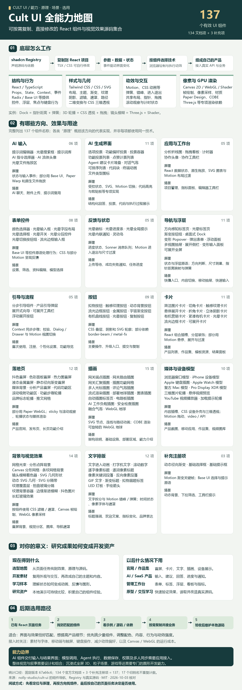
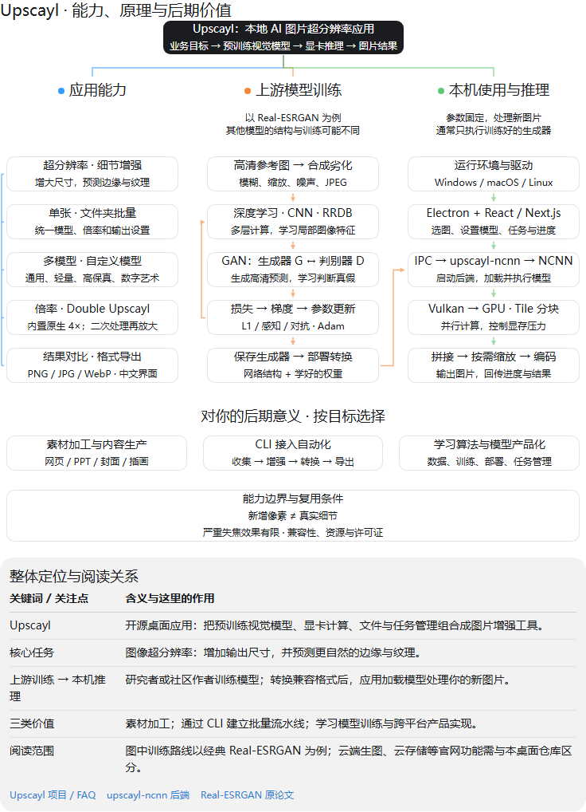
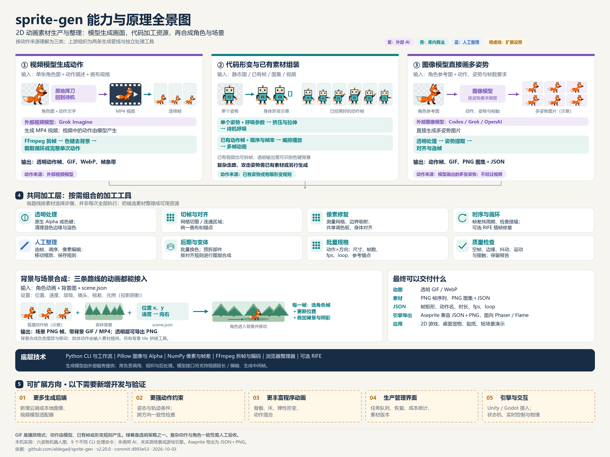
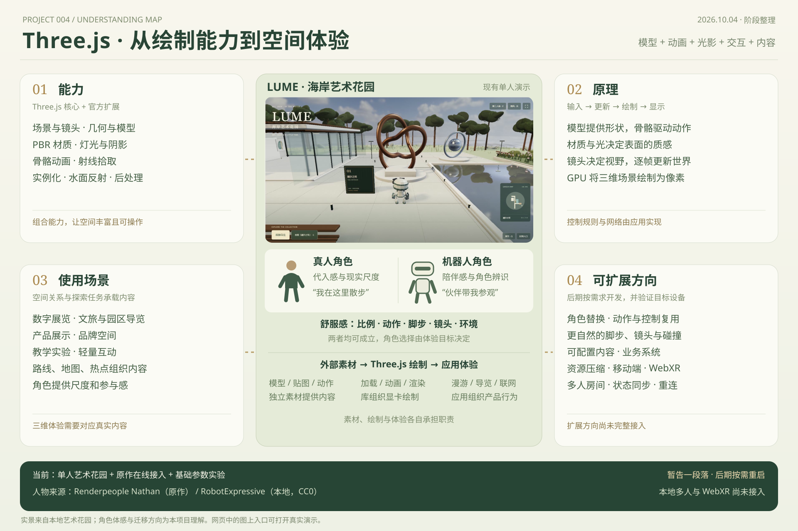
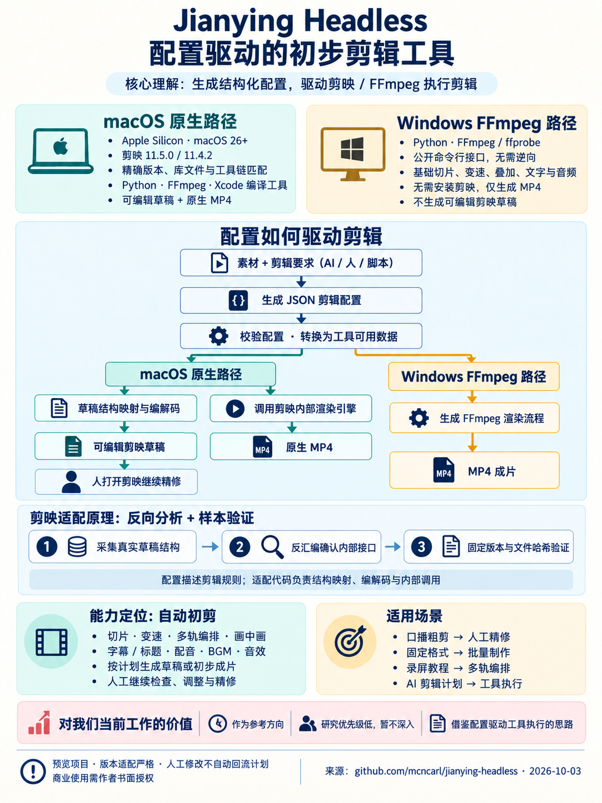
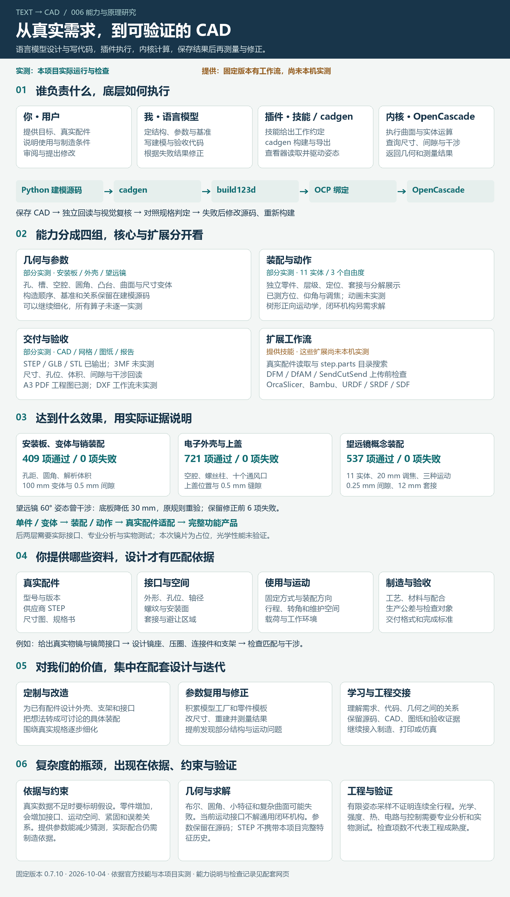
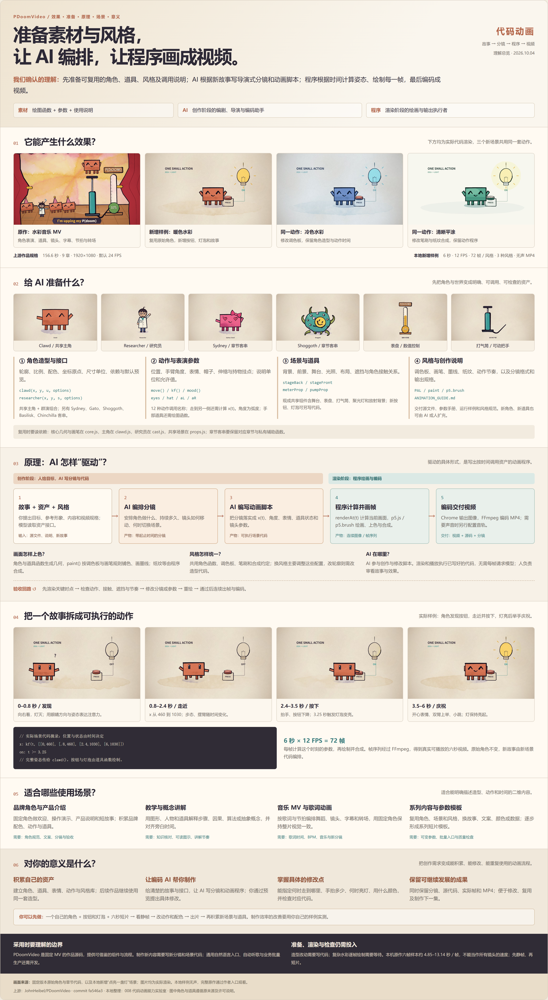
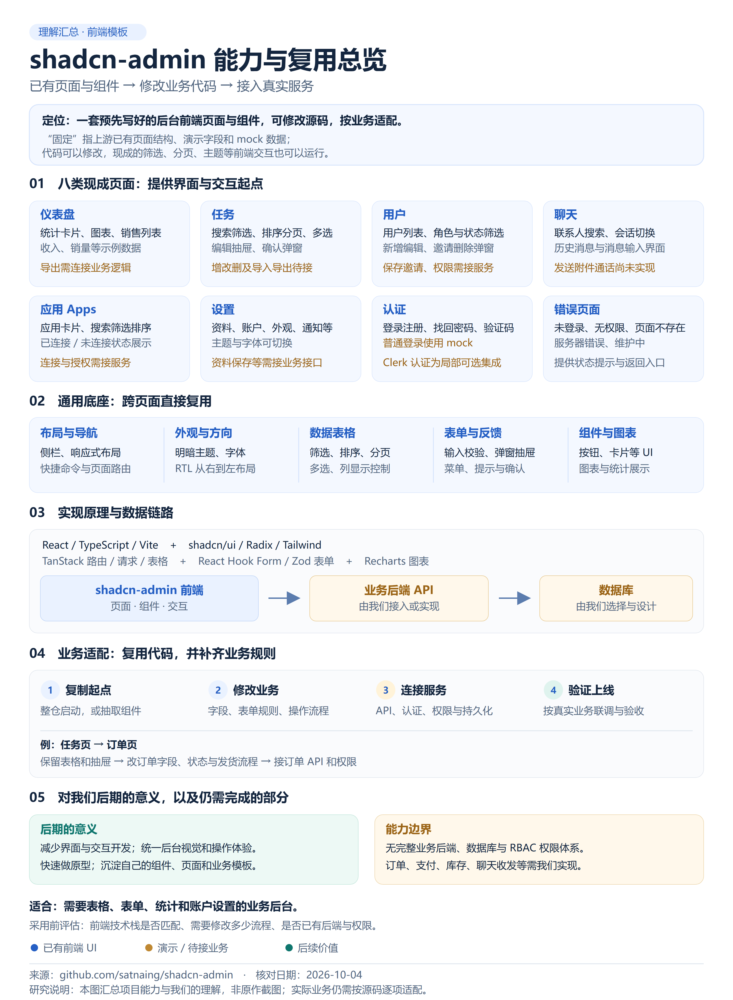

# GitHub 项目研究库

记录近期发现的项目与网站：理解设计思路、复现核心能力、整理研究结论，并按需提供 Web 演示。

这里是总入口。每个子项目都有固定编号、独立研究文档、图片和可选演示；首页只保留摘要与索引，具体分析放在子项目内。

## 子项目索引

编号按加入顺序递增，归档后保留编号。目录、README 和展示网站使用同一份 [项目清单](projects/catalog.json)。

<!-- PROJECTS:START -->
| 编号 | 子项目 / 研究文档 | 摘要 | 状态 | 来源 | Web |
| --- | --- | --- | --- | --- | --- |
| 001 | [Cult UI · 组件能力与原理实验室](projects/001-cult-ui/README.md) | **能力：** 可复制和修改的 React 界面与动效源码集合；137 个组件覆盖 AI 输入与结果、工作台、表单、导航、反馈、引导、官网、插画、媒体、文字与背景。<br>**原理：** 通过 React 状态、Tailwind / CSS / SVG，结合 Motion、Canvas / WebGL 实现交互与视觉效果；组件源码复制进自己的项目后可直接修改。<br>**使用场景：** React 官网、作品集、AI / SaaS 产品界面与后台工作台。<br>**价值：** 快速搭建界面、复用交互并学习动效实现；完整中文目录、真实示例与原理证据帮助选型。<br>**边界：** 业务后端、模型 API、鉴权与持久化需自行接入。 | 已完成 | [Cult UI](https://github.com/nolly-studio/cult-ui) | [演示](https://yydshly.github.io/1002_codex_project/projects/001-cult-ui/) |
| 002 | [Upscayl 图片超分辨率研究](projects/002-upscayl/README.md) | **能力：** 本地 AI 图片放大与细节增强，支持单张和文件夹批量处理。<br>**原理：** 调用预训练视觉模型，通过 NCNN 与 Vulkan GPU 在本机执行推理，放大图片并预测细节。<br>**使用场景：** 设计、展示与打印素材加工，以及重复图片处理的自动化。<br>**价值：** 改善素材交付尺寸，并学习如何把模型、显卡计算、文件管理与任务界面组合成产品。<br>**边界：** 预测纹理不等于恢复真实信息；本项目尚未实测图片质量或显卡性能。 | 已完成 | [Upscayl](https://github.com/upscayl/upscayl) | — |
| 003 | [sprite-gen · 精灵素材能力实验室](projects/003-sprite-gen/README.md) | **能力：** 制作与整理透明动图、精灵图集和帧数据；支持抠图、切帧、对齐、循环选择、换色、导出，以及动画与背景合成。<br>**原理：** 动作来自外部视频模型、多姿势图像模型，或已有帧与有限代码形变；Python、Pillow、NumPy、FFmpeg 加工资源，按时间、位置和图层合成。<br>**使用场景：** 2D 游戏原型、网页与桌面角色、贴纸、视频包装、短场景和素材库整理。<br>**价值：** 复用素材、减少批量整理，并学习“模型生成—算法加工—人工整理—资源交付”的制作流程，为后续角色动效与素材工具提供参考。<br>**边界：** 复杂动作仍需验收；本机验证了已有素材的后处理，未调用 AI 生成或运行场景渲染，网页提供研究与效果展示。 | 已完成 | [sprite-gen](https://github.com/aldegad/sprite-gen) | [演示](https://yydshly.github.io/1002_codex_project/projects/003-sprite-gen/) |
| 004 | [Three.js · 空间体验理解与海岸艺术花园](projects/004-threejs-worlds/README.md) | **能力：** 场景、镜头、几何与模型、PBR 材质、灯光阴影、骨骼动画、射线拾取、实例化；官方扩展提供模型/HDR 加载、水面反射和后处理。<br>**原理：** 外部素材提供形状、贴图与动作；每帧更新角色和世界，由 Three.js 组织 GPU 绘制。漫游、碰撞、导览、内容和联网由应用代码实现。<br>**角色价值：** 原作 Renderpeople Nathan 提供真人代入与现实尺度；本地 CC0 RobotExpressive 提供陪伴与辨识。舒适感由比例、动作、脚步、镜头与环境共同形成。<br>**使用场景：** 数字展览、文旅园区导览、产品展示、品牌空间、教学实验和轻量互动；用路线、地图和热点组织内容。<br>**现有效果：** 单人海岸艺术花园、动画导览员、玻璃展亭、金属雕塑、反射水池、光照与画质分档；保留原作在线接入、参数实验及可打开实时演示的生成引导图。<br>**可扩展方向：** 角色替换与动作复用、更自然的脚步镜头和碰撞、可配置内容、移动端优化、WebXR、多人同步与重连；需要另行开发和验证。<br>**当前结论：** 理解与演示已整理，阶段归档，后期按需求重启。本地多人、WebXR、业务后台和复杂物理尚未接入，原作跨设备联机尚未实测。 | 已归档 | [Porto Lume](https://porto-lume-worlds.vercel.app/) | [演示](https://yydshly.github.io/1002_codex_project/projects/004-threejs-worlds/) |
| 005 | [Jianying Headless · 配置驱动的初步剪辑](projects/005-jianying-headless/README.md) | **能力：** 以结构化 JSON 计划执行初步剪辑；Mac 生成可编辑剪映工程与原生 MP4，Windows 输出 MP4。<br>**原理：** Mac 适配剪映私有草稿格式与内部接口；Windows 将计划转成 FFmpeg 滤镜图和公开命令行调用。<br>**使用场景：** 口播粗剪、模板化批量制作，以及 AI 剪辑决定向人工编辑工程交接。<br>**价值：** 参考“配置驱动执行、AI 决策外接、人工精修”的自动化剪辑流程。<br>**当前结论：** 当前仅作方向参考，暂不深入研究或集成；尚未在本机运行，Mac 路径依赖匹配的剪映与运行环境。 | 已归档 | [Jianying Headless](https://github.com/mcncarl/jianying-headless) | — |
| 006 | [text-to-cad · 参数化 CAD 能力实验室](projects/006-text-to-cad/README.md) | **能力：** 参数化建模、零件装配、运动声明、文件交换、图纸与几何验收；制造、打印和机器人相关扩展均标明实测状态。<br>**原理：** 用户给需求与配件；语言模型设计并写 Python；cadgen / build123d 经 OCP 调用 OpenCascade，保存结果后测量、判定与修正。<br>**效果：** 已生成安装板、外壳、A3 工程图与 11 实体望远镜；演示 20 mm 调焦、方位和仰角，保留干涉修正与验收报告。<br>**价值：** 围绕真实配件设计外壳、支架和接口，复用参数与模型工厂，学习工程建模，积累可修改、可测量、可交接的项目资产。<br>**边界：** 复杂度增加会增加几何稳定性、接口与运动约束、制造和专业性能验证的难度；本次未证明望远镜成像或完整产品可用。 | 已完成 | [text-to-cad](https://github.com/earthtojake/text-to-cad) | [演示](https://yydshly.github.io/1002_codex_project/projects/006-text-to-cad/) |
| 007 | [X-Twitter-Downloader · 视频下载产品参考](projects/007-x-twitter-downloader/README.md) | **能力：** 解析公开 X 帖子的媒体信息，列出已有视频版本并提供下载入口。<br>**原理：** 链接经解析接口获取媒体元数据与视频地址，用户选择版本后请求媒体文件；具体后台实现尚未确认。<br>**使用场景：** 公开视频下载、链接解析与多版本选择产品。<br>**价值：** 借鉴链接输入、版本选择、下载与失败反馈流程，指导后期视频下载产品开发。<br>**当前结论：** 基础解析与下载技术已成熟，当前不继续深入研究，按产品参考归档。 | 已归档 | [X-Twitter-Downloader](https://x-twitter-downloader.com/zh-CN) | — |
| 008 | [PDoomVideo · 代码动画能力实验室](projects/008-pdoom-video/README.md) | **能力：** 用 JavaScript 编排二维角色、表情、动作、道具、镜头、歌词与转场，绘制水彩、墨线和纸纹效果，输出静帧、检查图、帧序列与 MP4。上游原作共 156.6 秒、九章、1080p，默认输出 24 FPS。<br>**创作流程与原理：** 先准备角色、道具、风格及接口说明；AI 根据故事写导演式分镜和动画脚本；程序按时间计算位置、角度、表情与状态，由 p5.js / p5.brush 绘画合成，Puppeteer 驱动 Chrome 出帧，FFmpeg 编码。AI 参与创作和修改代码，渲染与播放执行完成的程序。<br>**素材准备与驱动：** 整理八类角色用法和六类场景、道具及绘图基础，注明共享组件、群演组合与章节客串的不同依赖。直接运行原始 Clawd / Researcher 和 move()，可改动作、表情、配件、颜色、尺寸、位置、手臂与时间；给模型准备造型函数、表演参数、场景道具和创作规范。<br>**上色与风格：** 角色和道具函数生成几何，由 paint() 按调色板、画笔与墨线规则上色，再合成纸纹。共用造型函数与风格规范保持一致；更换颜色、笔刷和合成配置可产生不同风格，改角色轮廓则需修改造型代码。<br>**实测效果：** 保留六个上游真实时点、三秒无声片段及按时间重绘入口；新增“发现按钮、走近、按下点灯、举手庆祝”的六秒样例，暖色水彩、冷色水彩和平涂三种风格各 72 帧、12 FPS、1080p。提供分镜、逐帧姿态、上色拆分、三段 MP4、14 项实际元素预览和可复制的模型任务。<br>**使用场景：** 音乐 MV 与歌词动画、品牌角色及产品操作说明、教学与概念讲解、固定角色的系列短片，以及经额外参数化和批量开发的模板内容；适合能明确描述造型、动作和时间的二维题材。<br>**对你的意义：** 建立自己的角色、道具、动作与风格库，让编码 AI 按明确故事制作动画程序；可指定某时刻的位置、姿态、状态与颜色，保留分镜、源代码、实际帧和成片，便于检查、修改与复用。先做一个六秒原型，再积累个人场景和系列模板，制作效率需用自己的任务实测。<br>**边界与验证：** 上游是固定 MV 源码，新作品、新角色与新道具仍需设计和代码开发；通用自然语言入口、自动听歌和业务批量生产需另行接入。真实水彩采用离线逐帧渲染，本机原作六帧样本约 4.85–13.14 秒/帧，多 worker 加速未实测；完整 156.6 秒成片未在本机验收。本地四个页面共 36 项浏览器检查已通过，原作和新增样例均标明来源。 | 已完成 | [PDoomVideo](https://github.com/JohnHeibel/PDoomVideo) | [演示](https://yydshly.github.io/1002_codex_project/projects/008-pdoom-video/) |
| 009 | [shadcn-admin · 后台前端能力与业务适配](projects/009-shadcn-admin/README.md) | **能力：** 提供预先写好的可修改后台前端，覆盖仪表盘、任务、用户、聊天、Apps、设置、账户认证和错误页面八类模块，以及布局、主题、表格、表单与快捷导航。<br>**原理：** React / TypeScript / Vite 组织应用；shadcn、Radix、Tailwind 提供UI；TanStack 处理路由、请求与表格；通过修改源码、替换演示数据、连接自己的API完成业务适配。<br>**使用场景：** 以列表、搜索、筛选、编辑和统计为主的内部工具、CRM、SaaS、订单、资产、素材与任务管理后台；具体业务需按需求开发。<br>**价值：** 复用现成布局和常见交互，快速准备原型、统一后台体验，积累自己的组件与页面；提供中文研究网页和一张总览图，实际开发效率需在真实项目中验证。<br>**边界：** 固定的是预写页面起点，源码可改；连接数据库不会自动生成任意业务后台。普通登录与多项操作为演示，Clerk局部可选；完整后端、数据库、权限、聊天收发与第三方授权需自行接入。 | 已完成 | [shadcn-admin](https://github.com/satnaing/shadcn-admin) | [演示](https://yydshly.github.io/1002_codex_project/projects/009-shadcn-admin/) |

### 001 · Cult UI · 组件能力与原理实验室

**能力：** 可复制和修改的 React 界面与动效源码集合；137 个组件覆盖 AI 输入与结果、工作台、表单、导航、反馈、引导、官网、插画、媒体、文字与背景。

**原理：** 通过 React 状态、Tailwind / CSS / SVG，结合 Motion、Canvas / WebGL 实现交互与视觉效果；组件源码复制进自己的项目后可直接修改。

**使用场景：** React 官网、作品集、AI / SaaS 产品界面与后台工作台。

**价值：** 快速搭建界面、复用交互并学习动效实现；完整中文目录、真实示例与原理证据帮助选型。

**边界：** 业务后端、模型 API、鉴权与持久化需自行接入。

[](projects/001-cult-ui/README.md)

### 002 · Upscayl 图片超分辨率研究

**能力：** 本地 AI 图片放大与细节增强，支持单张和文件夹批量处理。

**原理：** 调用预训练视觉模型，通过 NCNN 与 Vulkan GPU 在本机执行推理，放大图片并预测细节。

**使用场景：** 设计、展示与打印素材加工，以及重复图片处理的自动化。

**价值：** 改善素材交付尺寸，并学习如何把模型、显卡计算、文件管理与任务界面组合成产品。

**边界：** 预测纹理不等于恢复真实信息；本项目尚未实测图片质量或显卡性能。

[](projects/002-upscayl/README.md)

### 003 · sprite-gen · 精灵素材能力实验室

**能力：** 制作与整理透明动图、精灵图集和帧数据；支持抠图、切帧、对齐、循环选择、换色、导出，以及动画与背景合成。

**原理：** 动作来自外部视频模型、多姿势图像模型，或已有帧与有限代码形变；Python、Pillow、NumPy、FFmpeg 加工资源，按时间、位置和图层合成。

**使用场景：** 2D 游戏原型、网页与桌面角色、贴纸、视频包装、短场景和素材库整理。

**价值：** 复用素材、减少批量整理，并学习“模型生成—算法加工—人工整理—资源交付”的制作流程，为后续角色动效与素材工具提供参考。

**边界：** 复杂动作仍需验收；本机验证了已有素材的后处理，未调用 AI 生成或运行场景渲染，网页提供研究与效果展示。

[](projects/003-sprite-gen/README.md)

### 004 · Three.js · 空间体验理解与海岸艺术花园

**能力：** 场景、镜头、几何与模型、PBR 材质、灯光阴影、骨骼动画、射线拾取、实例化；官方扩展提供模型/HDR 加载、水面反射和后处理。

**原理：** 外部素材提供形状、贴图与动作；每帧更新角色和世界，由 Three.js 组织 GPU 绘制。漫游、碰撞、导览、内容和联网由应用代码实现。

**角色价值：** 原作 Renderpeople Nathan 提供真人代入与现实尺度；本地 CC0 RobotExpressive 提供陪伴与辨识。舒适感由比例、动作、脚步、镜头与环境共同形成。

**使用场景：** 数字展览、文旅园区导览、产品展示、品牌空间、教学实验和轻量互动；用路线、地图和热点组织内容。

**现有效果：** 单人海岸艺术花园、动画导览员、玻璃展亭、金属雕塑、反射水池、光照与画质分档；保留原作在线接入、参数实验及可打开实时演示的生成引导图。

**可扩展方向：** 角色替换与动作复用、更自然的脚步镜头和碰撞、可配置内容、移动端优化、WebXR、多人同步与重连；需要另行开发和验证。

**当前结论：** 理解与演示已整理，阶段归档，后期按需求重启。本地多人、WebXR、业务后台和复杂物理尚未接入，原作跨设备联机尚未实测。

[](projects/004-threejs-worlds/README.md)

### 005 · Jianying Headless · 配置驱动的初步剪辑

**能力：** 以结构化 JSON 计划执行初步剪辑；Mac 生成可编辑剪映工程与原生 MP4，Windows 输出 MP4。

**原理：** Mac 适配剪映私有草稿格式与内部接口；Windows 将计划转成 FFmpeg 滤镜图和公开命令行调用。

**使用场景：** 口播粗剪、模板化批量制作，以及 AI 剪辑决定向人工编辑工程交接。

**价值：** 参考“配置驱动执行、AI 决策外接、人工精修”的自动化剪辑流程。

**当前结论：** 当前仅作方向参考，暂不深入研究或集成；尚未在本机运行，Mac 路径依赖匹配的剪映与运行环境。

[](projects/005-jianying-headless/README.md)

### 006 · text-to-cad · 参数化 CAD 能力实验室

**能力：** 参数化建模、零件装配、运动声明、文件交换、图纸与几何验收；制造、打印和机器人相关扩展均标明实测状态。

**原理：** 用户给需求与配件；语言模型设计并写 Python；cadgen / build123d 经 OCP 调用 OpenCascade，保存结果后测量、判定与修正。

**效果：** 已生成安装板、外壳、A3 工程图与 11 实体望远镜；演示 20 mm 调焦、方位和仰角，保留干涉修正与验收报告。

**价值：** 围绕真实配件设计外壳、支架和接口，复用参数与模型工厂，学习工程建模，积累可修改、可测量、可交接的项目资产。

**边界：** 复杂度增加会增加几何稳定性、接口与运动约束、制造和专业性能验证的难度；本次未证明望远镜成像或完整产品可用。

[](projects/006-text-to-cad/README.md)

### 008 · PDoomVideo · 代码动画能力实验室

**能力：** 用 JavaScript 编排二维角色、表情、动作、道具、镜头、歌词与转场，绘制水彩、墨线和纸纹效果，输出静帧、检查图、帧序列与 MP4。上游原作共 156.6 秒、九章、1080p，默认输出 24 FPS。

**创作流程与原理：** 先准备角色、道具、风格及接口说明；AI 根据故事写导演式分镜和动画脚本；程序按时间计算位置、角度、表情与状态，由 p5.js / p5.brush 绘画合成，Puppeteer 驱动 Chrome 出帧，FFmpeg 编码。AI 参与创作和修改代码，渲染与播放执行完成的程序。

**素材准备与驱动：** 整理八类角色用法和六类场景、道具及绘图基础，注明共享组件、群演组合与章节客串的不同依赖。直接运行原始 Clawd / Researcher 和 move()，可改动作、表情、配件、颜色、尺寸、位置、手臂与时间；给模型准备造型函数、表演参数、场景道具和创作规范。

**上色与风格：** 角色和道具函数生成几何，由 paint() 按调色板、画笔与墨线规则上色，再合成纸纹。共用造型函数与风格规范保持一致；更换颜色、笔刷和合成配置可产生不同风格，改角色轮廓则需修改造型代码。

**实测效果：** 保留六个上游真实时点、三秒无声片段及按时间重绘入口；新增“发现按钮、走近、按下点灯、举手庆祝”的六秒样例，暖色水彩、冷色水彩和平涂三种风格各 72 帧、12 FPS、1080p。提供分镜、逐帧姿态、上色拆分、三段 MP4、14 项实际元素预览和可复制的模型任务。

**使用场景：** 音乐 MV 与歌词动画、品牌角色及产品操作说明、教学与概念讲解、固定角色的系列短片，以及经额外参数化和批量开发的模板内容；适合能明确描述造型、动作和时间的二维题材。

**对你的意义：** 建立自己的角色、道具、动作与风格库，让编码 AI 按明确故事制作动画程序；可指定某时刻的位置、姿态、状态与颜色，保留分镜、源代码、实际帧和成片，便于检查、修改与复用。先做一个六秒原型，再积累个人场景和系列模板，制作效率需用自己的任务实测。

**边界与验证：** 上游是固定 MV 源码，新作品、新角色与新道具仍需设计和代码开发；通用自然语言入口、自动听歌和业务批量生产需另行接入。真实水彩采用离线逐帧渲染，本机原作六帧样本约 4.85–13.14 秒/帧，多 worker 加速未实测；完整 156.6 秒成片未在本机验收。本地四个页面共 36 项浏览器检查已通过，原作和新增样例均标明来源。

[](projects/008-pdoom-video/README.md)

### 009 · shadcn-admin · 后台前端能力与业务适配

**能力：** 提供预先写好的可修改后台前端，覆盖仪表盘、任务、用户、聊天、Apps、设置、账户认证和错误页面八类模块，以及布局、主题、表格、表单与快捷导航。

**原理：** React / TypeScript / Vite 组织应用；shadcn、Radix、Tailwind 提供UI；TanStack 处理路由、请求与表格；通过修改源码、替换演示数据、连接自己的API完成业务适配。

**使用场景：** 以列表、搜索、筛选、编辑和统计为主的内部工具、CRM、SaaS、订单、资产、素材与任务管理后台；具体业务需按需求开发。

**价值：** 复用现成布局和常见交互，快速准备原型、统一后台体验，积累自己的组件与页面；提供中文研究网页和一张总览图，实际开发效率需在真实项目中验证。

**边界：** 固定的是预写页面起点，源码可改；连接数据库不会自动生成任意业务后台。普通登录与多项操作为演示，Clerk局部可选；完整后端、数据库、权限、聊天收发与第三方授权需自行接入。

[](projects/009-shadcn-admin/README.md)
<!-- PROJECTS:END -->

## 添加项目

需要 Node.js 22.12 或更新版本；管理脚本无需安装依赖，框架子项目需要先安装各自依赖。

```bash
npm run new -- --slug example-repo --name "项目名称" --repo "https://github.com/owner/repo" --source-name "来源名称" --summary "一句话说明研究价值"
```

脚本自动分配下一个编号，例如 `001-example-repo`，创建研究文档、图片目录和 Web 目录，并更新上方索引。`--repo` 可填写 GitHub 仓库或网站的 HTTPS 地址；`--source-name` 指定索引显示的来源名称，省略时使用项目名称。命令中的名称和地址是占位示例，请替换为实际来源。

后续编辑子项目文档与 `projects/catalog.json`，再运行：

```bash
npm run sync   # 更新 README 的摘要、图片与索引
npm run check  # 检查编号、路径、图片和索引一致性
npm run build  # 生成展示入口与各子项目静态 Web 到 _site/
npm run preview # 启动本地总站预览（默认端口 4173）
```

## 目录结构

```text
projects/
  catalog.json             # 唯一项目清单，按固定编号排序
  001-project-slug/        # 添加首个项目后创建
    README.md              # 项目介绍、来源、图片、复现步骤、结论
    notes/research.md      # 深入分析、实验记录和待验证问题
    assets/                # 截图、封面、架构图等
    web/                   # 可选的 Web 源码或静态演示
templates/project/         # 新项目使用的文档模板
scripts/                   # 编号、索引同步、检查与网站生成
site/                      # 总展示入口的样式
docs/                      # 项目组织与部署约定
.github/workflows/         # 索引检查和手动 Pages 发布
_site/                     # 构建产物，不提交
```

## Web 展示

首个 Cult UI 子项目提供能力图、完整组件目录、真实预览，以及原理、使用场景和选用判断。总索引与子项目通过同一 GitHub Pages 工作流发布，上方 Web 链接指向对应子项目。

首次运行 Cult UI 展示：

```bash
npm --prefix projects/001-cult-ui/web ci
npm run build
npm run preview
```

打开 `http://localhost:4173/projects/001-cult-ui/`。端口被占用时可运行 `node scripts/serve.mjs --port 4187`；本次验证使用 [4187 本地预览](http://localhost:4187/projects/001-cult-ui/)。开发模式可运行 `npm run dev:cult`。

总入口：[GitHub 项目研究库](https://yydshly.github.io/1002_codex_project/)。子项目：[Cult UI 能力与原理实验室](https://yydshly.github.io/1002_codex_project/projects/001-cult-ui/)，各项目使用独立子路径。

支持项目内静态 Web 和外部演示链接。添加应用时再确定技术栈和构建命令，详见 [部署指南](docs/deployment.md)。

## 研究约定

- 编号固定、不复用；研究顺序按编号展示，停止研究时将状态设为“已归档”。
- 记录来源名称与链接；仓库来源记录研究版本或 commit、许可证，网站来源记录访问日期、实测范围与证据。
- 总 README 保持摘要；图片存入对应子项目的 `assets/`，完整分析写在项目文档和研究笔记中。
- 复现前写清环境、运行命令和验证结果；尚未验证的结论明确标注。

详细说明见 [项目管理指南](docs/project-guide.md)。
