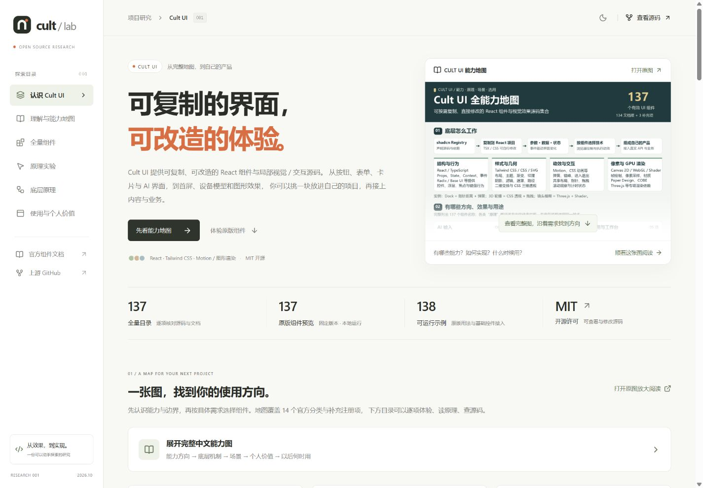
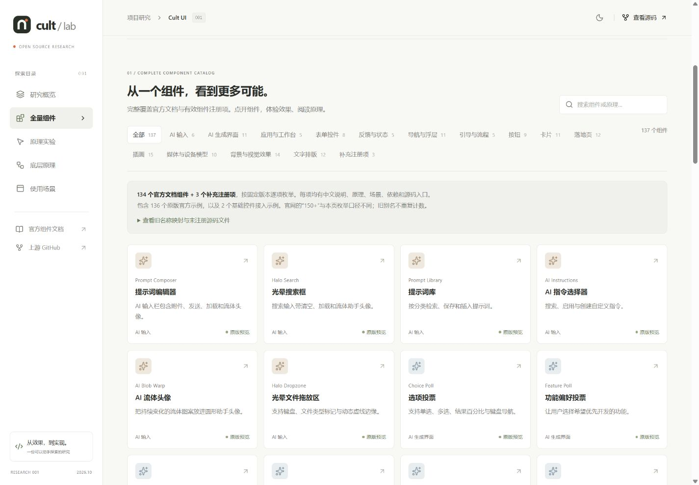
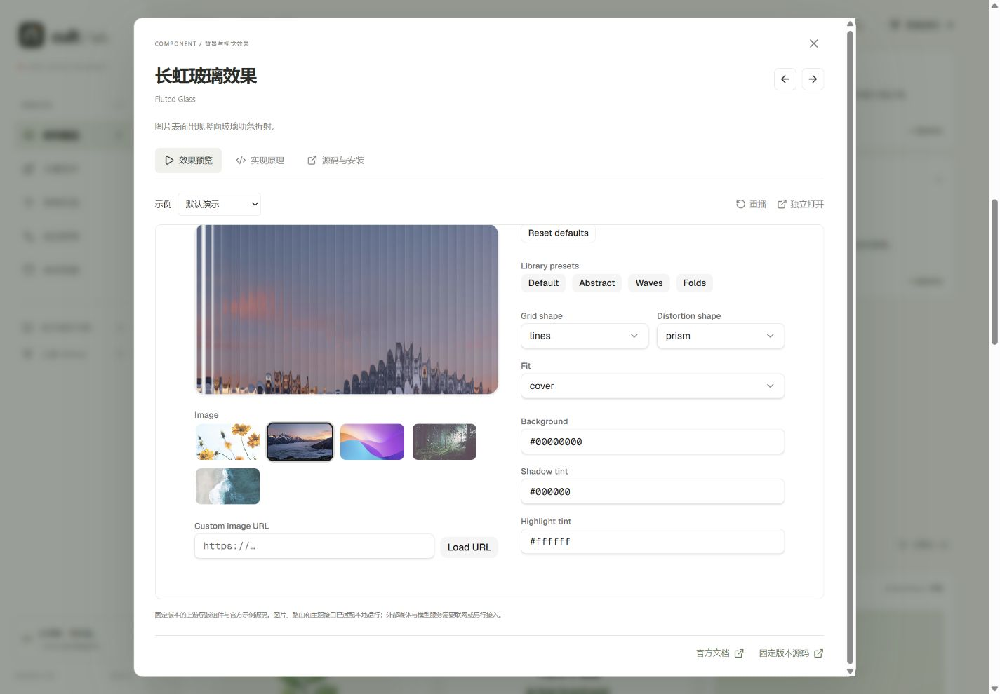
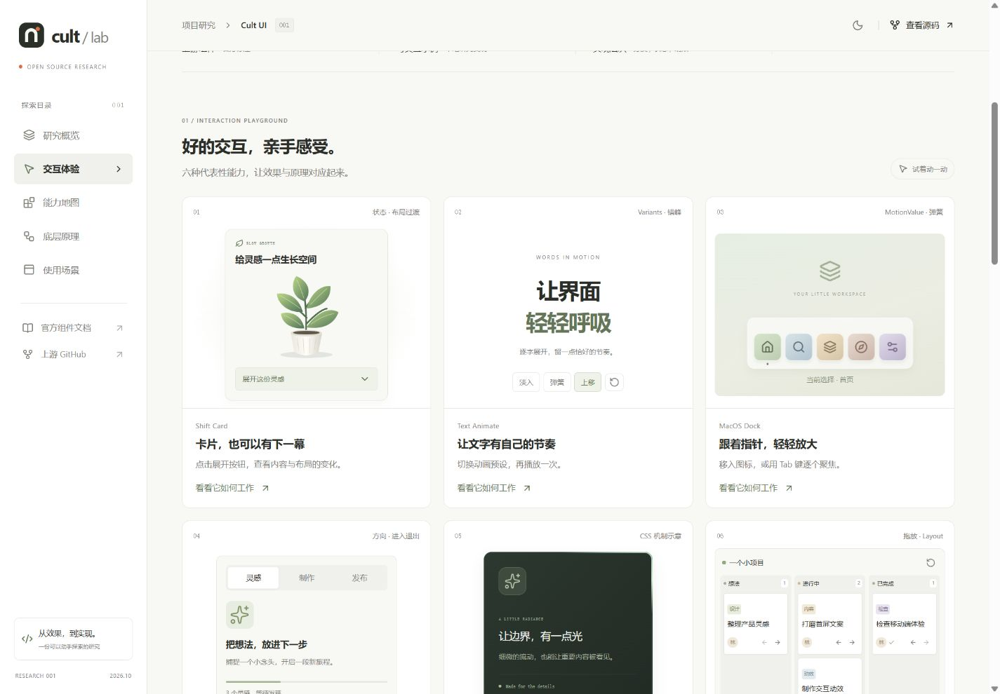
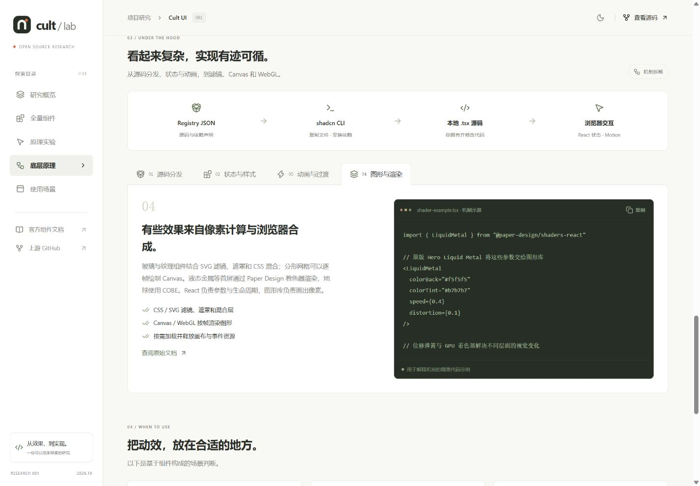

# 001 · Cult UI · 组件能力与原理实验室

**Cult UI 是按需复制到 React 项目的组件与视觉效果源码集合。** 它适合把卡片、输入框、导航、状态反馈和营销区块做得更精致，组件源码进入自己的项目后可以直接修改。这个子项目提供完整中文目录、真实示例和原理证据，帮助选型与学习。

[返回总索引](../../README.md) · [研究笔记](notes/research.md) · [Web 运行说明](web/README.md) · [上游文档](https://www.cult-ui.com/docs)

[全能力地图（137 项、原理、场景与选用路径）](assets/cult-ui-capability-map.png) · [SVG 矢量版](assets/cult-ui-capability-map.svg)

## 项目信息

| 项目 | 内容 |
| --- | --- |
| 固定编号 | 001 |
| 上游仓库 | [nolly-studio/cult-ui](https://github.com/nolly-studio/cult-ui) |
| 研究日期 | 2026-10-03，Asia/Shanghai |
| 研究 commit | [67a66c6ac1cd240914ba688a907611b3437a7a2b](https://github.com/nolly-studio/cult-ui/commit/67a66c6ac1cd240914ba688a907611b3437a7a2b)，通过实时 git ls-remote 获取 HEAD |
| 上游许可证 | [MIT，Copyright (c) 2023 Jordan-Gilliam](https://github.com/nolly-studio/cult-ui/blob/67a66c6ac1cd240914ba688a907611b3437a7a2b/LICENSE.md) |
| 技术栈 | React 19、TypeScript、Vite、Tailwind CSS v4、Motion |
| 静态输出 | web/dist，资源使用相对 base ./ |
| 本次实际预览 | [http://localhost:4187/projects/001-cult-ui/](http://localhost:4187/projects/001-cult-ui/)，总站默认端口 4173 在本机已占用 |
| Web 入口 | [Cult UI 能力与原理实验室](https://yydshly.github.io/1002_codex_project/projects/001-cult-ui/)，由仓库 Pages 工作流发布 |
| 研究状态 | 以 [项目清单](../catalog.json) 为准 |

## 能力与展示范围

上游自述提供 **150+ 免费动画组件**。本项目按固定 commit 清点：**134 个官方文档组件 + 3 个有效补充注册项，共 137 项**，旧别名不重复计数。Cult UI 的核心价值是可复制和修改的 React 组件源码，覆盖文字、卡片、导航、表单、AI 界面、工作台、插图、媒体和背景等领域。[完整目录审计](notes/full-catalog-audit.json)

Web 目录与 [研究笔记](notes/research.md#能力目录) 覆盖相同的 137 项，每项有独立中文功能、机制、场景、技术标签和来源。真实预览接入范围为 **136 个官方 example + 2 个本项目实际 API 接入示例**；保留上游组件并为 Vite 适配 Next.js 运行时、字体及媒体资源。接入数量与实际渲染验收分开记录。[机制与依赖审计](notes/mechanisms-audit.json)

另外保留 17 个旧 UI 别名、17 个旧示例别名和 4 个未注册源码文件的附录。复合 API 部件、示例变体及外部 AI SDK Agents 模式不追加成独立组件数量。

| 能力方向 | 覆盖内容 | 典型用途 |
| --- | --- | --- |
| 产品操作 | 表单、反馈、工作台 | 输入、上传、进度、通知、图表与任务板 |
| 交互组织 | 导航浮层、分步引导 | 内容切换、抽屉、工具面板与首次使用流程 |
| AI 产品界面 | 提示词输入与生成结果界面 | 指令、模板、代码、投票与建议展示 |
| 局部视觉 | 按钮、卡片、文字排版、背景效果 | 重点内容、状态变化、质感与品牌细节 |
| 营销展示 | 落地页、插画、媒体与设备模型 | 首屏、功能故事、产品截图和视觉预览 |

这五个方向覆盖官方全部 14 个叶分类；另有动态渐变、基础选择框、基础提示框 3 个补充注册项。图中和目录内的组件可作为具体开发素材，图表、协作头像和安全插图等名称只描述界面呈现。

完整目录、逐项机制及来源见 [研究笔记](notes/research.md#能力目录)。**AI 界面组件不包含模型推理或 Agent 执行能力**；有些组件是工作流 SVG 插图。模型 API、鉴权、工具执行和持久化需要业务系统接入。上游另行链接的 [AI SDK Agents](https://aisdkagents.com) 是独立产品/项目。[上游说明](https://github.com/nolly-studio/cult-ui#built-with-cult-ui)

## 六种代表机制剖析

以下六项说明典型实现机制，完整目录和预览不止这六项。

| 实验 | 可观察行为 | 所解释的机制 |
| --- | --- | --- |
| Shift Card | 展开/收起更多卡片内容 | React 状态控制目标高度，Motion 插值并管理内容出现 |
| Text Animate | 重播文字进入过程 | 字符拆分、逐项延时、位移和透明度动画 |
| Dock | 指针接近时图标放大 | 指针距离映射为尺寸，再经弹簧平滑 |
| Direction Aware Tabs | 切换选项时内容按方向进入 | 比较新旧索引、进入退出动画、共享选中标记 |
| Border Beam | 边框光带流动，可观察装饰与内容层 | 本地以 CSS 渐变演示边框运动；上游当前组件封装 border-beam 包 |
| Kanban | 移动任务并观察列计数变化 | HTML 拖放更新数据，Motion 展示布局变化 |

## 底层原理

~~~text
shadcn CLI → 解析组件 registry JSON → 安装依赖 / 写入本地源码
                                             ↓
用户交互 → React 状态 / MotionValue → Motion 或 CSS → 浏览器渲染
                                             ↑
                           Tailwind 类与 shadcn 主题变量
~~~

shadcn Registry 负责把源码和依赖交付给项目；React 管状态与事件，Tailwind / CSS / SVG 管布局和外观，Motion 管弹簧、进入退出、拖动和布局过渡。Canvas、WebGL、COBE、Paper Design 与 Three.js 等用于少数需要逐帧绘制或像素采样的效果，并非每个组件都用同一技术。[逐项原理](notes/research.md#能力目录)

复制后你拥有本地源码，也承担维护和合并更新。组件依赖不同，例如 Kanban 引入 next/image，Border Beam Card 包装 border-beam；本地框架、字体、媒体与主题都要匹配。[源码与数据流](notes/research.md#架构与数据流)

## 场景判断

下面是本研究的选用判断。前端开发者已有 React 页面、明确某个局部任务时最容易接入；设计者可用真实示例比较状态、节奏与视觉层次，产品团队可借它快速讨论原型。

| 谁在什么情况下使用 | 可以选用什么 | 需要补齐什么 |
| --- | --- | --- |
| 官网或作品集开发者，需要解释产品并展示成果 | 首屏、卡片、文字、插图和设备模型 | 自己的文案、素材、品牌主题与页面结构 |
| SaaS / AI 产品团队，已有业务功能需要改善体验 | 输入、建议、导航、进度、通知和工作台 | 模型调用、业务 API、权限、数据保存与多人同步 |
| 设计与原型团队，需要讨论可操作的方案 | 对应组件的真实预览与状态变化 | 实际用户任务、流程与交互验证 |
| 前端学习者，需要理解动效如何实现 | 源码、机制说明与最小修改实验 | 把效果放回真实页面，验证可读性与操作效率 |

对本项目的价值是形成可追溯的**选型地图、开发素材和学习样本**：以后从页面任务找到组件，观察效果，再读原理和源码，把合适部分改成自己的主题与内容。是否改善体验仍要通过真实用户任务验证，演示效果不能直接证明可用性提升。

当现有页面确实缺少一个更清晰的状态反馈或有辨识度的局部表现，且项目能承担依赖、适配和源码维护时，值得接入。高频操作页面应少量使用动效；复杂效果还要验证手机性能和减少动效偏好。Cult UI 不是沉浸式整站场景引擎，完整 3D 世界、游戏流程或叙事场景需要另行设计和开发。

## 本地复现

在仓库根目录运行：

~~~bash
npm --prefix projects/001-cult-ui/web ci
npm --prefix projects/001-cult-ui/web run dev
~~~

需要 Node.js >=22.12.0，具体依赖版本见子项目锁文件。开发服务器地址以 Vite 输出为准。首次安装依赖后，根构建会自动构建子项目并汇总静态页面：

~~~bash
npm run sync
npm run check
npm test
npm run build
npm run preview
~~~

预览默认使用端口 4173。本机该端口已占用，本次使用以下命令启动总站：

~~~bash
node scripts/serve.mjs --port 4187
~~~

访问 [本次实际预览](http://localhost:4187/projects/001-cult-ui/)。端口占用时可指定其他空闲端口，并同步替换访问地址；该本地预览服务仅绑定 127.0.0.1。[部署步骤](../../docs/deployment.md)

## 图片与验证

[查看手机目录](assets/mobile-catalog.png)。本轮已通过完整性校验：137 项全部有说明、原理、场景、依赖、源码及可达的本地预览；138 个示例逐项浏览器初始渲染通过，修正后的 12 项图片与着色器素材问题已复验。TypeScript、Vite、总站构建、清单检查及根 9 个测试通过。[逐项运行记录](notes/runtime-preview-audit.json)

1440px 桌面与 390px 手机目录无横向溢出；分类、搜索与重置、137 项展开、详情切换、安装命令复制、主题和手机导航通过。另实测 Base Select 选择状态与 Halo Switch 的键盘操作；这不等同于对全部示例每个操作、所有设备或所有浏览器的兼容性验收。首轮六个实验的历史证据保留在研究笔记。

系统减少动效偏好已在源码中核对，本次浏览器系统偏好为 false，未切换系统设置做实测；尚未进行帧率或屏幕阅读器测量。完整证据见 [研究笔记](notes/research.md#实验记录)。

## 范围与限制

本项目是静态研究展示，无登录、数据库或模型调用，任务移动等交互以浏览器内状态为基础。页面读取系统 prefers-reduced-motion；不同官方组件是否完整暂停持续动画仍需逐项审查。WebGL、Canvas、外部媒体、剪贴板和推文嵌入有各自运行条件。性能、移动设备和无障碍结论以实际检查为准，目录完整性不代替运行质量验收。[逐项审查说明](notes/mechanisms-audit.json)

## 来源与改动

研究来源固定为上述 commit，公开链接与 MIT 版权正文见 [研究笔记](notes/research.md#许可证原文)。全量预览导入真实上游组件与示例，并保留 [第三方声明](THIRD_PARTY_NOTICES.md)；最小框架适配与中文目录为本项目修改。原始下载缓存位于 .cache，提交内容以实际预览所需源码和审计资料为准；第三方依赖适用各自许可证。

为满足 React 19 的 peer 依赖，Embla React / Autoplay 从上游 8.0.0-rc15 调整到 8.6.0，React Wrap Balancer 从 0.4.1 调整到 1.1.1；具体解析版本见锁文件。目录和示例源码固定于研究 commit，运行依赖并非逐项照搬上游网站锁文件。
