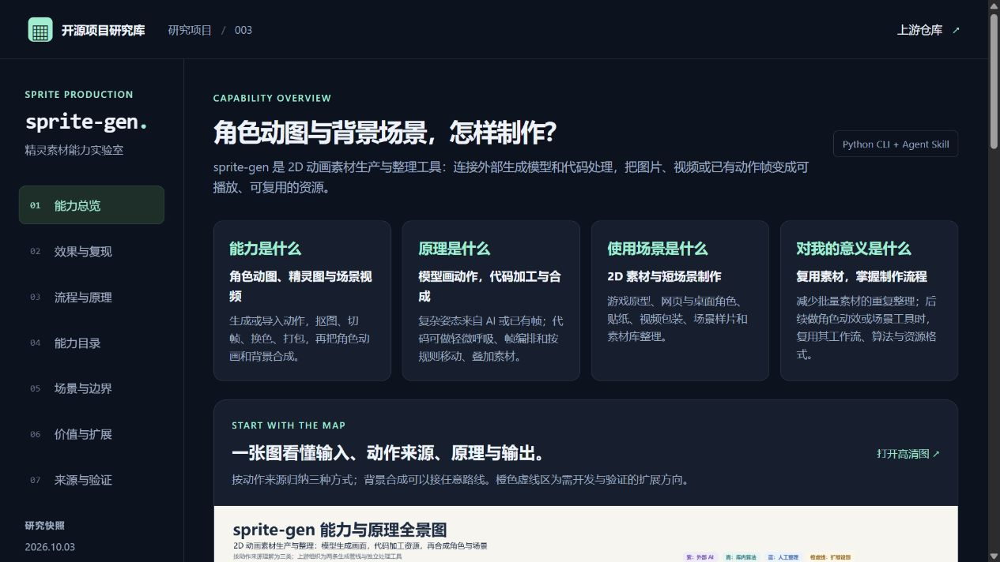
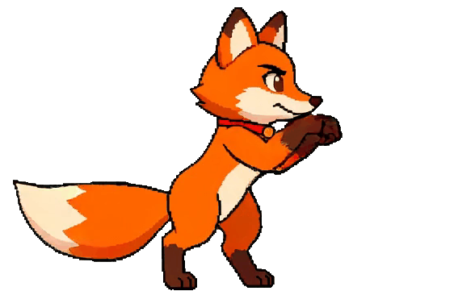
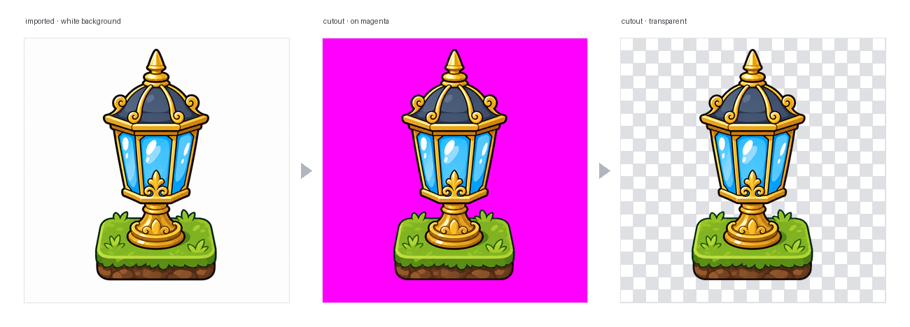
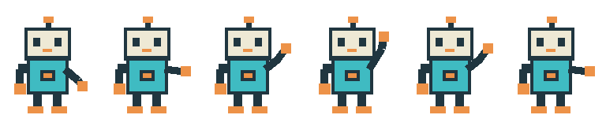

# 003 · sprite-gen · 精灵素材能力实验室

**能力：** 制作与整理透明动图、精灵图集和帧数据；支持抠图、切帧、对齐、循环选择、换色、导出，以及动画与背景合成。

**原理：** 动作来自外部视频模型、多姿势图像模型，或已有帧与有限代码形变；Python、Pillow、NumPy、FFmpeg 加工资源，按时间、位置和图层合成。

**使用场景：** 2D 游戏原型、网页与桌面角色、贴纸、视频包装、短场景和素材库整理。

**价值：** 复用素材、减少批量整理，并学习“模型生成—算法加工—人工整理—资源交付”的制作流程，为后续角色动效与素材工具提供参考。

**边界：** 复杂动作仍需验收；本机验证了已有素材的后处理，未调用 AI 生成或运行场景渲染，网页提供研究与效果展示。

依据：[上游架构](https://github.com/aldegad/sprite-gen/blob/d993e5300b4255111e8ee0e29779caea1b3b97bd/docs/architecture.md)

[返回总索引](../../README.md) · [在线能力展示](https://yydshly.github.io/1002_codex_project/projects/003-sprite-gen/) · [本地页面](web/index.html) · [研究笔记](notes/research.md) · [Web 运行说明](web/README.md) · [第三方来源与许可](THIRD_PARTY_NOTICES.md)

## 能力与原理总览图

按动作来源归纳三类实现方式：外部视频模型生成、代码形变与已有素材组装、图像模型直接生成多姿势。图中同时说明按需加工工具、背景合成、技术底座与输出格式；扩展区标明需要新增开发与验证的方向。


[查看原图](assets/capabilities-principles-map.png) · [绘图脚本](scripts/render_capabilities_map.py) · [图中文字与设计说明](notes/capabilities-principles-map.prompt.txt) · [依据与验证范围](notes/capabilities-principles-map.sources.json)

## 先回答四个问题

| 问题 | 我们形成的理解 |
| --- | --- |
| **能力是什么** | 制作和整理透明角色动画、精灵图集及结构化帧数据；处理已有图片、视频或姿势素材；将动画、物件和背景合成短场景。 |
| **实现原理是什么** | 外部模型产生复杂运动或新姿势；代码处理已有像素、做有限形变、按时间选帧，再按位置、层级与相机规则叠加。GIF 是导出与播放格式，动作来源要看输入和生成步骤。 |
| **使用场景是什么** | 2D 游戏与短动作原型、网页或桌面角色、表情与贴纸、视频包装、场景样片、已有素材库清理和批量配色。 |
| **对我的意义是什么** | 结合当前的开源项目研究，可以掌握动画素材的完整制作链路；以后需要角色动效、素材处理或场景工具时，复用其算法、规格、人工整理和导出设计。 |

## 三种实现方式：输入什么，动作从哪里来

这是为了理解能力作出的归纳。上游正式组织为 **A 图像到图集、B 视频到循环两条生成管线**，另外提供独立图片处理、后期、素材辅助与场景工具。中间的“代码方式”包括这些工具，不代表第三个生成模型。

| 实现方式 | 你提供的输入 | 动作来源与处理原理 | 输出 |
| --- | --- | --- | --- |
| ① 视频模型 | 单张角色图、动作描述、运动画布和尺寸要求，例如“原地攻击，结束回到待机” | Grok Imagine 生成 MP4；FFmpeg 解码取帧；色键算法去背景；帧差分析寻找循环周期或准备—动作—恢复的片段 | 透明帧、GIF / WebP、PNG 条带与时序 JSON |
| ② 代码形变与组装 | 单张静态姿势，或已有多姿势图、PNG 帧序列、图集、视频，加上帧顺序、fps、loop 或呼吸参数 | 单图可按周期轻微挤压、拉伸身体生成呼吸；已有动作帧按顺序编排；已生成的视频也可直接提帧。新复杂肢体姿态需已有素材或另行生成 | 呼吸动图、已有帧动画、透明图集和描述；也可进入场景合成 |
| ③ 图像模型 | 角色参考、动作或姿势要求、帧数与布局，例如“画出六个跳跃姿势” | Codex / Grok / OpenAI 图像模型直接画多姿势图片；按 Alpha 连通区域等提取姿势，对齐、人工选帧，再打包；中间不经过视频 | 动作帧、GIF、PNG 图集与 JSON |

**动作内容与播放方式是两件事。**输入的六个姿势本来就不同，按时间切换即可看到挥手；单张姿势的呼吸则来自形变规则；复杂攻击或走路由外部模型生成，或由预先画好的帧提供。浏览器播放 GIF 时解码已有帧；游戏或 Canvas 播放精灵图时按 JSON 矩形取出每帧。播放格式本身不创造动作。

本页机器人对应②：输入是 [一张已画好六姿势的品红网格](web/demo/input/keyed-sheet.png)，本机用库抠图、切格、打包、换色，得到 [透明 GIF](web/demo/output/wave.gif) 和 [图集描述](web/demo/output/manifest.json)。狐狸、史莱姆是上游成品演示；本机没有用单张图重新生成它们，也没有归档那次生成的完整原图、提示词和参数。

原理依据：[视频管线](https://github.com/aldegad/sprite-gen/blob/d993e5300b4255111e8ee0e29779caea1b3b97bd/docs/video-pipeline.md)、[图像行工作流](https://github.com/aldegad/sprite-gen/blob/d993e5300b4255111e8ee0e29779caea1b3b97bd/docs/atlas-workflow.md)、[静态呼吸](https://github.com/aldegad/sprite-gen/blob/d993e5300b4255111e8ee0e29779caea1b3b97bd/docs/breathing.md)。

## 背景合成如何接在动画后面

三种方式产生的动画，都可以作为已有素材进入场景。**输入是角色动画、背景图，以及 scene.json 中的位置、移动速度、层级、镜头、视差和投影阴影参数。**每一帧先按时间选择角色图片，再更新角色与相机位置，把角色、背景和物件按层级叠起来。这样可将“已有狐狸走路动画＋森林背景＋向右移动”合成一段狐狸穿过森林的样片。

场景改变的是素材的摆放和移动，肢体动作仍由输入帧提供；脚步与位移是否匹配需要检查。输出可以是 PNG 帧、带背景 GIF 或 MP4；场景 GIF / MP4 要求不透明背景，透明层可单独导出 PNG。背景 tile、投影阴影与运动测量还有独立工具入口。[场景契约](https://github.com/aldegad/sprite-gen/blob/d993e5300b4255111e8ee0e29779caea1b3b97bd/docs/scene.md)、[辅助素材工具](https://github.com/aldegad/sprite-gen/blob/d993e5300b4255111e8ee0e29779caea1b3b97bd/docs/asset-tools.md)

## 对当前研究与后续开发的价值

| 目标 | 可以复用什么 | 实际意义与前提 |
| --- | --- | --- |
| 快速验证角色动效 | 参考图、模型适配、动作规格、透明循环 | 以后做网页吉祥物、桌面角色、贴纸或游戏原型时，得到候选并加工成资源；模型成本、身份与动作质量仍需评估。 |
| 维护一批已有素材 | 抠图、切格、导入、人工整理、配色和多格式导出 | 同一动作多配色、多个角色与方向可按一致规则处理，不必每次重做手工整理；已有素材入口无需调用 AI。 |
| 把素材拼成可看的样片 | 场景配置、位置与相机、视差、图层、阴影 | 为场景或视频产品先验证效果；需要准备角色动作和匹配的背景，本项目没有把这一接口当作已经本机实测。 |
| 学习 AI 产品的制作链路 | 模型适配层、统一规格、可重复后处理、候选池、编辑规则、质量报告与导出 | 为后续素材生成、管理、处理和视频工具提供设计参考；具体产品界面与业务仍需实现。 |

**对单个现成视频转 GIF，它的额外优势有限；管理多个角色、动作、方向、配色和输出格式时，可重复的素材流程更有价值。**这是依据接口和处理方式作出的采用判断，未做人工耗时、生成成功率或批量性能基准。按自己的真实素材验证，才能确定节省多少工作。

在产品中，生成与后处理可放在 Python 任务中执行，网页或游戏消费最终 GIF、PNG 与 JSON。当前 Web 是研究展示与图集播放器，没有在浏览器中接入完整生成服务。完整生产流程还需要服务凭据、任务运行环境和人工验收。

## 可扩展方向：需要新增开发与验证

| 方向 | 可以进一步实现 | 与现有能力的关系 |
| --- | --- | --- |
| 更多生成后端 | 其他云端或本地图像、视频模型适配器 | 复用已有请求、结果和报告接口，新增后端实现。 |
| 更强动作与角色约束 | 姿态 / 轨迹条件、跨方向一致性校验 | 现有参考与锚点提供约束，不能保证每个结果一致。 |
| 更丰富程序动画 | 骨骼、IK、弹性形变、动作混合 | 在有限呼吸、已声明图层的基础上新增模块；现有库不会自动把完整角色拆成骨骼。 |
| 生产管理与素材库 | 可视化队列、恢复、成本统计、资产版本和批量验收 | 在 CLI、报告和整理器上构建完整生产界面。 |
| 引擎与交互 | Unity / Godot 加载、状态机、实时控制、物理 | 现有重点是资源导出与离线场景合成，扩展需实际引擎测试。 |

上表是结合代码结构推导的开发方向，**不代表这些扩展已经实现或已经跑通**。图中橙色虚线区和 Web「价值与扩展」采用同一标记。

## 展示页预览



[本机图集播放器与换色展示](assets/local-demo.jpg) · [价值与扩展预览](assets/guide-value.jpg) · [手机布局](assets/guide-mobile.jpg) · [发布前页面检查](notes/publish-ui-validation.json) · [既有交互验证记录](notes/ui-validation.json)

## 项目信息与研究范围

| 项目 | 内容 |
| --- | --- |
| 固定编号 | `003` |
| 研究日期 | 2026-10-03，Asia/Shanghai |
| 上游仓库 | [aldegad/sprite-gen](https://github.com/aldegad/sprite-gen) |
| 固定研究 commit | [d993e5300b4255111e8ee0e29779caea1b3b97bd](https://github.com/aldegad/sprite-gen/commit/d993e5300b4255111e8ee0e29779caea1b3b97bd) |
| 此快照的包版本 | `2.20.0`，以 [pyproject.toml](https://github.com/aldegad/sprite-gen/blob/d993e5300b4255111e8ee0e29779caea1b3b97bd/pyproject.toml) 为准 |
| 上游许可证 | [Apache-2.0](https://github.com/aldegad/sprite-gen/blob/d993e5300b4255111e8ee0e29779caea1b3b97bd/LICENSE)，保留 LICENSE 与 NOTICE |
| 本仓库成果 | 中文展示、原理与场景整理、固定源码证据、上游示例媒体、本地 CLI 实验 |
| 已运行范围 | 无外部模型的像素处理与导出；外部 AI 图像 / 视频生成未在本机运行 |

源文件索引见 [upstream-snapshot.json](notes/upstream-snapshot.json)。上游演示、本地处理实验与网页交互分别标识，避免把展示素材等同于本机生成结果。

## 展示与实验产物

打开 [能力实验室](web/index.html)，按能力、流程、场景和证据阅读。页面提供素材预览和交互解释；真正的 sprite-gen 处理命令在 Python 实验中运行。

以下两幅是**上游原始演示素材，未经修改**。攻击循环用于认识视频管线结果；灯具图展示背景图与透明图的对照，不代表本机重新生成或处理了相同素材。





出处分别为固定快照的 [README](https://github.com/aldegad/sprite-gen/blob/d993e5300b4255111e8ee0e29779caea1b3b97bd/README.md) 与 [抠图切帧说明](https://github.com/aldegad/sprite-gen/blob/d993e5300b4255111e8ee0e29779caea1b3b97bd/docs/sheet-slicing.md)。7 个媒体的逐项出处、尺寸、帧数和摘要见 [media-index.json](assets/media-index.json)。

下面是**本机真实 CLI 处理的图集**，输入由程序绘制，为 6 帧几何机器人，不是 AI 生成角色。透明 PNG 图集与单帧、颜色变体、manifest 和 Aseprite-compatible JSON 一并保留。



[输入网格](web/demo/input/keyed-sheet.png) · [透明处理结果](web/demo/output/cutout-sheet.png) · [透明 GIF 预览](web/demo/output/wave.gif) · [运行时描述](web/demo/output/manifest.json) · [导出 JSON](web/demo/output/aseprite.json) · [验证报告](notes/validation.json)

## 能力与实际用途

| 能力 | 输入 → 输出 | 实际用途 |
| --- | --- | --- |
| 动作行与图集生成 | 参考图 + 动作规格 → 候选行 → 透明帧、图集、运行时 JSON | 准备短动作候选，明确每帧位置和播放参数 |
| 视频到透明循环 | 静态角色 → 外部模型短片 → RGBA 帧、GIF、WebP、条带 | 吉祥物、角色展示与动作候选 |
| 抠图、切格与导入 | 图片、网格 sheet、图集、PNG 集合 → 透明素材或可整理的 run | 加工已有素材，不必重新调用 AI |
| 像素修复与对齐 | 不规则像素块与帧间偏移 → 网格测量、重取色、调色板、对齐 | 减少像素风素材的模糊、色闪和抖动 |
| 可视化整理 | 多个候选 → 筛选、重排、变形、像素编辑、实时预览 | 从多个 take 中挑选可用序列，保留编辑记录 |
| 呼吸动效 | idle 序列 + 侧车配置 → 确定性的形变帧 | 轻量待机，保留像素网格和面部细节 |
| 换色与分层合成 | 图集 + 颜色映射 / 显式 rig 与图层规格 → 变体、合成图集 | 角色皮肤、装备与效果叠加 |
| 引擎元数据导出 | 完成图集与 manifest → Aseprite-compatible JSON | 对接 Phaser / Flame；导出不是 `.aseprite` 工程 |
| 背景、阴影与动作检查 | 已有素材 → tile、投影阴影、时序和接触报告 | 场景素材整理与 QA |
| 可选场景合成 | 已有素材 + scene.json → PNG、MP4 / GIF、放置与检查报告 | 相机移动、视差、分层场景与统一阴影 |

能力对应 [图集工作流](https://github.com/aldegad/sprite-gen/blob/d993e5300b4255111e8ee0e29779caea1b3b97bd/docs/atlas-workflow.md)、[视频管线](https://github.com/aldegad/sprite-gen/blob/d993e5300b4255111e8ee0e29779caea1b3b97bd/docs/video-pipeline.md)、[切帧](https://github.com/aldegad/sprite-gen/blob/d993e5300b4255111e8ee0e29779caea1b3b97bd/docs/sheet-slicing.md)、[整理器](https://github.com/aldegad/sprite-gen/blob/d993e5300b4255111e8ee0e29779caea1b3b97bd/docs/curation.md)、[呼吸](https://github.com/aldegad/sprite-gen/blob/d993e5300b4255111e8ee0e29779caea1b3b97bd/docs/breathing.md)、[换色](https://github.com/aldegad/sprite-gen/blob/d993e5300b4255111e8ee0e29779caea1b3b97bd/docs/recolor.md)、[分层](https://github.com/aldegad/sprite-gen/blob/d993e5300b4255111e8ee0e29779caea1b3b97bd/docs/layer-tracks.md)、[引擎导出](https://github.com/aldegad/sprite-gen/blob/d993e5300b4255111e8ee0e29779caea1b3b97bd/docs/engine-export.md)、[素材工具](https://github.com/aldegad/sprite-gen/blob/d993e5300b4255111e8ee0e29779caea1b3b97bd/docs/asset-tools.md)与[场景规格](https://github.com/aldegad/sprite-gen/blob/d993e5300b4255111e8ee0e29779caea1b3b97bd/docs/scene.md)。

## 底层原理

```text
图集：参考图 + 规格 → prepare → gen / gen-set → extract → 整理 → compose-atlas → 导出
视频：静态图 → video-canvas → video → video-frames → video-loop → GIF / WebP / strip
```

**生成层提出新图像与运动。**程序构造布局图、动作提示和参考。多方向工作流使用接受过的 idle anchor 约束角色身份；后续动作参考该 anchor。图像接入 Codex、Grok、OpenAI，视频调用 Grok Imagine。服务的训练和内部网络不由本库实现；角色、朝向和姿态仍需验收。[生成适配器](https://github.com/aldegad/sprite-gen/blob/d993e5300b4255111e8ee0e29779caea1b3b97bd/docs/gen.md)、[方向锚点](https://github.com/aldegad/sprite-gen/blob/d993e5300b4255111e8ee0e29779caea1b3b97bd/docs/directional-anchor-workflow.md)

**透明与切帧层处理已有像素。**`gen --transparent` 按后端选择策略：Codex / OpenAI 使用原生 alpha，Grok 使用色键。色键路径检测背景并处理边缘混色，再识别连通区域、切出姿态、放进标准帧；无法恢复声明姿态数时会报错。视频则通过 FFmpeg 拆帧，再逐帧清理背景。[抠图原理](https://github.com/aldegad/sprite-gen/blob/d993e5300b4255111e8ee0e29779caea1b3b97bd/docs/chroma-alpha.md)、[提取源码](https://github.com/aldegad/sprite-gen/blob/d993e5300b4255111e8ee0e29779caea1b3b97bd/sprite_gen/frames/extract.py)

**像素修复层测量已有色块。**它逐帧检测像素块间距 pitch，用行级共识纠正倍频 / 半频误检并为失败测量提供回退；正常范围内保留各帧自身 pitch。随后测量相位、吸附实际色块边界、重取色、二值化 alpha、对齐身体、统一调色板并按整数倍率放置。“Backbone Lattice”不能理解为所有帧无条件使用同一 pitch。[像素修复契约](https://github.com/aldegad/sprite-gen/blob/d993e5300b4255111e8ee0e29779caea1b3b97bd/docs/pixel-unfake.md)、[精确 pitch 决策](https://github.com/aldegad/sprite-gen/blob/d993e5300b4255111e8ee0e29779caea1b3b97bd/sprite_gen/frames/extract.py#L1884)

**时间与打包层检查实际播放结果。**视频用帧差寻找重复周期，比较尾帧到首帧的变化与普通播放步长；单次动作寻找完整的离开与返回。可选 RIFE 提供突变帧修复和方向集时长对齐。图集用 `manifest.json.frame_layout` 记录绝对矩形，引擎按矩形采样。[循环源码](https://github.com/aldegad/sprite-gen/blob/d993e5300b4255111e8ee0e29779caea1b3b97bd/sprite_gen/video/loop.py)、[循环修复](https://github.com/aldegad/sprite-gen/blob/d993e5300b4255111e8ee0e29779caea1b3b97bd/docs/loop-repair.md)、[运行契约](https://github.com/aldegad/sprite-gen/blob/d993e5300b4255111e8ee0e29779caea1b3b97bd/docs/run-contract.md)

## 使用场景与边界

| 场景 | 可以尝试 | 验收重点 |
| --- | --- | --- |
| 2D 游戏原型 | idle、jump、attack、wave 等短动作，透明图集与描述 | 动作、角色一致性和帧完整性 |
| 吉祥物与网页角色 | 透明循环、轻量待机、颜色变体 | 循环接缝、边缘与显示尺寸 |
| 已有素材库整理 | 抠图、切格、导入、比较与重新打包 | 分组、顺序、尺寸与透明度 |
| 像素风素材加工 | 网格、调色板与对齐 | 眼睛、轮廓和细部是否受损 |
| 分层场景展示 | 背景平铺、视差、阴影、相机移动 | 接缝、裁切、速度与足部接触 |

这些采用场景依据接口和处理方式推导，收益需要用自己的素材评估。上游把图像行生成中的 walk / run、精确落脚、多方向相位一致性列为实验能力；简单动作通常以 4 帧起步，更多帧可能增加重复、粘连或提取失败。视频统计分数也不能证明步态正确；朝向检测会误判，接触证据不足时 stride 保持未验证。[动作与帧数](https://github.com/aldegad/sprite-gen/blob/d993e5300b4255111e8ee0e29779caea1b3b97bd/docs/states-and-frames.md)、[动作 QA](https://github.com/aldegad/sprite-gen/blob/d993e5300b4255111e8ee0e29779caea1b3b97bd/docs/qa-motion.md)、[接触测量](https://github.com/aldegad/sprite-gen/blob/d993e5300b4255111e8ee0e29779caea1b3b97bd/sprite_gen/qa/motion.py)

## 本地阅读与复现

在仓库根目录运行展示与索引检查：

```powershell
npm run sync
npm run check
npm run build
npm run preview
```

预览地址见 [web/README.md](web/README.md)。也可以直接打开 `web/index.html` 阅读静态页面。

在子项目目录复现处理实验：

```powershell
Set-Location projects/003-sprite-gen
python scripts/run_demo.py
```

脚本建立独立 `.venv`，通过 [fetch_upstream.py](scripts/fetch_upstream.py) 抓取固定源码并逐文件验证 Git blob SHA，再安装符合上游约束的固定依赖、绘制测试样本并运行真实 CLI。需要网络下载源码和依赖；无需外部生成服务凭据。已有环境可用 `& .\.venv\Scripts\python.exe scripts/run_demo.py` 重跑。

本次环境为 Python `3.12.14`、Pillow `12.3.0`、NumPy `2.5.3`。10 次 CLI 调用、9 个不同命令通过，涵盖抠图、切格、PNG 导入、图集、图集往返、透明 GIF、调色板草稿、换色和两种导出：PNG 图集为 `768×160`，包含 6 个 `128×160` 帧矩形；去除 84,182 个背景像素，前景保留、帧像素一致、变体 alpha 不变。详细指标与范围见 [研究笔记](notes/research.md#本地实验与验证) 和 [validation.json](notes/validation.json)。

自行运行完整上游能力时，Python 要求 `>=3.11`，Pillow `>=12.3.0,<13`，NumPy `>=2.2.6,<3`。图像生成需要所选后端的可用登录 / 凭据；视频处理需要 `ffmpeg` / `ffprobe` 与 `img2webp`，RIFE 是额外组件。固定安装与生成命令模板见 [研究笔记](notes/research.md#命令模板与依赖)。

## 结论与来源

研究价值在于把 AI 候选转成可检查、编辑和读取的素材：规格、参考归属、透明处理、编辑记录、时间检查与运行时契约共同构成产品能力。采用时可从短动作和已有素材处理入手，再按真实素材质量扩大范围。

本仓库新增中文说明、展示页面与实验脚本。上游媒体原样保留，LICENSE、NOTICE 与逐文件来源见 [第三方说明](THIRD_PARTY_NOTICES.md)；本地几何角色另标为程序绘制。外部生成、视频质量、复杂步态和游戏引擎集成不属于本机已验证结论。
