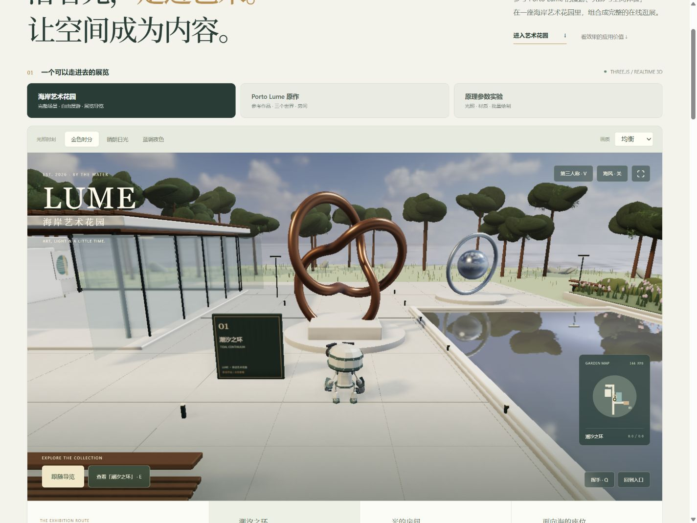

# 004 · Three.js · 空间体验理解与海岸艺术花园

本项目参考 Porto Lume，把 Three.js 的绘制、材质、光照、动画和漫游能力组合成一座可以参观的海岸艺术花园。以数字展览与园区导览为具体用途，让作品、建筑、路线、角色、地图和内容热点组成完整体验。原作在线接入与基础参数实验保留为对照。2026-10-04 已完成阶段理解整理，暂告一段落，后期按需求重启。

[返回总索引](../../README.md) · [研究笔记](notes/research.md) · [Web 源码说明](web/README.md) · [第三方声明](THIRD_PARTY_NOTICES.md)


引导图由可复现 SVG 脚本生成，网页中的五个图上入口可展开能力说明或打开同一个实时艺术花园。图为理解示意，演示为本地实现；完整生成提示与来源记录见[生成说明](notes/image-generation.json)。

[Web 理解总览与演示](https://yydshly.github.io/1002_codex_project/projects/004-threejs-worlds/#understanding) · [完整 SVG 引导图](assets/threejs-understanding.svg) · [JPG 预览](assets/threejs-understanding.jpg)

## 阶段理解与后期方向

| 维度 | 当前结论 |
| --- | --- |
| 库的能力 | Three.js 提供场景图、几何、模型、相机、材质、灯光、动画、拾取和实例化绘制；官方 addon 补充 glTF/HDR 加载、水面与后处理。 |
| 实现原理 | 输入改变意图，每帧按时间更新角色、骨骼和世界，Three.js 组织 GPU 把三维场景绘制成像素；材质光照决定质感，相机决定视野。 |
| 素材与应用职责 | 模型、贴图与动作来自独立素材；应用实现输入、碰撞、角色与镜头控制、路线、作品内容、地图和网络同步。 |
| 人物与机器人 | 真人有利于代入与现实尺度，机器人有利于陪伴和辨识，两者没有统一的优先级；比例、动作、脚步、镜头和环境的一致性共同产生舒服感。 |
| 使用场景 | 数字展览、文旅园区导览、产品展示、品牌空间、教学实验、轻量互动；空间关系与探索任务需要对应真实内容。 |
| 可扩展方向 | 更换授权角色、动作重定向与控制复用、脚步与镜头调校、复杂碰撞、可配置内容、加载和移动端预算、WebXR、多人房间同步与重连。 |
| 当前状态 | 现有单人艺术花园、原作对照与参数实验保留；阶段归档，按需求重启。扩展方向尚需实现，本地没有多人或 WebXR。 |

原作公开程序标注 **Renderpeople Nathan / scanned human explorer**，加载 `models/explorer-nathan.glb`；该名称确认素材系列，未确认具体商业 SKU。本地模型为 **RobotExpressive**，作者 **Tomás Laulhé / Quaternius**，由 **Don McCurdy** 整理为 glTF，使用 **CC0 1.0**；配色在本地调整。模型精细度、角色身份、骨骼动作和镜头手感分别影响体验，不能仅凭模型精细度判断整体价值。

后期重启可先确定具体目标：需要真人尺度时选人物素材，需要品牌陪伴时保留或设计机器人；再确定内容、设备与是否需要多人，围绕目标扩充控制、素材、业务与验证。当前不继续无需求的视觉迭代。



## 项目信息

| 项目 | 内容 |
| --- | --- |
| 固定编号 | `004` |
| 主展示 | 原创 LUME 海岸艺术花园，单人数字展览与园区导览 |
| 原作体验 | [Porto Lume](https://porto-lume-worlds.vercel.app/#world=solstice&room=commons)，主页面 iframe 接入与原站直达链接 |
| 渲染库上游 | [mrdoob/three.js](https://github.com/mrdoob/three.js)；不代表已取得原作应用仓库 |
| 渲染库研究版本 | `r180` / npm `three@0.180.0` |
| 渲染库固定 commit | [`0af9729d0c143a86a1d725d6e2c3ad83301f3f34`](https://github.com/mrdoob/three.js/commit/0af9729d0c143a86a1d725d6e2c3ad83301f3f34) |
| 渲染库许可证 | MIT；[保存的原文](assets/three-LICENSE.txt)；原作应用与模型许可未确认 |
| 研究日期 | 2026-10-03，Asia/Shanghai |
| 参考应用 | [Porto Lume · Solstice / Commons](https://porto-lume-worlds.vercel.app/#world=solstice&room=commons) |
| 演示入口 | 构建后访问 `/projects/004-threejs-worlds/`；[页面源码](web/index.html) |
| 研究状态 | 以 [项目目录](../catalog.json) 中的状态为准；本地运行证据见下方验证记录 |

## 海岸艺术花园

入口、雕塑庭院、玻璃展亭和海岸观景台组成一条可行走的路线。通过「跟随导览」自动参观，或点击画面后用 WASD 自由探索；展点按钮直接定位，走近作品按 E 或点击三维标牌打开说明。V 切换第三人称、第一人称和全景；Shift 奔跑，Q 挥手。手机提供方向按钮，拖动观察。

| 场景中的内容 | 组合的能力 | 承担的任务 |
| --- | --- | --- |
| 青铜曲面雕塑、镜面金属装置 | 金属 PBR、HDR/PMREM 环境反射、实时阴影 | 让材质与观看角度成为展览内容 |
| 玻璃展亭、木格栅、室内画作 | MeshPhysicalMaterial 透射、混凝土颜色/法线/粗糙度贴图、建筑细节 | 用建筑定义可进入的第二展区 |
| 反射水池与海面 | 官方 Water、镜像相机和离屏渲染、动态法线、距离雾 | 组织庭院并建立海岸氛围 |
| Lumo 导览员 | CC0 glTF 骨骼模型、AnimationMixer、站立/步行/跑步/挥手动作混合 | 提供空间尺度、移动反馈和自动参观 |
| 作品介绍、地图、路线入口 | Raycaster、位置映射、UI 与内容数据 | 将自由探索连接到具体信息 |
| 树冠、叶片、花坛与草 | InstancedMesh、实例颜色与变换、风动顶点 | 用有限绘制提交铺设连续景观 |
| 光照与画质 | 金色/日光/蓝调、灯具、SSAO 接触遮蔽、Bloom、ACES 输出 | 保持气氛一致，并提供不同设备的绘制预算 |

本地模型、两张 1k HDR 与三张材质图连同官方 addon 约 4.3 MiB，随页面保存，运行时无需 CDN。场景包含平面边界、花坛、水池、展亭和雕塑障碍判断，导览路线穿过展亭并绕开水池。画质「流畅」关闭阴影、反射更新、SSAO 与 Bloom；「均衡/精细」增加像素、阴影和反射预算。FPS 显示当前浏览器的即时状态，不能作为通用性能保证。

角色使用 Three.js 官方示例中的 RobotExpressive（CC0，重新配色为导览员），天空和混凝土来自 Poly Haven（CC0）；没有导入原作的 Renderpeople 人物。来源、作者与许可见[第三方声明](THIRD_PARTY_NOTICES.md)，固定资源与哈希见[素材清单](web/assets/manifest.json)。

## 原作实际效果

主页面将原作装入 iframe，原站负责加载场景、渲染、角色控制和联网；也提供直接打开原站的入口。原作 URL 中的三个 world 值由公开代码确认：

| 目的地 | URL | 体验重点 |
| --- | --- | --- |
| Porto Lume | [world=porto](https://porto-lume-worlds.vercel.app/#world=porto&room=commons) | 港湾、石砌建筑、水岸与旧城漫游 |
| Solstice Coast | [world=solstice](https://porto-lume-worlds.vercel.app/#world=solstice&room=commons) | 松林、海岸与木栈道 |
| Sable Observatory | [world=astral](https://porto-lume-worlds.vercel.app/#world=astral&room=commons) | 暮色中的岛屿与天文台 |

2026-10-03 已验证嵌入中三个目的地正常显示、进入漫游、键盘 V 切换第一/第三人称、光照设置和全屏进出。原站公开代码提供真实多人通路，本次观察到公共 MQTT 中继 `connack timeout`，未跨两个客户端验证联机。iframe 的显示、输入和网络能力依赖原站当前部署与浏览器；直接打开原站可用于体验完整交互。接入不会把原作程序、人物模型或服务器变为本地资源。

## 从原作提炼的有效价值

以下用途与迁移建议是基于观察和源码特征的设计判断，不代表原站已经验证了对应业务转化率。详细证据与实现边界见[研究笔记](notes/research.md)。

| 可迁移模式 | 原作效果与实现要点 | 适用场景 | 投入边界 |
| --- | --- | --- | --- |
| 氛围 | 天空、雾、水面、材质和克制 UI 形成连贯空间；统一光照/颜色/声音参数 | 品牌体验、文化展览、沉浸叙事 | 先做统一美术与一处完整场景；精细模型、反射与后处理需要素材和性能预算 |
| 漫游 | 角色、相机和移动让用户主动探索；输入、动画混合、轻量碰撞配合 | 展厅、建筑导览、互动故事 | 先打磨镜头与控制；复杂物理、可达性与移动端输入是额外工作 |
| 空间导航 | 三个目的地、传送门、地图与可分享链接结合 | 多展区、虚拟校园、主题空间 | 保留清楚的目的地入口与回退；场景地图和 world 路由由应用维护 |
| 多人房间 | 链接邀请、私房间、名字/颜色、挥手建立同在感；Trystero/WebRTC 同步人物状态 | 小型共同参观、导览、社交活动 | 原作限定 8 人；发现服务、直连可达性和同步规则需独立建设，大规模/持久会话超出当前证据 |
| 渐进进入 | 加载提示、欢迎页、Start walking、按需构建与缓存其他世界 | 访问成本较高的 3D 首页、展览入口 | 先明确首屏加载与进入动作；点击进入并不能单独解决加载体积和低端设备成本 |
| 性能分档 | Adaptive / High / Performance，像素预算、缓存与剔除，较高画质增加效果 | 面向多种电脑/手机的 Web 3D 产品 | 保留低成本路径并测目标设备；不承诺统一 FPS，阴影与反射仍有额外开销 |

## 本地原理实验补充

| 实验 | 画面和交互 | 学习重点 |
| --- | --- | --- |
| 三个小世界 | 港湾 `harbour`、松林海岸 `coast`、天文台 `observatory` | 用几何体和场景图组织空间；应用负责布局、切换和叙事 |
| 人物与镜头 | 程序化人物，WASD 行走、Shift 加速，first / third / orbit 镜头 | 人物位置、视角和相机变换如何共同决定画面 |
| 材质与光影 | dawn / day / dusk 光照、粗糙度、阴影开关 | 同一物体为何在不同灯光和材质参数下呈现不同质感 |
| 线框观察 | 切换线框显示 | 三维物体最终由顶点和三角形构成 |
| 批量树林 | 0–600 棵树，比较 InstancedMesh 与普通 Mesh 的绘制次数 | 实例共享几何与材质，保存各自变换；减少 draw calls 不等于减少三角形 |
| 空间热点 | 点击场景热点获得说明 | Raycaster 把屏幕位置转为三维射线并查找交点 |
| 多人原理 | 房间发现、直连、状态包、远端平滑的流程说明，以及原站入口 | Three.js 负责画人；网络库与应用协议负责让不同浏览器共享状态 |

基础参数实验使用程序化几何人物，主展示花园使用真正的 glTF 骨骼动画和 Water 反射。多人部分仍是流程说明，本地没有联机房间；原作的扫描人物、传送门和房间体验由嵌入站点提供。

## 本地运行

在仓库根目录运行：

```powershell
npm run build
node scripts/serve.mjs --port 4189
```

打开 [本地演示](http://localhost:4189/projects/004-threejs-worlds/)。端口占用时可换一个可用端口。使用仓库的 Node.js 环境（根 `package.json` 要求 Node.js ≥ 22）；本项目的 Three.js 静态 vendor 文件随源码保存，不需要另行安装 Three.js 依赖。仓库总构建仍遵循根项目已有依赖要求。

请通过 HTTP 预览；ES module 和静态资源不应通过双击 `file://` 页面加载。GitHub Pages 部署路径为 `/1002_codex_project/projects/004-threejs-worlds/`，资源使用相对路径。

## Three.js、应用和网络各做什么

Three.js 提供 Scene、Mesh、Camera、Material、Light、Renderer 等三维抽象，把场景绘制成浏览器中的像素。它也提供 Raycaster、InstancedMesh，以及 GLTFLoader、AnimationMixer 等模型与动画工具。人物移动规则、碰撞边界、镜头切换、场景入口、UI 和内容仍由应用代码编写。

Porto Lume 的公开发布资源显示 Three.js r180，以及 Trystero/WebRTC 多人机制：Nostr 或 MQTT 中继帮助同房间浏览器相互发现，随后玩家状态经 WebRTC 通道同步。联网与房间协议不是 Three.js 自带能力。研究只确认其代码通路，未做跨设备联机测试；原站体验可能随网络与部署变化。

## 适用场景

- 产品和品牌展示：把产品、空间或故事做成可探索的三维体验。
- 虚拟展厅与空间导览：用热点解释展品，切换视角和场景帮助理解位置关系。
- 教育与技术教学：用材质、灯光和批量渲染实验说明实时图形原理。
- 轻量浏览器游戏和互动地图：Three.js 负责显示，应用补充玩法、物理和状态管理。
- 小型社交空间原型：在三维画面外接房间发现与状态同步；还需另行考虑网络可达性、身份和持久化需求。

## 图片与验证记录

2026-10-03 在本机 Codex 内置浏览器完成已有本地原理实验的检查；见[结构化验证记录](notes/validation.json)、[完整页面](assets/full-page.jpg)、[手机总览](assets/mobile-overview.jpg)与[手机漫游](assets/mobile.jpg)。原作 iframe 是本次新增接入项，验证结果单独记录。

| 检查 | 状态 | 证据 |
| --- | --- | --- |
| 海岸艺术花园主展示 | 已验证 | glTF 动画导览、完整自动参观、三个展点、第一/第三/全景、W 与触屏接管、三维标牌拾取与 E；[主展示](assets/art-garden.jpg)、[展亭](assets/art-garden-gallery.jpg) |
| 花园光照、画质与窄屏 | 已验证 | 三种光照、三档画质、音频开关、浏览器内全屏进出；390×844 与 1440×1080 视口无横向溢出；[蓝调](assets/art-garden-night.jpg)、[手机](assets/art-garden-mobile.jpg) |
| 本地素材与模块 | 已验证 | 27 个模块依赖解析通过，26 个资源的字节数/SHA-256 匹配，glTF 必需四个动作存在；[清单](web/assets/manifest.json) |
| 原作 iframe 接入 | 已验证 | 三世界加载、进入漫游、V 切换人称、光照预设、全屏进出；[接入截图](assets/porto-integrated.jpg)、[手机接入](assets/porto-mobile.jpg) |
| 效果参考与价值提炼 | 已完成 | 六项「效果 / 原理 / 价值 / 场景 / 投入」；[价值拆解截图](assets/value-extraction.jpg) |
| 来源切换与生命周期 | 已验证 | 花园与实验按需创建；离开时停止 RAF、输入与音频；本地模式卸载原 iframe；参数卡片可恢复实验 |
| 本次窄屏接入布局 | 已验证 | 390×844 视口，文档宽度与内容宽度均为 375 px，无横向溢出；只验证布局，不作为原作触屏漫游测试 |
| Three.js 版本和许可证来源 | 已核对上游元数据与许可证原文 | [版本快照](notes/upstream-snapshot.json)、[许可证](assets/three-LICENSE.txt) |
| 本地构建 | 已通过 | `npm run build`、模块语法检查与根索引检查 |
| 三场景与镜头交互 | 已通过 | 三场景切换、WASD、第一/第三人称、暂停后挥手与重置 |
| 材质、阴影、线框和批量实验 | 已通过 | [线框与参数](assets/wireframe.jpg)；粗糙度、阴影与树木滑块 |
| 批量绘制对比 | 已测 | 同一海岸、600 棵树：[普通](assets/trees-ordinary.jpg) 2,120 次，[实例化](assets/trees-instanced.jpg) 323 次；三角面均约 82.1k |
| 热点与窄屏布局 | 已通过 | [天文台拾取](assets/hotspot.jpg)；390 px 测试视口，内容宽度与文档宽度同为 375 px，无横向溢出 |
| 多人机制教学 | 已通过本地流程验证 | 四步切换、500 ms 延迟后位置一致、重新开始重置位置；原站中继本次有连接超时，未执行真实联机 |

统计为 `renderer.info.render` 的主视角绘制调用与三角面，**不包含阴影通道**。阴影额外成本会影响帧率；线框以线段绘制，三角面计数也会改变。对比是当前设备与默认鸟瞰镜头下的观察，不代表所有设备的性能。

## 来源与改动

Three.js 的 vendor 文件来自固定版本官方仓库，保留版权与许可声明，未修改库代码。场景布局、建筑、展品、路线、界面与教学代码为本项目实现；主展示的角色、HDR 与 PBR 图来自独立 CC0 素材。Porto Lume 通过公开 URL 接入，没有复制其模型、页面样式、打包源码或场景资源。[研究笔记](notes/research.md)列出参考证据及限制。
