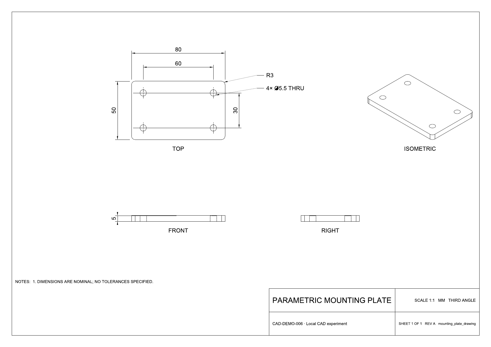

# 006 · text-to-cad · 参数化 CAD 能力实验室

**把尺寸需求分解成几何特征，编写参数化 Python 模型，生成可交换的 CAD 文件，再读回实际几何验收。** 本项目已经实测参数变体、电子外壳、工程图生成，以及带运动声明和完整责任分工的望远镜装配。

[返回总索引](../../README.md) · [研究笔记与证据](notes/research.md) · [模型清单](src/README.md) · [上游仓库](https://github.com/earthtojake/text-to-cad)

## 能力、原理、效果与价值总览

[完整理解整理](notes/understanding.md)归纳了本轮讨论：用户提供目标和真实配件，语言模型设计结构并写代码，插件组织执行与交付，OpenCascade 计算几何；保存后回读、测量并修正。涵盖核心 CAD、制造/打印/机器人扩展、实际配件输入、个人价值和复杂产品瓶颈，明确区分实测与文档能力。

[在线总览网页](https://yydshly.github.io/1002_codex_project/projects/006-text-to-cad/) · [一张图 PNG](assets/text-to-cad-understanding.png) · [可放大 SVG](assets/text-to-cad-understanding.svg) · [静态网页源码](web/telescope-demo/overview/index.html)。在线总览包含完整理解、实测图像、验收报告、配件输入模板与本地复现步骤，使用我们生成的同一张总览图。启动下面的本地演示服务后打开返回地址的 `overview/`；望远镜演示页顶部也有入口。实时 CAD 查看与运动操作需要本地服务。

内容源在 [understanding.json](notes/understanding.json)，运行 `uv run --frozen python scripts/build-understanding.py` 可重新生成总览图、详细网页和整理笔记。PNG / SVG 为同一张图，文本排版可编辑；生成器读取实际验收报告中的状态与检查项数。

## 望远镜完整演示

新增 [望远镜演示记录](notes/telescope-demo.md)：从用户实际目标到方案、假设参数、11 个实体、代码、插件/内核执行、独立验收、失败修正和用户交接，逐步标清责任。九个保存模型与两个运动姿态已视觉复核；537 项几何检查通过。物镜为几何占位，光学性能没有验收结论。

```powershell
pwsh -NoProfile -File scripts/run-telescope-demo.ps1
uv run --frozen python scripts/serve_telescope_demo.py
```

打开服务返回的 `demo_url`，即可逐步查看过程、切换装配/分解/调焦伸出，并在插件查看器中检查运动。[建模源码](src/telescope_assembly.py) · [目标假设](notes/telescope-target.json) · [修正前后验收](notes/telescope-validation.json)。

## 研究记录

| 项目 | 内容 |
| --- | --- |
| 固定编号 / 日期 | 006 / 2026-10-03，Asia/Shanghai |
| 固定上游版本 | 0.7.10；[f62f86746a9c74bab08f8e68d0fb76ba68dc3c86](https://github.com/earthtojake/text-to-cad/commit/f62f86746a9c74bab08f8e68d0fb76ba68dc3c86) |
| 原生插件 | 已在本机 Codex 用户级注册并启用 `text-to-cad@earthtojake` 0.7.10；[安装记录](notes/installation.json) |
| 项目环境 | Windows、Python 3.12、`cadgen[snapshot]==0.7.10`；[依赖定义](pyproject.toml)与 [uv.lock](uv.lock) |
| 本地技能 | 子项目 `.agents/skills/` 中有 13 个上游技能快照；该目录、`.venv/` 和缓存均已忽略 |
| 许可 | 上游 MIT；保留 [许可证副本](notes/upstream-MIT-LICENSE.txt) |
| 当前状态 | 首轮六个模型和工程图已复核；新增九个望远镜模型、两个运动姿态与 537 项几何检查均通过，完整复现脚本退出 0；总体状态见 [项目清单](../catalog.json) |

## 已完成的实验

首轮基础实验生成六个模型，每个均有 STEP 和 GLB；两块安装板另有 STL。源码保留尺寸、构造顺序和功能基准，文件可以继续重新生成。

| 实验 | 参数与实测结果 | 产物 |
| --- | --- | --- |
| 穿孔安装板 | 80×50×5 mm，R3 四角，四个 Ø5.5 通孔，孔距 60×30 mm | [源码](src/mounting_plate.py) · [STEP](STEP/mounting_plate.step) · [STL](STL/mounting_plate.stl) · [GLB](GLB/mounting_plate.glb) |
| 参数变体 | 同一几何工厂将长度改为 100 mm，X 孔距随之变为 80 mm；其余尺寸保留 | [源码](src/mounting_plate_wide.py) · [STEP](STEP/mounting_plate_wide.step) · [STL](STL/mounting_plate_wide.stl) · [GLB](GLB/mounting_plate_wide.glb) |
| 安装板与四根销 | 五个独立实体；销 Ø4.5×12 mm，穿过 Ø5.5 孔，径向最小间隙 0.5 mm，交叠体积为零 | [装配源码](src/plate_assembly.py) · [STEP](STEP/plate_assembly.step) · [GLB](GLB/plate_assembly.glb) |
| 电子外壳底座 | 外包络 100×70×30 mm，壁厚与底厚 3 mm，外角 R5、内角 R2；四个螺丝柱及 Ø3.2 通孔、两侧合计十个 6×8 mm 通风口 | [源码](src/enclosure_base.py) · [STEP](STEP/enclosure_base.step) · [GLB](GLB/enclosure_base.glb) |
| 独立上盖 | 100×70×3 mm，R5 四角，四个 Ø3.5 通孔；底面为本零件的 z=0 基准 | [源码](src/enclosure_lid.py) · [STEP](STEP/enclosure_lid.step) · [GLB](GLB/enclosure_lid.glb) |
| 外壳装配 | 底座、上盖为两个独立叶节点；装配源码把上盖底面放到 z=30.5，实测最小缝隙 0.5 mm，无交叠 | [装配源码](src/enclosure_assembly.py) · [STEP](STEP/enclosure_assembly.step) · [GLB](GLB/enclosure_assembly.glb) |

[安装板验收](notes/validation.json)和 [外壳验收](notes/enclosure-validation.json)均为 `pass`。检查读取保存的 STEP，核对包围盒、有效正体积实体、完整圆孔、孔轴位置、圆角、解析体积与装配间隙；外壳还检查选定空腔、底板、螺丝柱及通风口位置的实体占用。长度容差为 0.00001 mm，体积容差为 0.001 mm³。

## 工程图与视觉复核

[工程图脚本](scripts/drawing_demo.py)从安装板 STEP 投影生成 [A3 PDF](PDF/mounting_plate_drawing.pdf)：第三角三视图、斜视图、外形尺寸、孔距、厚度、通孔和圆角标注。线性尺寸由几何点计算，孔径由保存文件中的圆边测量，图中尺寸为名义值，未指定生产公差。



PDF 整页图与六张模型快照均已逐张查看并通过视觉复核，本地浏览器 CAD Viewer 已确认能显示六个模型。[视觉复核记录](notes/visual-review.json)与图像保存在 [assets](assets/)。

## 本地复现

在 PowerShell 中进入子项目，使用已安装的 `uv`：

```powershell
cd projects/006-text-to-cad
uv sync --frozen

# 为本项目 shell 快照安装 Chromium。
uv run --frozen python -m playwright install chromium --only-shell

# 生成六个模型，执行两组几何检查，生成 PDF 和模型快照。
.\scripts\run-demo.ps1
```

`.venv/` 是子项目独立运行环境；本机的 13 个技能快照位于忽略目录中，不随 Git 提交。`uv sync --frozen`依据锁文件恢复 CAD 运行时。原生插件注册属于本机用户配置；本次实际成功执行的安装命令为：

```powershell
codex plugin marketplace add earthtojake/text-to-cad --json
codex plugin add text-to-cad@earthtojake --json
```

全新检出需恢复项目技能：从插件安装返回的 `installedPath` 下，将 `skills/` 中的 13 个技能目录复制到子项目 `.agents/skills/`。选择本实验记录的 0.7.10 快照；安装证据见 [installation.json](notes/installation.json)。技能文件的恢复不包含未测能力的可选依赖。

[run-demo.ps1](scripts/run-demo.ps1)临时设置 `OPENBLAS_NUM_THREADS`、`OMP_NUM_THREADS`、`MKL_NUM_THREADS` 为 `1`，采用本次 Windows 环境验证使用的单线程 BLAS/OMP workaround；同时将 CAD 缓存放在项目忽略目录，运行结束后恢复原环境变量。

单独重建或检查时，同样使用脚本中的单线程环境设置：

```powershell
$env:OPENBLAS_NUM_THREADS = '1'
$env:OMP_NUM_THREADS = '1'
$env:MKL_NUM_THREADS = '1'
uv run --frozen python src/enclosure_assembly.py
uv run --frozen python checks/verify_enclosure.py
```

已有 STEP 可以通过原生插件的 CAD Viewer 接口打开。也可以从子项目目录启动本地查看器，使用返回 JSON 中的实际 `url`，端口由进程分配：

```powershell
uv run --frozen cadgen viewer --host 127.0.0.1 --json --detach
```

本次实际验证了浏览器查看器可用；原生工具返回了启动信息，自动 CAD tab 联动本次未验证。查看器读取已保存文件，修改源码后需要重新运行模型。上面的 Playwright 安装命令用于 shell 快照；原生查看器打开已有模型不依赖执行该快照安装步骤。

## 这项能力的意义与边界

复杂度来自可维护的特征分解：外壳由外轮廓、内腔、柱、孔和通风切口组成，装配再把独立零件按功能基准定位。代理负责解释需求、组织约束和写代码；build123d 与 OpenCascade 内核执行实体构造；保存后的几何回读证明本次尺寸、孔和间隙是否满足规格。

参数化设计意图保留在 Python 源码。STEP 提供独立的可交换几何；本实验没有导出商业 CAD 软件的完整原生特征历史。无尺度图片只能提供比例参考，配合尺寸仍需明确。任意雕塑、自动工程方案选择、材料与承载设计不在本次验收范围。

本次未测试制造审查、切片与实际打印、机器人描述/仿真或零件采购。外壳和销均为通用能力样例，未定义载荷、材料和生产公差。完整发现与证据见 [研究笔记](notes/research.md)。

## 来源与改动

以固定上游 commit 的技能、运行时说明和 MIT 许可为研究来源；本地新增六个建模入口、两个独立规格验收脚本、工程图脚本与 PowerShell 复现入口。模型源码为本次实验编写，未加入打印、下单或外部服务调用。
