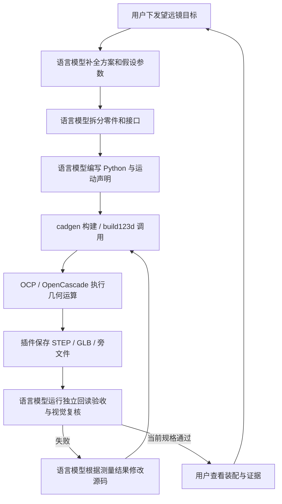

# 望远镜：从目标下发到 CAD 产物的完整演示

日期：2026-10-03 至 2026-10-04，Asia/Shanghai。沿用本项目已安装的 text-to-cad / cadgen 0.7.10、build123d 0.11.1 和 OCP / OpenCascade 运行环境。

[返回子项目](../README.md) · [目标与假设](telescope-target.json) · [实际构建记录](telescope-build-log.json) · [几何验收](telescope-validation.json) · [修正前报告](telescope-validation-before-repair.json) · [视觉复核](telescope-visual-review.json) · [页面与交互检查](telescope-browser-review.json) · [演示页截图](../assets/telescope-demo-page.png)

## 1. 用户实际下发的目标

> 那么以望远镜为准把，这里需要把步骤，包括下发目标，谁负责做什么都标记清楚，做一个完整的演示

这条目标规定了对象、完整演示与责任标记。用户没有指定望远镜类型、尺寸、光学指标或实际商品接口。

## 2. 语言模型补全的演示目标

我选择教学用折射式望远镜概念装配，包含物镜、主镜筒、调焦座、调焦滑筒、目镜、双环托架、叉架及底座。生成独立组件、整体装配、分解展示和实际伸出变体，再用插件的运动声明演示方位、仰角与调焦。

所有数值为本次明确记录的设计假设：物镜净口径 70 mm；主镜筒长 420 mm、外径 86 mm、内径 80 mm；轴线平行 X 轴、Z=355 mm；调焦行程 0–20 mm，径向间隙 0.25 mm；仰角 0–60°，方位 ±135°。玻璃几何没有光学处方，焦距、倍率和成像没有验收结论。

## 3. 谁负责什么

| 参与方 | 本次实际职责 | 产生的东西 |
| --- | --- | --- |
| 用户 | 提出目标，明确想理解的过程，审阅演示并提出下一轮要求 | 原始目标 |
| 语言模型（我） | 选择结构、设定假设参数、拆分零件、组织轴线与装配、编写 Python 和运动声明、设定验收、根据失败结果修正 | 源码、独立验收代码、步骤说明 |
| text-to-cad 技能 | 提供建模接口、文件组织、运动声明与验证流程的工作约定 | 我执行的技能说明与参考 |
| cadgen / build123d | cadgen 管理构建、子模型依赖、输出与旁文件；build123d 提供几何建模接口 | STEP、GLB、运动旁文件、构建记录 |
| OCP / OpenCascade | 接收建模 API 调用，执行曲面和实体运算，提供有效性、尺寸、最近点和交叠体积查询 | 三维几何与实际测量结果 |
| CAD Viewer | 读取已保存的 CAD 与运动声明，显示、选取、测量和驱动姿态 | 可交互的模型视图 |

插件依据明确的代码和声明执行。结构方案、部件划分、参数来源、装配关系及验收判断由我组织。网页各步标明输入、负责人、本步动作和下一个接收方。

## 4. 实际执行链路与步骤



| 步骤 | 输入 → 动作 → 输出 |
| --- | --- |
| 01 下发目标 · 用户 | 望远镜与过程要求 → 提出任务 → 原始需求 |
| 02 方案与参数 · 语言模型 | 原始需求 → 选择折射式结构、尺寸与验收 → 目标规格和假设 |
| 03 零件与接口 · 语言模型 | 目标规格 → 组织 11 个独立实体和三个自由度 → 装配树 |
| 04 建模代码 · 语言模型 | 装配树 → 编写实体构造、位置和运动关系 → Python 源码 |
| 05 执行 · 插件与内核 | 源码 → 构建、几何计算、导出 → CAD 文件与日志 |
| 06 验收 · 语言模型与内核查询 | 保存文件 + 独立规格 → 回读测量并判定 → 验收报告 |
| 07 修正 · 语言模型、插件与内核 | 失败报告 → 改结构、重建、再验收 → 修正后的装配与证据 |
| 08 交接 · 用户 | 模型与证据 → 查看、测量、提出修改 → 下一轮目标 |

## 5. 结构与文件

| 模型入口 | 内容 | 保存 STEP |
| --- | --- | --- |
| [telescope_tube.py](../src/telescope_tube.py) | 一个空心主镜筒 | [镜筒](../STEP/telescope_tube.step) |
| [telescope_objective.py](../src/telescope_objective.py) | 物镜框与双球面镜片几何占位 | [物镜组](../STEP/telescope_objective.step) |
| [telescope_focuser.py](../src/telescope_focuser.py) | 固定调焦座 | [调焦座](../STEP/telescope_focuser.step) |
| [telescope_focus_unit.py](../src/telescope_focus_unit.py) | 滑筒、目镜筒、镜片占位和眼罩 | [调焦单位](../STEP/telescope_focus_unit.step) |
| [telescope_cradle.py](../src/telescope_cradle.py) | 双环托架、托板与转轴销 | [托架](../STEP/telescope_cradle.step) |
| [telescope_mount.py](../src/telescope_mount.py) | 底座立柱与转动叉架 | [支架](../STEP/telescope_mount.step) |
| [telescope_assembly.py](../src/telescope_assembly.py) | 11 个实体的整体装配及运动声明 | [装配](../STEP/telescope_assembly.step) |
| [telescope_extended.py](../src/telescope_extended.py) | 调焦单位实际平移 20 mm 的保存几何 | [伸出变体](../STEP/telescope_extended.step) |
| [telescope_exploded.py](../src/telescope_exploded.py) | 功能组件分解展示，位置不用于装配验收 | [分解视图](../STEP/telescope_exploded.step) |

共九个 STEP、九个 GLB。[telescope_geometry.py](../src/telescope_geometry.py)为普通工厂函数，保留实体构造与假设参数；独立入口声明导出。装配从子模型组合，保留层级和标签。

整体装配的 [STEP 旁文件](../STEP/telescope_assembly.step.json)带有三种运动及 home、focused、observing 姿态。转移运动模型时需要同时保留这个旁文件。运动滑块改变显示姿态，原 STEP 的几何字节保持原始配置；伸出变体则是独立保存的真实几何。

## 6. 实际失败、修正与验收

实际执行经历了以下失败与修正：

1. 物镜最初的求交与裁切构造返回空结果。改为对已定位的原生实体求交，并由口径计算双球球心距，省去额外裁切，随后实体有效性检查通过。
2. 调焦运动的首次父对象标签与实际导出标签不一致，插件报告未找到引用。改为保存场景中的 `#telescope_tube`，三个运动目标成功解析。
3. 第一轮独立运动采样检查出现六项干涉失败，最大交叠体积 15121.56 mm³，发生于 60° 仰角的托架、镜筒与支架。报告保留为 [修正前证据](telescope-validation-before-repair.json)。
4. 我将支架底板从 Z=255..265 降为 Z=225..235，降低 30 mm，转轴仍在 (210,0,300)，并延长叉架支臂。保持原调焦间隙、位移、套接、运动范围和采样姿态要求，重新生成与验收。

最终 [独立回读验收](telescope-validation.json)为 **pass：537 项通过、0 项失败**。验收代码不导入建模源码参数，读取保存的 STEP B-rep；记录文件 SHA256、标签和实际测量。线性容差 1e-5 mm，交叠体积阈值 1e-3 mm³。

| 当前验收内容 | 结果 |
| --- | --- |
| 独立叶实体 | 11 个，各包含一个有效正体积实体 |
| 主镜筒 | 长 420 mm，Ø86 / Ø80，轴线位置和解析体积符合规格 |
| 调焦移动 | 四个移动零件均平移 20 mm，固定部件保持原坐标 |
| 调焦间隙 | 实测最小间隙与径向半径差均为 0.25 mm |
| 伸出套接 | 最外位置仍保留 12 mm |
| 静态干涉 | 基准和伸出装配全部 55 个零件对无超过阈值的交叠 |
| 运动采样 | 仰角/方位/调焦：(25°,35°,10 mm)、(60°,-135°,20 mm)、(60°,135°,0 mm)；每组 55 个零件对通过 |
| 运动数据 | 三种运动的类型、范围、目标引用和 STEP 哈希绑定通过 |

视觉复核另行执行：九个保存模型的快照，以及 focused、observing 两个由插件运动声明驱动的姿态快照，共 11 张，均已逐张查看。图像检查用于外观与显示复核，精确尺寸与间隙以保存 STEP 的测量为准。

## 7. 完整复现与交互演示

在子项目根目录运行：

```powershell
uv sync --frozen
uv run --frozen python -m playwright install chromium --only-shell
pwsh -NoProfile -File scripts/run-telescope-demo.ps1
uv run --frozen python scripts/serve_telescope_demo.py
```

服务输出 `demo_url` 和实际 `cad_viewer_url`，打开返回的演示 URL，终端保持运行。网页无额外外部前端依赖，内嵌的是插件自带 CAD Viewer。可以逐步查看目标、参数来源、结构分解、实际源码、构建记录、验收和修正对比，并切换装配、分解、调焦伸出。

网页是已完成建模过程的回放，三维查看器可实时交互。步骤按钮不重新调用语言模型或执行 Python；重新生成使用上述脚本。在整体装配中点击工具栏的 **Position**，用 azimuth / altitude / focus 调节方位、仰角和调焦。**Pose** 可选 home、focused、observing；其中 observing 的实际界面读数为 35° / 25° / 10 mm，组合运动已在独立查看器中验证。演示页的“单独打开”可展示完整工具面板。

## 8. 当前边界

该产物用于演示 CAD 几何与工作分工。镜片为几何占位；没有焦距、倍率、像差和成像结论。没有验证连续全行程碰撞、材料承载、稳定性、真实紧固及镜片保持结构、制造公差或商品接口适配。没有执行打印、采购或部署。

参考接口为本项目固定插件版本的 [模型契约](../.agents/skills/cad/references/step-generation.md)、[装配定位](../.agents/skills/cad/references/positioning.md)、[运动声明](../.agents/skills/cad/references/kinematics.md)和 [回读检查](../.agents/skills/cad/references/inspection-and-validation.md)；这些项目本地技能由安装流程恢复，不随 Git 提交。
