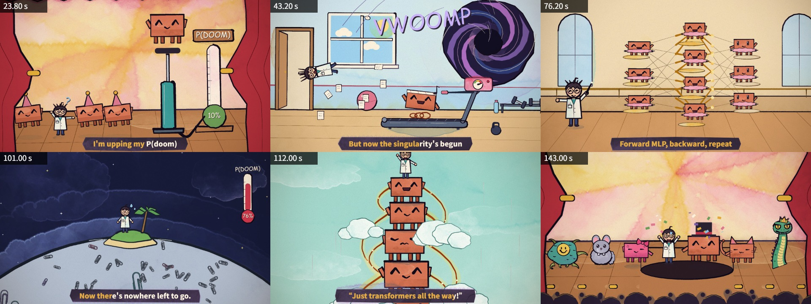
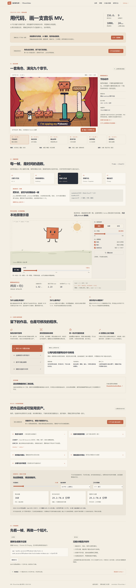

# 008 · PDoomVideo · 代码动画能力实验室

**能力**：用 JavaScript 编排角色、镜头、歌词和转场，在浏览器中逐帧绘制一部 156.6 秒、1920×1080 的水彩风音乐视频，支持静帧、检查图、短片及完整 MP4 输出。

**原理**：创作阶段由 AI 编写分镜与动画代码；运行阶段由 p5.js、p5.brush 根据时间绘制画面，Puppeteer 驱动 Chrome，FFmpeg 编码视频。每个镜头独立计算当前时间的画面，因而支持跳转预览和并行出帧。

**使用场景**：歌词 MV、品牌角色宣传、算法与概念讲解、动态图形和可重复输出的系列内容，尤其适合能拆成几何、角色动作与镜头编排的题材。

**价值**：展示 AI 编程如何把创意变成可编辑的时间轴、角色组件和渲染程序。值得借鉴的是精确时间控制、角色复用、章节协作和先看检查图再出片的工作方式。

**边界**：这是为固定歌曲编排的作品源码，不是输入任意文字或歌曲即可生成视频的通用模型。歌词与节拍预先写入，P(doom) 是剧情道具。包元数据声明 ISC，但不能据此推断音乐等素材的许可范围，详见 [第三方说明](THIRD_PARTY_NOTICES.md)。

[返回总索引](../../README.md) · [研究笔记](notes/research.md) · [能力实验室](web/index.html) · [一图理解效果、原理与价值](web/overview.html) · [角色与要素目录](web/elements.html) · [实际场景样例](web/example.html) · [上游画面重绘](web/source-studio.html) · [原作视频](https://youtu.be/8j-hR4fJywU)

## 一张图整理我们的理解

[理解总览](web/overview.html) 将已经确认的流程整理为可逐段阅读的网页及 [一张完整 PNG](web/assets/pdoom-understanding.png)：先准备角色、道具、风格和接口，AI 按故事写分镜与动画程序，再由程序根据时间绘画并编码视频。图中明确创作阶段与渲染阶段的分工，说明上色、风格控制、实际点灯分镜、四类使用场景、对个人制作流程的价值及投入边界。

总览直接使用 14 幅已有代码实际渲染的效果、角色、道具和分镜帧；原作与本地新场景分别标明来源与规格。PNG 为 3200×5830，原生 HTML / CSS 排版导出，文本仍可在网页编辑。页面另接入六秒实际 MP4，可跳转元素控制台和完整样例。导出来源与图片哈希见 [overview-manifest.json](web/assets/overview-manifest.json)，浏览器验证见 [overview-web-verification.json](notes/overview-web-verification.json)。

[](web/overview.html)

## 现成元素怎样准备和驱动

[角色与要素页面](web/elements.html) 用原始源码实际绘制 14 项预览：Clawd、研究员、群演组合与五个章节客串；舞台、表盘、打气筒、聚光灯、放射背景与绘图基础。每项注明源码位置、接口、可变参数、准备方式与依赖。群演复用 Clawd；客串接口位于章节作用域，迁移时要保留辅助函数。

页面按“造型函数 → 表演接口 → 场景道具 → 风格与创作说明”组织准备工作。实时控制台直接运行原始 `clawd()`、`researcher()` 和 `move()`，可改角色、动作、表情、配件、颜色、尺寸、位置、手臂与时间，查看实际重绘和对应调用代码。新故事输入框可生成并复制给能访问此项目文件的编码模型的创作任务；模型写新分镜和场景程序，播放阶段由程序执行。

14 张预览的原帧为 1920×1080，网页图为 960×540。[实际绘制记录](notes/elements-render-results.json) 和 [9 项浏览器检查](notes/elements-web-verification.json) 均已完成，检查覆盖目录、源文件、准备说明、模型任务、真实参数驱动、同参数复现与桌面 / 手机布局。具体接口与准备清单见 [准备指南](notes/elements-guide.md)。

## 实际场景：点亮一盏灯

[打开六秒实际样例](web/example.html)：角色发现按钮、走近、按下后灯泡亮起，再开心庆祝。页面把本次 AI 编写的四段分镜、实际姿态参数、上色步骤、三种风格和最终 MP4 放在一起，可以播放、逐帧查看和下载。

样例新增故事和道具，复用 PDoomVideo 原始 `core.js`、`clawd.js` 及 p5.brush；三种风格共用动作函数。原始出帧为 1920×1080，12 FPS，三种风格各 72 帧，编码为六秒无声 H.264 MP4。网页逐帧预览为 960×540。具体分镜与复用范围见 [样例说明](notes/example-storyboard.md)，实际渲染记录见 [example-render-results.json](notes/example-render-results.json)。

样例的 9 项验证全部通过：源码哈希与 FFprobe 规格、分镜跳转、逐帧与键盘、同动作换风格、三种实际视频播放与暂停、上色拆分、1440px / 375px 布局、原始代码重绘和浏览器错误检查。结果见 [example-web-verification.json](notes/example-web-verification.json)。

## 项目信息

| 项目 | 内容 |
| --- | --- |
| 固定编号 | `008` |
| 来源 | [PDoomVideo](https://github.com/JohnHeibel/PDoomVideo) |
| 研究日期 | 2026-10-04（Asia/Shanghai） |
| 固定版本 | [fa546a3](https://github.com/JohnHeibel/PDoomVideo/tree/fa546a38092e75f2b079e6a86d6abc54dd525d17)，包声明 `pdoomvideo@1.0.0` |
| 许可证 / 使用条款 | `package.json` 声明 ISC；本次版本未发现独立 `LICENSE` 文件 |
| 研究状态 | 以 `../catalog.json` 中的状态为准 |
| Web 演示 | HTML / CSS / JavaScript 静态页面、真实上游帧与本地 Canvas 原理实验 |

## 这个仓库实际实现了什么

上游把歌曲安排成实验室、舞台、起飞、宇宙、道路、数据中心和谢幕等九个章节。Clawd 与 Researcher 使用可复用的绘图函数，靠姿态、表情和大小变化维持造型一致；客串角色和道具由章节扩展。具体画面包括沿损失曲线滑行、黑洞吸入物体、骑火箭滑板、纸夹洪水和舞台揭幕反转。[分镜说明](https://github.com/JohnHeibel/PDoomVideo/blob/fa546a38092e75f2b079e6a86d6abc54dd525d17/STORYBOARD.md)

水彩渗边、墨线、纸张颗粒和暗角由程序绘制及合成产生。角色动作使用关键帧、缓动、节拍脉冲和伸缩变形；镜头支持推拉、平移、倾斜与震动。除了笔刷擦屏，还有大嘴闭合遮住镜头、心形气泡覆盖、落入黑暗和爆炸后烟雾散开的剧情转场。[绘制核心](https://github.com/JohnHeibel/PDoomVideo/blob/fa546a38092e75f2b079e6a86d6abc54dd525d17/src/core.js)、[动画指南](https://github.com/JohnHeibel/PDoomVideo/blob/fa546a38092e75f2b079e6a86d6abc54dd525d17/ANIMATION_GUIDE.md)

## 本地展示怎样区分真实效果与示意

- **上游实际画面**：固定版本的原始章节与绘画代码在本机产生静帧和无声短片，展示水彩效果、角色动作与镜头。另有 [按时间重绘页面](web/source-studio.html)，直接运行上游代码，可拖动到指定歌曲时间。
- **本地原理实验**：轻量 Canvas 与可操作管线用来解释时间、节拍和线条抖动；它们另行编写，不代表上游的水彩画质或性能。
- **原作观看入口**：完整音乐视频通过 [YouTube](https://youtu.be/8j-hR4fJywU) 访问，本站不镜像完整视频或歌曲 MP3。

本地重绘使用系统字体回退，文字形状可能与原作不同；复杂水彩帧需要等待绘制完成，不属于实时播放器。真实媒体文件与浏览器验证结果见下方记录。



六个时点分别为 23.8、43.2、76.2、101、112、143 秒。每个原始静帧为 1920×1080；上图为 1920×720 的检查图，便于比较各章画面。

### 能力实验室页面预览



[桌面原理区域](assets/lab-principles-desktop.png) · [375px 手机页面](assets/lab-page-mobile.png) · [手机原理区域](assets/lab-principles-mobile.png)。这些是本地展示页的浏览器截图，与上方上游渲染检查图区分来源。

## 输入怎样变成视频

```text
分镜 + 固定歌词时间 + 角色 / 道具参数
                    ↓
     时间轴按 t 选择章节与镜头
                    ↓
      关键帧 / 节拍 / 缓动求姿态
                    ↓
   p5.js + p5.brush 绘制与纸纹合成
                    ↓
       Chrome 输出指定时间的图像
                    ↓
          FFmpeg 编码视频文件
```

`renderAt(t)` 直接计算“这一秒的画面”，无需累计上一帧的位置。这支持时间滑块、乱序出帧与补渲缺帧。线稿随机种子每秒重置 12 次，制造轻微手绘抖动，同时让变化仍由时间决定。歌词开始和结束时间预写在数组里，节拍固定为 88 BPM；没有自动听歌、识别歌词或逐音素口型对齐。[核心入口](https://github.com/JohnHeibel/PDoomVideo/blob/fa546a38092e75f2b079e6a86d6abc54dd525d17/src/core.js#L178-L207)、[歌词与时间轴](https://github.com/JohnHeibel/PDoomVideo/blob/fa546a38092e75f2b079e6a86d6abc54dd525d17/src/timeline.js)

## 本地复现

本页是静态展示。已有总站构建环境时，在仓库根目录执行：

```bash
npm run build
node scripts/serve.mjs --port 4191
```

打开 `http://localhost:4191/projects/008-pdoom-video/`。首次准备总站环境见 [部署指南](../../docs/deployment.md)。浏览能力实验室无需 Claude 登录或模型 API Key；外部原作视频需要网络访问。

完整上游复现需在独立 PDoomVideo 目录安装依赖并准备 Node.js、Chrome 和 FFmpeg。`puppeteer-core` 不自动下载 Chrome。以下是上游接口示例，最后编码步骤会使用上游目录中的音乐文件：

```bash
npm install
node render.mjs --stills=0.8,23.8,106.6 --out=out/check
node render.mjs --sheet=23,23.5,24 --cols=3 --w=640 --out=out/check.jpg
node render.mjs --frames=0:156.6 --workers=4
node render.mjs --encode --out=out/pdoom.mp4
```

Chrome 默认路径和 GPU 参数带有 Windows 环境假设，其他系统需调整。本研究未复制 `assets/pdoom.mp3`。[渲染器](https://github.com/JohnHeibel/PDoomVideo/blob/fa546a38092e75f2b079e6a86d6abc54dd525d17/render.mjs)、[Web 说明](web/README.md)

本地另写 [证据渲染脚本](tools/render-evidence.mjs)，执行本地重绘页中的原始 `renderAt(t)`，保留 1920×1080 画幅并记录 GPU 与逐帧耗时。它专门输出无声片段，不使用上游音乐。以下命令从仓库根目录执行；需有 Chrome，短片编码还需 FFmpeg：

```bash
npm --prefix projects/008-pdoom-video/tools ci
node projects/008-pdoom-video/tools/render-evidence.mjs
node projects/008-pdoom-video/tools/render-evidence.mjs --stills=none --clip=23:26 --fps=12
```

参数、硬件后端与错误记录见 [工具说明](tools/README.md)。本地示例短片采用 12 FPS；上游渲染器默认 24 FPS，两者不要混同。

## 本地验证记录

- **真实静帧**：六个上述时点已由上游代码完成本机重绘，使用 Chrome 154 与 Intel UHD / ANGLE D3D11 硬件后端，输出 1920×1080。各帧绘制耗时约 4.85–13.14 秒，实际结果见 [render-results.json](notes/render-results.json)；不能据此将原画面称为实时动画。
- **真实无声短片**：[pdoom-chorus.mp4](web/assets/pdoom-chorus.mp4) 已完成，歌曲时间 23–26 秒，12 FPS、36 帧、H.264、1920×1080，无音轨；文件 6,748,442 字节，记录的总输出耗时约 289.9 秒。`lastRun.status` 为 `success`。
- **本地 Canvas 示意**：在桌面与 375px 窄屏检查暂停、时间拖动、三种动作、BPM 与图层、键盘及像素复现；同时间同配置重复绘制，以及跳转离开再返回，图像数据一致。此结果仅针对本地示意，不代表上游 p5.brush 的性能或跨设备一致性。
- **完整页面**：1440×1000 与 375×1000 视口的 12 项浏览器检查全部通过，包括六图切换、五步管线、四类场景、Canvas 控制、视频实际播放与返回静帧；两种视口无横向溢出，控制台错误 / 警告、页面错误、失败请求和 HTTP 资源错误均为零。详见 [web-verification.json](notes/web-verification.json)。FFprobe 另确认短片为 12 FPS、36 帧、3 秒，仅有视频轨。
- **总站检查**：`npm run check` 检查 8 个项目通过，`npm test` 的 16 项脚本测试全部通过，`npm run build` 成功。完整 156.6 秒成片未在本机渲染。

## 核心设计与实验

详细分析和实验记录见 [研究笔记](notes/research.md)。

## 可复用资产与投入要求

补充记录日期：2026-10-04。下面将上游 `src/` 对应到已保留的本地模块；这些文件互相依赖，应结合 [重绘入口](web/source-studio.html) 的加载顺序阅读。表中的价值是设计判断，未测量新项目的制作时间节省或内容效果。

| 资产类别 | 本地模块 | 复用价值 | 制作新内容需要改什么 |
| --- | --- | --- | --- |
| 角色 | [clawd.js](web/vendor/pdoom/clawd.js)、[cast.js](web/vendor/pdoom/cast.js) | 固定造型、姿态、表情、节拍动作和持物接口保持角色一致 | 新角色轮廓、配色、服装、表情及道具；按新镜头编排动作，客串角色仍需另画 |
| 绘画 | [core.js](web/vendor/pdoom/core.js)、[props.js](web/vendor/pdoom/props.js) | 几何形状、水彩与墨线、纸纹、镜头和舞台道具可组合 | 调色板、场景几何、纹理强度、构图与道具；用静帧确认对比、字幕避让和绘制成本 |
| 时间轴 | [timeline.js](web/vendor/pdoom/timeline.js)、[lyrics.js](web/vendor/pdoom/lyrics.js)，以及 `core.js` 的时间工具 | 按时间定位镜头、关键帧、字幕和节拍事件，可独立求每帧 | 新歌词起止时间、BPM / 偏移、章节与镜头边界；P(doom) 数据按新剧情替换 |
| 渲染 | [本地证据工具](tools/render-evidence.mjs)、[上游 render.mjs](upstream/render.mjs)、[source-studio.html](web/source-studio.html) | 指定时刻出帧、检查图、视频编码和缺帧恢复逻辑可参考 | Chrome / FFmpeg 路径、分辨率与帧率、输出范围、字体和声音策略；本地工具输出无声样例 |
| 分镜 | [STORYBOARD.md](upstream/STORYBOARD.md)、[ANIMATION_GUIDE.md](upstream/ANIMATION_GUIDE.md)、[章节目录](web/vendor/pdoom/ch/) | 镜头列表、私有章节作用域、明确焦点和动作转场提供组织方式 | 新内容的故事、镜头动作、连续场景与转场；这些代码镜头不是通用素材搜索或自动分镜服务 |

实际投入包含内容脚本、角色与场景绘制、JavaScript / p5 参数调整、时间对齐、GPU 出帧与视觉验收。先修改少量镜头并检查关键时点，再渲染短片，可以更早发现动作和构图问题。以下范围是首个小实验的建议，不是已验证的项目效果或交付承诺。

| 场景 | 输入 | 可复用 | 新增工作 | 建议首个小实验 |
| --- | --- | --- | --- | --- |
| 音乐 MV | 音频、歌词时间、节拍和角色设定 | 角色动作、镜头注册、歌词条与出帧 | 为新歌曲写分镜、对齐时间、设计衔接并验收镜头 | 3–6 秒、一句歌词、1–2 个镜头；先看静帧，再试低帧率无声片段 |
| 品牌角色短片 | 角色规范、配色、文案与目标动作 | 姿态、表情、持物钩子和绘画风格 | 绘制品牌角色与道具，建立造型和动作规范 | 3–5 秒、一个角色与一件道具，完成欢迎动作和一次表情变化 |
| 教学讲解 | 已核对的知识点、图示关系与旁白时间 | 几何、关键帧、文字和镜头 | 设计可读图示、同步讲解并核对事实 | 5–8 秒、一个概念或因果过程，以少量图形验证是否看得懂 |
| 模板化素材 | 固定分镜、可变文案 / 颜色参数和输出规格 | 时间函数、绘图组件和导出逻辑 | 提取配置、处理不同输入、批量导出与质量检查 | 2–4 秒、一个动作，两组文案或颜色配置；检查首尾和不同参数下的布局 |

### 怎样读渲染工作量

上游渲染器默认 **24 FPS**，本地 3 秒样例采用 **12 FPS**；`core.js` 的 **12 次/秒种子更新**只控制手绘线条变化，三者不同。改变输出 FPS 会改变要画的帧数，种子频率不会把成片自动降成 12 FPS。

六个真实静帧在这次环境中约为 4.85–13.14 秒/帧；23–26 秒短片的 36 帧输出记录为 289.9 秒。这是一次实测，不是所有镜头、完整视频或多 worker 的吞吐测量。[实测数据](notes/render-results.json)

理论工作量可用 `帧数 ≈ 时长 × 输出 FPS`、`单 worker 绘制工作量 ≈ 帧数 × 样本秒/帧` 理解，区间取整以实际工具为准。按六帧样本作算术换算，3 秒 / 24 FPS 约 72 帧，对应约 5.8–15.8 分钟；156.6 秒 / 24 FPS 约 3,759 帧，对应约 5.1–13.7 小时。**这些是样本外推，均未实测**，不包含分镜、代码迭代、素材准备和完整验收，不能当作交付耗时预测。

把该工作量除以 worker 数只能表示理想并行假设。本机尚未测量多 worker 加速；多个 Chrome 页面共享 GPU、内存和传输资源，实际收益需用同一片段单独比较。详细口径与建议实验见 [研究笔记](notes/research.md#渲染成本解读)。

## 采用判断

适合先借鉴动画组件与离线出片流程。写实摄影、复杂通用三维动作、实时移动端效果和任意提示词视频生成需要另选或增加技术。本次不据轻量 Canvas 实验推断上游性能，也不宣称已完整验证 156.6 秒成片。

作者另推荐 [ClaudeAnimationBase](https://github.com/JohnHeibel/ClaudeAnimationBase) 作为更通用基础。本研究只覆盖 PDoomVideo，未验证该项目。[作者说明](https://github.com/JohnHeibel/PDoomVideo/blob/fa546a38092e75f2b079e6a86d6abc54dd525d17/README.md)

## 来源与改动

来源为 JohnHeibel 的 [PDoomVideo](https://github.com/JohnHeibel/PDoomVideo/tree/fa546a38092e75f2b079e6a86d6abc54dd525d17)。作者声称代码与分镜由 Claude Code 中的 Claude Opus 5.5 生成；这是创作过程的作者自述，源码审查能确认运行机制，不能独立证明全部创作来源。

本地新增中文研究、静态能力页面、原理实验与重绘入口，保留原始动画脚本和固定版本记录；本机字体回退不被称作原作逐像素复现。资源来源和许可范围见 [THIRD_PARTY_NOTICES.md](THIRD_PARTY_NOTICES.md)。
