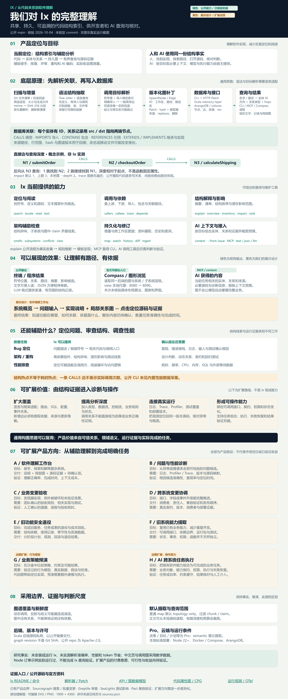

# 010 · Ix · 代码图谱理解与产品方向

**能力**：供开发者和 AI 使用的持久代码结构索引。抽取函数、类及调用、导入等关系，提供源码定位、依赖导航、结构检查、潜在影响分析和任务上下文；通过 CLI / MCP 复用同一份结构事实。

**原理**：Tree-sitter 解析源码，提取实体和调用、导入、包含关系，经规则解析与图补丁写入本地 ArangoDB 和 Scala memory-layer；CLI、MCP 与 Compass 可视化共享这份持久图谱。

**展示效果**：实体位置、关系与路径、结构摘要、影响候选、JSON / LLM 记录及 Compass 入口。本研究网页提供一张完整理解图、分区缩放、文字解读和调用查询教学交互，示例均标明来源与实测范围。

**使用场景**：接手陌生仓库、沿业务入口追踪代码、重构前评估依赖、审查架构、为 Codex 等 Agent 提供与当前任务相关的代码上下文。

**价值**：把反复搜索和阅读积累为可复用、可追溯的结构索引，减少每次会话重新理解代码的工作；也为我们研究代码分析工具与 Agent 上下文设计提供实现参考。实际节省和分析质量仍需在目标项目中测量。

**可扩展产品方向**：软件理解工作台、问题 / 性能诊断、业务变更验收、跨系统变更协调、旧功能退役、旧系统能力提取、业务策略预演和 AI 跨系统任务执行。需进一步补充业务模型、真实运行证据、接口契约、权限与执行验证；这些是待验证的产品假设。

**边界**：关系来自静态提取与启发式解析，影响分析给出候选范围，不能证明运行时行为或所有变更风险。公开仓库不含私有 Scala 后端源码，部分项目记忆功能属于 Pro，向量语义搜索依赖云提取服务。本次只完成源码研究和中文说明页，没有安装或启动 Ix 后端。

[返回总索引](../../README.md) · [研究笔记](notes/research.md) · [中文说明页](web/index.html) · [PNG 总览图](assets/ix-understanding.png) · [SVG 总览图](assets/ix-understanding.svg)

[](assets/ix-understanding.svg)

引导图使用本轮生成的完整 **1800 × 4360** 图，点击打开可编辑 SVG；绿色表示当前能力与公开机制，黄色表示展示设计和扩展产品假设。网页提供同图分区阅读、缩放和文字说明。

## 项目信息

| 项目 | 内容 |
| --- | --- |
| 固定编号 | `010` |
| 来源 | [Ix](https://github.com/ix-infrastructure/Ix) |
| 研究版本 / 访问日期 | 公开 `main` 文档与关键源码；2026-10-04，Asia/Shanghai；未锁定 commit |
| 许可证 / 使用条款 | 公开仓库的 [LICENSE](https://github.com/ix-infrastructure/Ix/blob/main/LICENSE) 为 Apache-2.0；不据此推定私有后端和 Pro 的授权条款 |
| 研究状态 | 源码研究与说明整理已完成；实际运行、准确率和性能验证未执行 |
| Web 演示 | [web/index.html](web/index.html)；中文静态说明与交互示意，无 Ix 后端连接 |
| 证据清单 | [sources.json](notes/sources.json) · [upstream-snapshot.json](notes/upstream-snapshot.json) |

本次依据公开文档和源码交叉核对。网页检索可能返回缓存，`main` 也可能继续变化；未获得可信 commit SHA，因此不把访问日期表述为固定源码快照。

## 它解决什么问题

开发者或 Agent 面对大型代码库时，常需要先找到定义，再查谁调用它、它导入哪些模块、下游还有什么依赖。重复读取全文容易丢失结构，也会占用 AI 上下文。Ix 把这些结构保存为图，使后续问题可以从一个明确目标出发，返回与任务相关的信息。

可以把它理解为**代码库的持久结构索引和查询工具**。这里的记忆首先是保存下来的代码图谱；模型不会因为安装 Ix 就重新训练，也不会自动理解所有业务约定。

这张图用于整理理解，不是上游产品截图；说明页中的关系图和交互也采用示意数据。

完整理解图为 **1800 × 4360** 可编辑 SVG，提供 PNG。网页将同一张图分成八个阅读范围，并提供完整总览、缩放及八组文字解释。绿色表示公开能力与已核验机制，黄色表示展示设计、扩展路线和产品假设。原理部分包含直接 CALLS 边和一跳 / 两跳的订单例子；诊断部分区分静态结构线索与真实运行证据。

## 展示效果、扩展价值与产品方向

Ix 的当前结果包括实体位置、关系与路径、结构摘要、影响候选、JSON / LLM 记录和 Compass 可视化入口。我们的展示设计将系统概览、局部关系图、解释与源码证据联动，让人能找到实现、核对依据和记录待确认项。本次未运行 Compass，也未核验其具体布局或交互。

扩展路线分四层：扩大语言与框架关系覆盖；增加类型、控制流、数据流、业务规则和状态；连接日志、Trace、Profiler、测试覆盖及部署版本；绑定接口、契约、权限和执行能力。运行信息应定位回同一版本源码。静态调用关系不能直接充当业务因果、性能数据或正确性证明。

| 产品假设 | 预期交付 | 关键补充 |
| --- | --- | --- |
| 软件理解工作台 | 解释、局部图、代码证据、待确认项 | 任务交互、证据组织与更新 |
| 问题 / 性能诊断 | 可检验、可复现的故障与瓶颈候选 | 日志、Trace、Profiler 和版本映射 |
| 业务变更验收 | 实现遗漏、例外破坏与验证缺口 | 团队确认的业务规则及测试映射 |
| 跨系统变更协调 | 消费者、兼容证据、责任人与发布顺序 | 契约、部署和消费者版本 |
| 旧功能安全退役 | 退役计划、观测、回滚与资源回收 | 使用记录、季节性、成本和依赖 |
| 旧系统能力提取 | 可调用接口、运行包和验证测试 | 状态、事务、权限与运行约束 |
| 业务策略预演 | 沙盒中的策略、约束与结果比较 | 行为模型、真实数据、假设与校准 |
| AI 跨系统任务执行 | 多个软件能力组合完成的任务 | 业务对象、契约、权限、执行与失败恢复 |

这些方向不是 Ix 现成能力，也没有验证市场、付费意愿和收益。相邻能力已有 Sourcegraph、Greptile、SeaLights 和 Pact 等产品覆盖；应在具体用户与任务中寻找差异。详细交付结果和验证指标见网页“按问题读图”与总览图第 07 部分。相关官方参考见 [sources.json](notes/sources.json)。

Bug 排查可以由结构查询缩小代码范围，根因仍需复现和运行证据；按依赖数排序得到结构热点，不是 CPU 耗时或调用频率。公开 CLI 未见内置性能数据采集，运行观测集成是扩展方案。

## 能做什么

| 能力 | 代表命令 | 回答的问题 | 需要注意 |
| --- | --- | --- | --- |
| 建立与更新图谱 | `map`、`watch` | 当前代码库有哪些实体和关系？ | 修改后需要刷新；跳过或失败的解析影响完整性 |
| 定位与阅读 | `search`、`locate`、`read`、`text` | 符号定义在哪里？相关源码是什么？ | 同名目标需消歧；`text` 使用 ripgrep |
| 结构理解 | `explain`、`overview`、`inventory` | 模块包含什么、连接到什么？ | 结构信息不等于业务语义证明 |
| 关系导航 | `callers`、`callees`、`imports`、`imported-by`、`depends` | 谁调用谁？谁依赖谁？ | 依赖已提取、成功解析的静态边 |
| 流程与影响 | `trace`、`impact` | 从入口关联到哪些代码？修改要优先检查哪里？ | 不是实际请求追踪，也不是必然故障清单 |
| 架构线索 | `rank`、`smells`、`subsystems` | 哪些组件关联多？哪里值得检查？ | 图结构线索需要结合设计判断 |
| 历史与差异 | `history`、`diff`、`patches` | 图谱实体和关系怎样变化？ | revision 是图谱修订号，不是 Git commit SHA |
| 上下文提取 | `context <target>` | 给这个目标生成一份有限的上下文 | 可限制实体、关系、证据和字符量 |
| GitHub 资料导入 | `ingest --github owner/repo` | 纳入 issues、PR、commits 资料 | 该形式访问 GitHub，并非所有操作都只访问本地 |
| AI 与可视化接入 | `mcp`、`view` | 让 Agent 或人浏览相同图谱 | MCP 提供工具；Compass 是上游可视化客户端 |

表中命令均使用 `ix` 前缀，能力可在 [OSS 注册表](https://github.com/ix-infrastructure/Ix/blob/main/ix-cli/src/cli/register/oss.ts) 和 [MCP 实现](https://github.com/ix-infrastructure/Ix/blob/main/ix-cli/src/mcp/server.ts) 核对，用法见 [Ix 命令参考](https://github.com/ix-infrastructure/Ix/blob/main/skills/ix/references/commands.md)。本研究页使用自编示例数据，不是真实 Ix 输出。

上游 README 声明支持 27 种代码语言，并识别若干配置和数据格式。我们未逐语言测试；能解析一种语言不代表完整恢复其动态类型、反射或所有框架关系。[语言支持说明](https://github.com/ix-infrastructure/Ix#supported-languages)

## 底层原理

处理链路分为六步：

1. **扫描与筛选**：遍历工作区；增量摄取利用文件时间和内容 hash，处理变化或删除的文件。
2. **语法解析**：Tree-sitter 识别语法结构，提取函数、类、模块，以及调用、导入、包含记录。
3. **关系解析**：根据明确导入、有限再导出和同语言唯一名称等规则连接目标；歧义或过于常见的名称可能不连边。
4. **生成图补丁**：实体、边及来源信息组织为 patch。符号 ID 结合工作区、规范化路径和限定名；patch ID 结合路径、内容 hash 与提取器版本帮助去重。
5. **持久化与版本化**：补丁提交给 memory-layer，在 ArangoDB 保存图、来源与图谱修订；后端提供结构查询接口。
6. **提取与呈现**：CLI、MCP、Compass 调用共享接口，从目标取邻域或有限上下文；开发者或外部 Agent 解读这些证据。

证据包括 [解析与连边](https://github.com/ix-infrastructure/Ix/blob/main/core-ingestion/src/index.ts)、[图补丁构造](https://github.com/ix-infrastructure/Ix/blob/main/core-ingestion/src/patch-builder.ts)、[CLI 摄取](https://github.com/ix-infrastructure/Ix/blob/main/ix-cli/src/cli/commands/ingest.ts) 和 [HTTP API](https://github.com/ix-infrastructure/Ix/blob/main/docs/api/README.md)。细节及限定条件见研究笔记。

查询收益来自提取任务对应的图切片，减少为了确认一个关系反复读取完整文件的工作。输出可用 `text`、`json` 或面向 Agent 的 `llm` 格式；AI 客户端仍需自己的模型和工具执行能力。[Ix README](https://github.com/ix-infrastructure/Ix#the-model)

## 适合的使用场景

| 场景 | 具体用法 | 预期价值 | 仍需完成的工作 |
| --- | --- | --- | --- |
| 接手陌生项目 | 概览模块，再定位符号、读少量源码 | 形成可核对的结构地图 | 确认业务、部署和外部系统 |
| 重构公共函数 | `impact` / `callers` 查调用者 | 缩小阅读和回归范围 | 编译、测试、契约与动态调用检查 |
| 排查登录流程 | 从明确入口用 `trace`、`callees` 展开 | 找到跨文件实现路径 | 用日志、调试器或 tracing 验证实际执行 |
| 架构与代码评审 | 检查高连接组件、子系统与 smells | 找到结构热点 | 判断依赖是否合理、是否符合业务分层 |
| AI 编码任务 | MCP 获取目标上下文，再读源码 | 结构证据可跨会话复用 | 核对源码并验证修改 |
| 多仓库依赖分析 | 为共享后端内的工作区建立包导入连接 | 观察部分跨仓库关联 | 检查 stitch、包声明与边的新鲜度 |

这些场景是根据实现推导的建议，没有对生产效果作保证。跨仓库 stitching 连接明确的包生产者和消费者，不能据此推断已识别全部微服务 HTTP、消息队列或数据库关系。

## 公开功能、Pro 与云服务边界

| 范围 | 已核对的边界 |
| --- | --- |
| 公开仓库 | 解析库、CLI、MCP、共享客户端与可视化相关代码；源码许可证为 Apache-2.0 |
| 本地后端 | Compose 启动 ArangoDB 和公开 memory-layer 镜像；Scala 源码在私有 `Ix-memory` 仓库，本仓库不能重建完整后端 |
| OSS 上下文 | `context` 在 OSS 注册表中；MCP 提供有限、确定性的 `ix_context` |
| Pro 项目记忆 | `briefing`、决策、目标、计划、任务、truth、workflow 等由独立 Pro 包提供 |
| 语义向量搜索 | API 文档要求云提取服务，未配置时返回 503，不能推断默认离线可用 |
| 旧自由问答 | `query` 仍在 OSS CLI 注册，但已弃用；当前 MCP 不提供它 |

证据：[后端说明](https://github.com/ix-infrastructure/Ix/blob/main/CONTRIBUTING.md#backend-development)、[Compose](https://github.com/ix-infrastructure/Ix/blob/main/docker-compose.standalone.yml)、[OSS / Pro 注册](https://github.com/ix-infrastructure/Ix/blob/main/ix-cli/src/cli/register/oss.ts)、[API 语义搜索](https://github.com/ix-infrastructure/Ix/blob/main/docs/api/README.md#post-v1searchsemantic)。API 中出现端点不等于普通 OSS CLI / MCP 开放，应同时检查注册、独立包和后端能力。

## 怎样判断结果

先确认目标，再解释关系。同名函数可能存在多个模块，建议从 `search --kind` 结果检查路径和实体 ID，再执行相关命令。截短 ID 也可能歧义，不宜自动把第一个结果当作目标。

先确认图谱新鲜度，再评估影响。源码修改后应执行 `map` 或检查 `watch`，并看跳过、解析失败和 stitch 状态。缺少调用边可能是没有被提取或无法可靠解析，不能单独证明没有调用者。

上游公布的 token 节省来自内部测量，并非公开 benchmark。本研究未复测，不将数字当作普遍收益；应比较相同任务的上下文量、正确率、建图成本和维护成本。[Ix Results](https://github.com/ix-infrastructure/Ix#results)

## 本地查看本研究

本子项目无需安装 Ix。打开 [web/index.html](web/index.html) 查看中文解释与示意交互，也可在本研究仓库根目录运行：

```powershell
npm run build
node scripts/serve.mjs --port 4194
```

服务启动后访问 [Ix 中文说明页](http://127.0.0.1:4194/projects/010-ix/)，也可从总索引打开 `010 · Ix`。使用其他端口时以终端输出为准。网页和图用于教学，没有连接 Docker、ArangoDB 或 Ix API。

要按步骤理解实际用法，可看 [订单结算例子](notes/checkout-walkthrough.md) 和 [可运行源码](examples/checkout/README.md)：从源码建立关联、查询运费函数的调用方，再修改免邮门槛。本次实际执行的是 Node.js 业务代码，Ix 建图与查询仍为待执行步骤；[运行记录](notes/checkout-example-run.json) 区分了二者。

要继续深入底层机制，可看 [从原库到最终展示的完整数据链路](notes/source-to-result.md)：以同一例子跟踪语法树、符号记录、跨文件解析、图补丁、数据库查询，以及 CLI / MCP / Compass 的结果呈现。

当前完整理解图与说明页的 37 项检查见 [验证记录](notes/summary-web-verification.json)。提供 [原理分区桌面预览](assets/verification/desktop-complete-principle.png)、[产品方向桌面预览](assets/verification/desktop-complete-products.png) 和 [手机预览](assets/verification/mobile-complete-summary.png)；这些是本地研究页截图，没有运行 Ix 后端。[初版验收记录](notes/web-verification.json) 保留作历史参考。

## 以后怎样复现真实 Ix

以下是依据上游整理的操作路径，**本次未执行**。Windows 先准备 Node.js 22+ 和 Docker Desktop；其他平台参见 [Ix 安装说明](https://github.com/ix-infrastructure/Ix#install)，文本搜索使用 ripgrep。

1. 从官方路径安装 CLI / 后端，记录版本、镜像 release / digest。
2. 进入明确的代码仓库，执行 `ix status`、`ix doctor` 检查后端和 schema。
3. 执行 `ix map .`，记录处理、跳过、失败和返回的图谱 revision。
4. 选一个路径明确的真实函数，核对源码与关系。

```powershell
ix search verify_token --kind function --limit 10
ix locate verify_token
ix explain verify_token
ix callers verify_token
ix impact verify_token
ix context verify_token --format json
```

`verify_token` 是示例目标名，替换为真实符号并先处理同名候选。Agent 接入可先检查 `ix mcp install --dry-run` 再注册；上游的单独 Codex 注册示例为：

```powershell
codex mcp add ix-memory -- ix mcp
```

5. 对照人工预期，记录误连、漏连和动态关系缺失；改动测试文件后重新映射，检查增量更新。
6. 比较同一任务使用传统搜索与 Ix 的上下文量和正确性，再决定采用。

`history` / `diff` 使用图谱修订，不能直接换成 Git commit。实际验证用独立测试仓库与数据；清理范围需核对安装版本，公开文档关于 `reset --workspace` 存在版本差异。

## 当前结论与下一步

Ix 值得作为结构导航与 Agent 上下文工具试验，适合重复分析同一仓库、查询明确符号关系。采用前应验证自身语言、框架和动态调用模式的边质量，并接受私有后端、独立 Pro 和可选云服务的边界。

本次完成公开证据研究与中文说明。后续验证项是后端运行、关系准确率、增量更新、跨仓库一致性和实际任务收益；这些均未实测。

## 来源与本地改动

研究来源为 [Ix](https://github.com/ix-infrastructure/Ix)。本地新增中文说明、研究笔记、来源清单和示意页；没有复制完整上游工程、修改上游实现或安装其 Agent skill。详细来源见 [研究笔记](notes/research.md#参考资料)。
