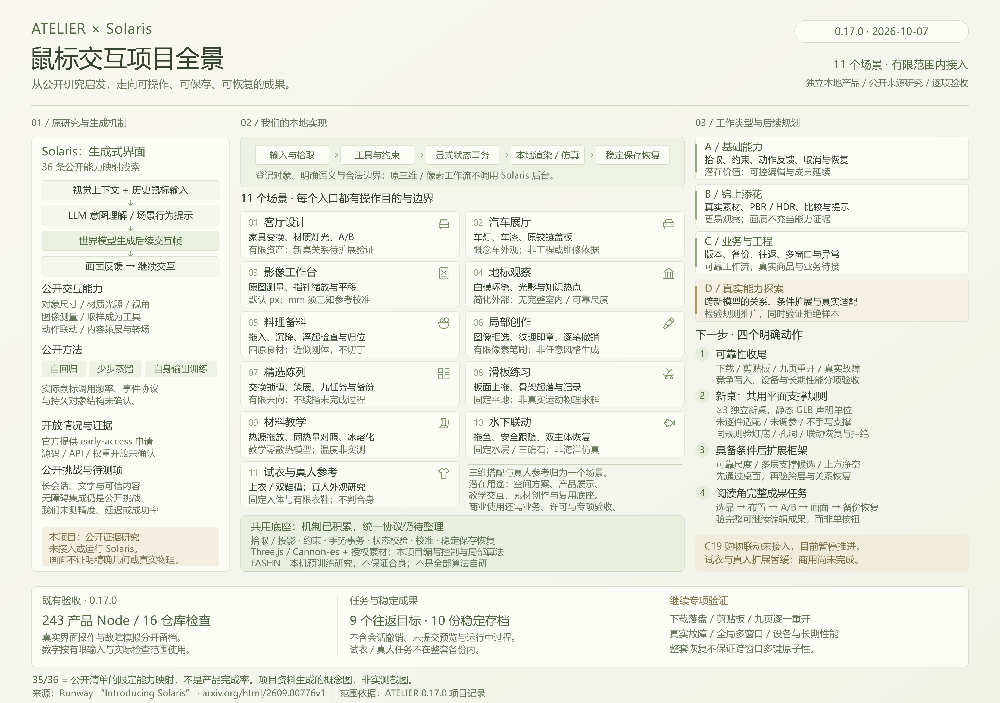
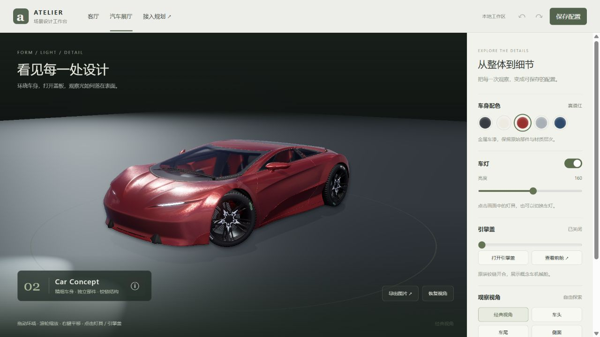
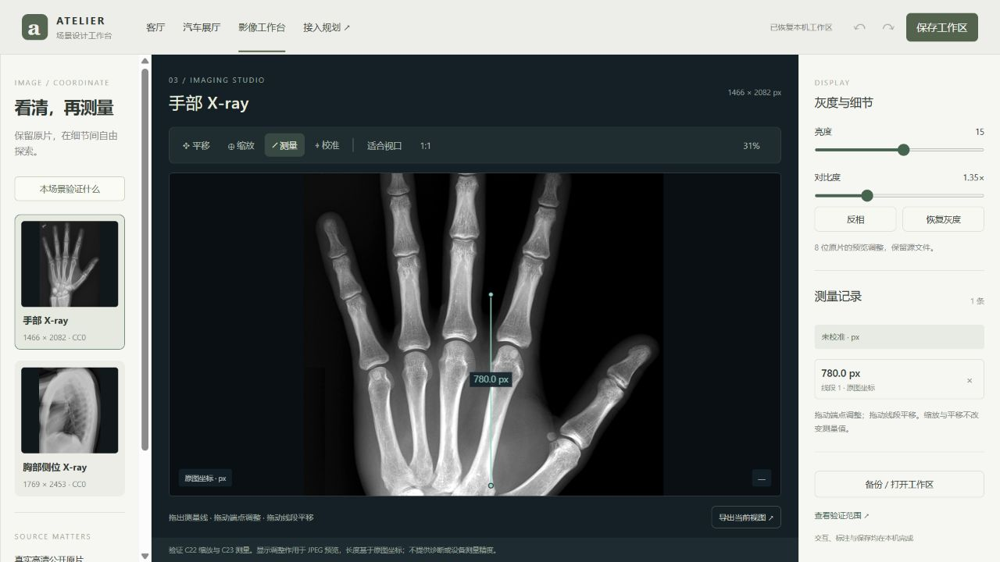
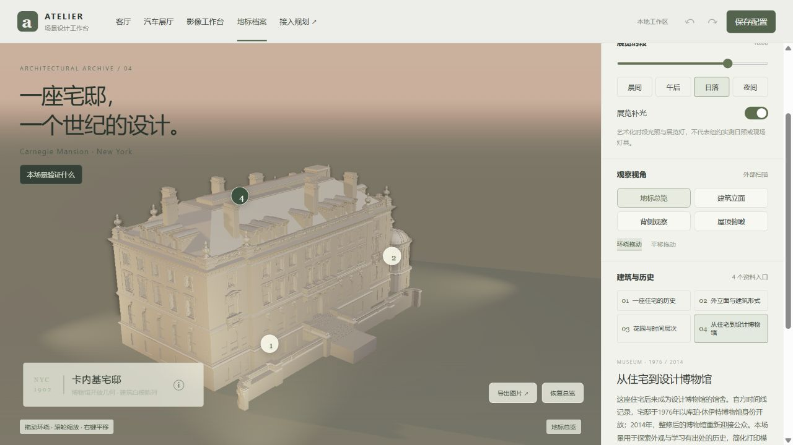
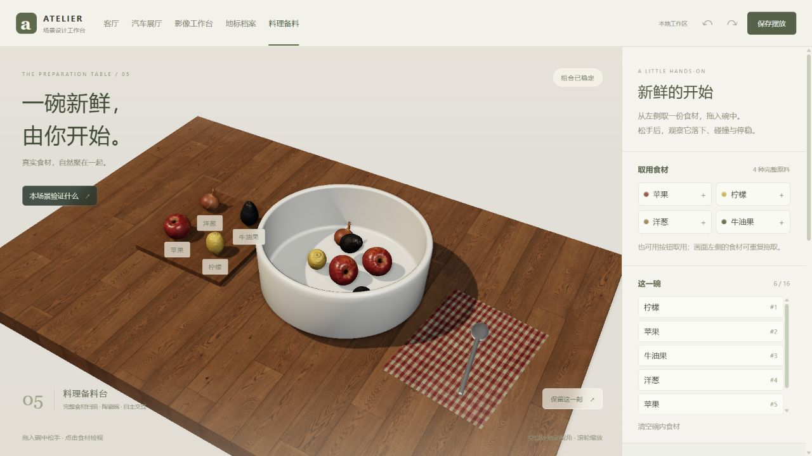
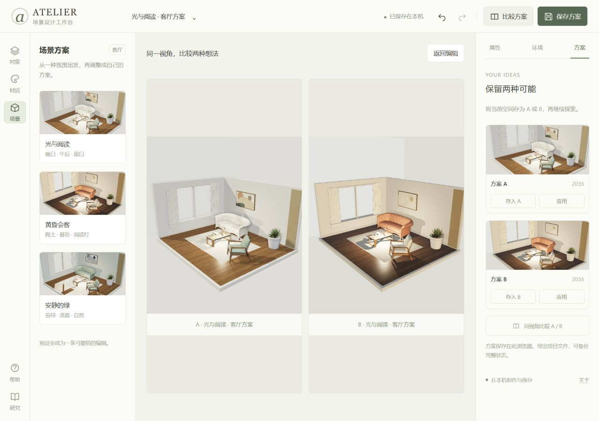
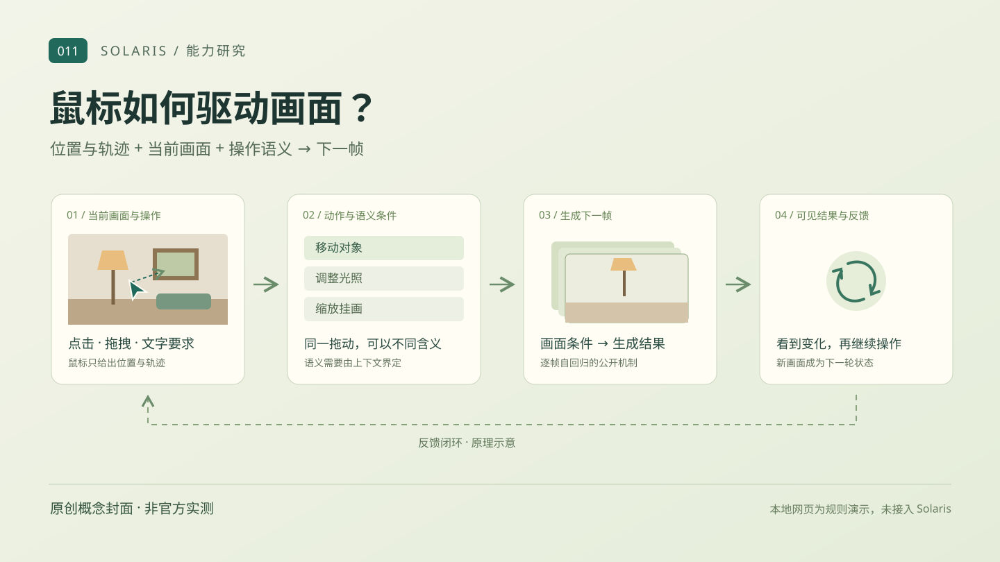
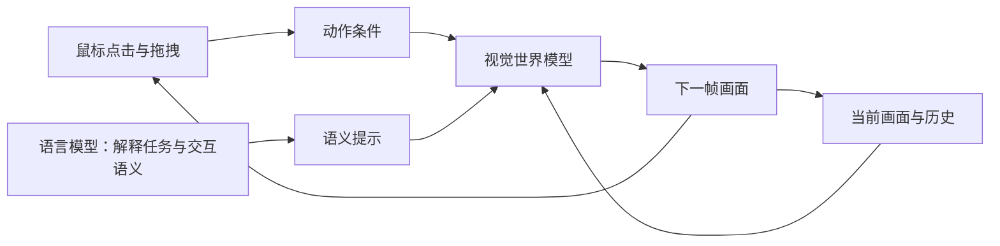
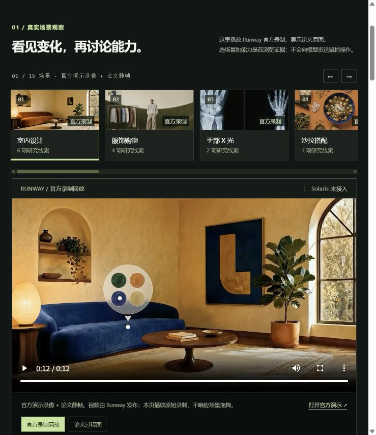

# 011 · ATELIER · 独立场景设计工作台

2026-10-07资料整理。产品仍为 **0.17.0、11个场景、35/36项受控研究映射**；本次整理入口、实现依据、证据和下一步，不新增能力或改写旧验收。

[先看项目总览](http://localhost:4189/projects/011-solaris/overview.html) · [体验客厅](http://localhost:4189/projects/011-solaris/) · [进入跨场景任务](http://localhost:4189/projects/011-solaris/collection.html) · [查能力清单与规划](http://localhost:4189/projects/011-solaris/integration.html) · [查原始研究](http://localhost:4189/projects/011-solaris/research.html#demo) · [接入说明](notes/integration.md) · [交付与验收](notes/product-release.md)



总览图用于导航，不是运行截图或新增验收证据。提供[可编辑矢量原图](assets/atelier-project-overview.svg)和[3840像素PNG](assets/atelier-project-overview.png)；图源可在本目录运行 `node scripts/project-overview-figure.mjs` 重建。[网页接入截图](assets/atelier-project-overview-page.png)与[本次发布检查](notes/project-overview-validation.json)另行留档；[0.17.0整套备份实际页面](assets/atelier-workspace-backup.png)与[完整原文对照](assets/atelier-workspace-backup-state-checks.json)继续保留。

## 从Solaris研究到我们的产品

起点是用户提供的[GKev1n帖子](https://x.com/GKev1n/status/2106629610590888065)。[Runway官方介绍](https://runway.com/news/research/introducing-solaris)与[Solaris论文v1](https://arxiv.org/html/2609.00776v1)公开描述了一条生成式路线：过去的点击、拖动与历史画面作为后续帧的条件，LLM解释意图并形成场景行为提示，视觉世界模型继续生成画面；方法包含自回归生成、少步蒸馏以及在自身生成输出上训练。鼠标是控制输入，效果来自模型与交互上下文。

这些是公开原理与展示，**本项目未实测Solaris原模型**；没有逐帧核验原帖视频，也不据此确认专用源码、API或权重已经可用。2026-10-07复核时官方页仍展示early-access申请，并列出文字稳定、长会话、可信上下文、无障碍与集成挑战。公开描述不能补成确定的事件格式、调用频率、内部三维表示或性能指标；事实与未公开问题见[研究笔记](notes/research.md)。

ATELIER选择本地受控交互路线：鼠标拾取稳定对象 → 选择工具/解析有限命令 → 校验几何与业务规则 → 提交可取消、可撤销的结构化状态 → 本地渲染 → 保存并重建。家具、图像、动作、材质与内容有明确来源；已登记对象可编辑、关系可保持、结果可恢复。不借用Solaris后台，也不把预先制作的网格与规则称为任意图像世界生成。

大部分场景使用本地Three.js、图像/画布工具和自有状态；料理另使用Cannon-es近似刚体。**真人上装参考是例外**：本机部署FASHN预训练模型与解析组件生成照片外观参考，不调用外部推理API，但不是从零训练或全部算法自研。该入口已有细节改动、实拍对照与非商业许可限制，当前暂缓扩展。

## 十一个场景：现在可以做什么

| 场景与能力映射 | 可完成的操作与用途 | 当前边界 |
| --- | --- | --- |
| [客厅设计](http://localhost:4189/projects/011-solaris/) · C01–C04、C06–C11、C15–C16、C34、C36 · 14项 | 灯桌关系、挂画/植物尺寸、家具变换、有限中文移动/配色、坐具材质、墙色/画作、时段/光影、相机与教程；制作并比较可恢复阅读角方案。 | 固定房间、登记资产与放置规则；现有茶几与台灯关系预先登记，不是新模型自动理解；没有工程日照或完整动态全局光。 |
| [汽车展厅](http://localhost:4189/projects/011-solaris/showroom.html) · C24–C26 · 3项 | 控制车灯、探索完整授权车型、打开引擎盖；观察输入、部件状态和画面的联动。 | 登记车型、灯组和铰链；机械舱为源模型简化细节，不是任意车型生成或检修仿真。 |
| [影像工作台](http://localhost:4189/projects/011-solaris/imaging.html) · C22–C23 · 2项 | 缩放/平移、两点测量、标注编辑与手动校准，保持原图坐标关系。 | 两张登记JPEG；默认像素，毫米依赖用户标尺；不含DICOM、诊断或临床精度认证。 |
| [建筑白模](http://localhost:4189/projects/011-solaris/landmark.html) · C12–C14 · 3项 | 同一Carnegie几何上的时段氛围、多角度观察和四张有出处知识卡。 | CC0简化外部打印模型，无原纹理、编码单位、完整室内/花园；不是建筑测量或未知视图生成。 |
| [料理备料](http://localhost:4189/projects/011-solaris/kitchen.html) · C20、C29 · 2项 | 将四类完整食材拖入碗形成稳定实例，点击无阻食材浮起检视，再归位/恢复。 | 最多16件，球形包络与近似刚体；没有剥皮、切丁、烹饪、重量或营养判断。 |
| [材质与笔触创作](http://localhost:4189/projects/011-solaris/creative.html) · C27–C28 · 2项 | 可见矩形取样成为持续纹理印章或调色/方向笔刷；局部绘画、两图层与逐笔恢复。 | 登记来源、固定1200×900画纸；没有语义毛发提取、任意上传或通用神经风格迁移。 |
| [精选陈列](http://localhost:4189/projects/011-solaris/collection.html) · C05、C33、C35 · 3项 | 六槽交换/锁定/选品、显式偏好整理、九目标任务往返；整套已保存成果导出与选择恢复。 | 策展标签与固定去向；不推断开放意图、不自动植入商品、不生成新场景；十记录备份不含试衣/真人或未完成动作。 |
| [滑板练习](http://localhost:4189/projects/011-solaris/skate.html) · C32 · 1项 | 上拖真实板面触发骑手与板同步起跳/落地，取消、记录和重播。 | 固定平地、有限rig姿态与抛物线；无膝脚IK、越障、翻板或真实训练仿真。 |
| [热响应教学](http://localhost:4189/projects/011-solaris/materials.html) · C21 · 1项 | 拖火源、看铜铝温升/冰熔化、做同热量对照，保持热量与账本。 | 固定样品、10W均匀零散热等教学假设；读数为计算值，不是实测、燃烧化学或任意材料预测。 |
| [水下联动](http://localhost:4189/projects/011-solaris/underwater.html) · C30–C31 · 2项 | 拖鱼改变位置/朝向，潜水员沿合法路线跟随，绕礁或不可达停留；整次双主体恢复。 | 固定水层、单鱼/单潜水员/三礁石与有限路径规划；没有海洋物理或通用动作生成。 |
| [三维试衣](http://localhost:4189/projects/011-solaris/fitting.html) / [真人参考](http://localhost:4189/projects/011-solaris/tryon.html) · C17–C18 · 2项 | 固定人体上两款上衣、两双鞋的独立拖放与搭配恢复；真人另可比较本机生成的正面上装参考。 | 一个体型、有限姿态与预适配衣鞋；真人有细节改变且缺跨衣实穿对照，不能判真实合身或商用；继续暂停扩展。 |

**35/36是研究编号的受控实现映射，不是“产品已完成97%”。** 场景的素材范围、算法泛化、可靠性、性能和业务成熟度必须另验。唯一尚未接入的编号是C19试穿与购物关联；收藏清单不能替代真实商品身份、变体与购物事务。

## 四类工作，四种价值

| 类别 | 要解决的问题 | 如何判断进展 |
| --- | --- | --- |
| 基础保障 | 资产许可/单位、对象协议、事务恢复、保存备份、设备与并发可靠性 | 真正下载并重开、异常恢复、完整状态对照与指定设备数据；不能用源码或模拟替代实测。 |
| 内容丰富 | 在既有协议内加入更多家具、车型、图像、建筑和教学内容 | 新内容有来源、正确几何与清楚用途，能复用保存和操作；单纯增素材不算通用能力突破。 |
| 业务工程 | 商品身份、变体、搭配事件与清单/库存/订单一致性 | 真实数据与事务闭环；C19尚未接入，试衣/真人方向继续暂停。 |
| 能力探索 | 未逐件适配模型的支撑域、跨对象关系与可复用接入契约 | 独立新模型共用规则通过，歧义与不支持输入明确拒绝；开放生成、任意体型/布料等另设研究。 |

后期价值来自把“某个素材能动”推进为“新素材在明确条件下能接入、关系能解释、任务能完成、成果能恢复”。近期集中在空间设计与跨场景工作流，让用户完成阅读角方案，而不是继续堆页面或追求36/36。

## 下一步：按实际任务验收

以下四步为后续规划，尚未实现或验收，不承诺工期；C19与试衣/真人继续暂停扩展。

1. **可靠性收尾。** 验证整套备份实际下载落盘、文件重开和选择恢复；核对十份稳定存档，并逐一重开九个目标检查状态与画面。剪贴板、真实存储故障、并发竞争、设备/离线/长期性能分别登记，Node模拟不算完成。
2. **新桌模型的支撑面与台灯关系。** 输入带声明单位/尺寸的静态GLB，先限定平面桌面；至少三种未逐件适配、未参与调参的桌模型共用一套规则，不为每件手写桌面边界或摆放点。验证完整灯底贴面、不越边缘/孔洞、桌面移动/旋转/声明范围内缩放后关系保持，并覆盖取消、撤销、保存和重开；歧义或无法判定时明确拒绝且状态不变。
3. **柜面/架面复用。** 桌面验收后，再处理多层候选面与上方净空，整理共同输入、单位、变换、支撑域、失败说明和恢复契约；保留柜架与各场景的专用约束，不因一张桌通过就宣称任意物体摆放。
4. **完整阅读角任务。** 用户实际完成摆放 → 午后/黄昏方案比较 → 保存 → 恢复，核对几何关系、两套方案和画面；以任务价值验收，不新增页面或研究编号充当成果。

这里的“通用”仅指在静态GLB、明确单位和限定平面条件内复用规则；不等于任意模型自动语义理解、真实承重判断或完整物理求解。

## 证据怎样读

| 层次 | 当前记录 | 不应外推的结论 |
| --- | --- | --- |
| 公开研究 | 原帖、Runway介绍、论文与[能力来源清单](notes/capability-catalog.md) | 公开展示不是本项目对Solaris的实测，也不确认源码/权重或可用API。 |
| 本地实现与历史检查 | 0.17.0记录243/243产品Node测试、16/16仓库检查；见[备份验收](notes/workspace-backup-validation.json) | 本次资料整理重新运行同一套243项产品与16项仓库检查，全部通过；见[总览发布检查](notes/project-overview-validation.json)。容量、半写、读写故障与回滚仍只做Node模拟。 |
| 实际浏览器主流程 | 十份公开原文、实际文件选择、选择恢复、坏/空项拒绝、陈旧预览禁用；六旧目标与三新目标按各轮留证 | 不是同一轮全部场景、全部设备或所有故障通过；[总验收聚合](notes/product-validation.json)保留旧版本，后续专项以各自文件为准。 |
| 明确待验 | 下载落盘、剪贴板完整性、恢复后九渲染页逐一重开、真实故障/竞争写入、进行中转场、触屏/多浏览器、完整断网和长期性能 | 不能用现有测试量或一张实景图宣布全面产品化。 |

<details>
<summary>此前首页版本说明与工作区证据（历史保留，不作为新验收）</summary>

**当前产品：** ATELIER 0.17.0在精选陈列增加整套工作台备份：一份文件保留当前陈列与九个登记工作台的最近已保存原文，客厅包含完整A/B方案。真实界面已核对十份完整原文、打开实际JSON文件、逐项差异/选择恢复、坏项/空项禁恢复、只恢复勾选项及另一窗口更新后的拒绝；恢复后十份原文逐字回到基线。完整243/243项产品Node测试（含25项新增备份测试）和16/16项仓库检查通过。下载落盘与剪贴板完整性尚未验收；九个渲染页本轮未逐一重开。整套备份支撑既有工作流，35/36、十一场景、C35九目标、阶段5的2/3及C19待接保持；试衣/真人继续暂缓扩展。

**0.16.1历史：** ATELIER 0.16.1补全既有跨场景工作流的陈列多窗口保护：检测到另一窗口的新记录时暂停本窗口写入，常驻提示并禁用保存/进入；仍可备份当前窗口，再明确读取最新陈列。客厅（含完整A/B）、展厅、影像、地标、料理和创作原六目标的公开完整JSON均在进入前、目标页和返回后重开逐值一致；每次返回陈列完整，只有lastScene更新为登记目标。完整218/218项产品Node测试（含23项新存储测试）及16/16项仓库测试实际通过。35/36、十一场景、C35九目标和阶段5的2/3保持，C19仍待接，试衣/真人继续暂缓扩展。

**实现：** 指针射线选择稳定对象 ID；工具把轨迹转换为移动、旋转或缩放命令；约束校验后更新结构化状态，再由本地 Three.js 绘制。台灯和实际灯光绑定，随茶几移动；一次拖动是一条可撤销事务。专业家具模型、PBR 材质、HDR 与渲染依赖均已本地打包。

**第一项完整任务：** 为阅读角制作午后与黄昏两套方案，调整对象和环境，同视角比较，保存后重新打开。提供三个可编辑氛围预设、本地图片挂画、受限中文指令、场景地面测量及项目 JSON 备份。

**研究依据：** 继续保留 Solaris 的 36 个公开研究条目、12 个能力族与 15 个来源场景；研究画廊用于查证原始效果，产品工作台用于真实编辑，两者各有独立入口。

**交付范围：** 客厅14、汽车3、影像2、地标3、料理2、创作2、陈列3、滑板1、热响应1、水下2、试衣2，共35项；仅C19待接入，阶段5为2/3。固定人体两款上衣/两双鞋与两静态姿态用于真实拖放和恢复，不能据此推断真人试穿、任意体型/尺码、步态或布料物理；真人参考作为C17同场景深化另行记录；当前C35九登记目标，0.16.0三目标历史验收与0.16.1六目标完整JSON新核查分别留证。

[打开客厅](http://localhost:4189/projects/011-solaris/) · [打开汽车展厅](http://localhost:4189/projects/011-solaris/showroom.html) · [打开影像工作台](http://localhost:4189/projects/011-solaris/imaging.html) · [打开地标白模展览](http://localhost:4189/projects/011-solaris/landmark.html) · [打开料理备料台](http://localhost:4189/projects/011-solaris/kitchen.html) · [打开创作台](http://localhost:4189/projects/011-solaris/creative.html) · [打开精选陈列](http://localhost:4189/projects/011-solaris/collection.html) · [打开滑板练习场](http://localhost:4189/projects/011-solaris/skate.html) · [打开热响应教学台](http://localhost:4189/projects/011-solaris/materials.html) · [打开水下拖动工作台](http://localhost:4189/projects/011-solaris/underwater.html) · [打开三维试衣工作台](http://localhost:4189/projects/011-solaris/fitting.html) · [打开真人上装参考](http://localhost:4189/projects/011-solaris/tryon.html) · [查看网页规划](http://localhost:4189/projects/011-solaris/integration.html#roadmap) · [打开研究画廊](http://localhost:4189/projects/011-solaris/research.html#demo) · [交付与验收](notes/product-release.md) · [返回总索引](../../README.md)

[ATELIER 0.17.0整套工作台备份实际页面：十份存档与逐项恢复说明](assets/atelier-workspace-backup.png)

[0.16.1陈列与可恢复任务历史页面](assets/atelier-workflow-completion.png)保留。

[0.15.0真人上装参考原工作区](assets/atelier-real-person-workspace.png)保留，当前暂缓继续扩展。

[0.14.0原三维衣鞋工作区](assets/atelier-footwear-workspace.jpg)保留。

[0.13.0上衣原工作区](assets/atelier-fitting-workspace.jpg)及原JSON/PNG/拖动与背面证据继续保留。

[0.2.0可恢复样例](assets/atelier-editor-project.json)包含复制对象、独立尺寸、茶几替换与教程进度，经过实际JSON导入验证。

**0.14.0历史：** 新增C18完整成对鞋履：Court/Ridge实体展样和侧栏拖到脚掌/脚踝，左右一起替换并保持上装、姿态和相机；合法持有预览、错位/Escape与一次undo/redo已原生验收。衣鞋互相保持、脱鞋恢复、三鞋面色、两静态姿态和侧后近看、三合法/八坏JSON通过。181产品（25试衣核心，新增10鞋履）、16仓库及9素材有限足域检查通过；最终修后v2保存重开完整JSON一致，实际PNG1431×969。详见[操作目的](notes/integration.md#footwear)、[素材依据](notes/footwear-sources.md)及[本轮验收](notes/footwear-validation.json)，原C17/C31和材料历史全部保留。

**使用热响应教学台：** 将完整设计热源拖到圆环，命中释放后吸附固定接口；默认×1观察，暂停后可选×4。看温度/ΔT、熔化比例与累计Q/教学秒，到60°C或融尽时可只“重新观察”该样品，其余样品保持，整次可取消或撤销。蓝焰、独立环和热流箭头标明教学示意，物理输入仍10W均匀零散热，不作实测或燃烧预测。0.10.1新增反馈已完成桌面真实验收；[物性与素材](notes/materials-sources.md)、[原主流程证据](notes/materials-validation.json)、[本轮反馈验收](notes/materials-feedback-validation.json)与[本轮说明](notes/integration.md#材料教学体验修复0101)可查。

**0.14.0验证：** C18把鼠标取鞋与成对足部适配、独立鞋槽、固定姿态及整套恢复连起来；完整原双足/53骨持续保留。当前35项接入，只剩C19购物联动；登记足/低腿有限核查不证明体积零交叉、尺码或任意步态。

</details>

<a id="workspace-backup"></a>

## 整套备份与选择恢复（0.17.0）

在[精选陈列](http://localhost:4189/projects/011-solaris/collection.html)点击“整套工作台备份”。这项支撑让一次跨场景工作的成果可以共同保留，再按工作台选择恢复；它深化既有工作流，不新增研究能力或场景。

先在各工作台完成操作、保存并关闭其他编辑窗口，再回陈列读取本机存档。一份文件含陈列、客厅、展厅、影像、地标、料理、创作、滑板、材料、水下十个固定记录，保存最近已持久化的原文，不触发目标页保存或中断动作。未保存编辑不在这份文件中；下载文件上限12MiB。

整套文件协议为atelier-workspace/version 1，records固定十项，每项保存原文字符串或null。仅有旧水下v1时，应提示先到水下保存升级；它不被说成“没有存档”，旧key和返回检查点只作并发检查基线，不写入整套文件。旧原文继续保留。

通过实际文件选择器打开整套文件，或点击“查看备份内容 / 粘贴已有备份”读取完整JSON、复制或粘贴后检查；这些操作不立即写入。表格展示文件内容、本机差异与可恢复状态；勾选有效工作台，先下载恢复前的本机备份，再明确点击“恢复所选工作台”。未勾选和文件空项保持本机；恢复后重新打开对应工作台，由各页重建稳定方案。读取最新陈列会清空本窗口预览及撤销历史。

| 文件或本机状态 | 应显示的说明与处理 |
| --- | --- |
| 有效记录与本机不同 | 展示差异，用户明确选中后才覆盖对应存档 |
| 有效记录与本机相同 | 说明内容相同，不冒称生成新方案或新增编辑 |
| 文件中没有保存该工作台 | 明确“未保存”，不删除本机，也不制造初始方案充当备份 |
| 原文无法解析或业务结构不合法 | 原样保留供抢救；该项禁恢复，不用默认方案掩盖坏记录 |
| 文件格式、版本、大小或固定记录结构不支持 | 明确拒绝整份文件；预览检查不写入 |
| 检查后本机记录被其他窗口更新 | 暂停恢复并要求重新读取/检查，保留文件与原记录 |
| 恢复写入失败或回滚受阻 | 按实际结果说明失败、恢复或较新记录保留，不笼统宣布全部成功 |

**稳定存档范围：** 陈列保留顺序、锁定、详情选择、选品、偏好和最近去向；客厅保留当前project、个人挂画与完整A/B project/thumbnail/date；展厅和地标保留外观、观察及相机配置；影像保留每张登记原片的视口、校准和测量；料理保留稳定食材实例、姿态、编号和相机；创作保留正式来源选区、完整图层、笔触及压力；滑板保留已落地的试验账与选中记录；材料保留样品热量和完整热账；水下保留鱼/潜水员位置、方向、路径账与相机。

文件不包含会话撤销、未提交预览、进行中的动作/供热/追随、返回检查点或试衣/真人任务。模型、纹理、渲染依赖和真人权重仍由本地项目提供，备份文件不是独立可运行产品；个人挂画与A/B缩略图属于文件内容。影像在不同视口重开会调整显示偏移，应分别判断方案数据保持和视口适配。

恢复前须保存并关闭其他编辑页，恢复后重新打开。现有目标页没有统一的多窗口同步保护；原文比较和受控回滚不等于十记录原子事务，也不保证同时写入不会冲突。

**本轮实际验收：** 内置浏览器公开导出显示10/10有效保存，已读取完整文本框JSON。通过实际文件选择器打开同一导出内容生成的JSON，十项与本机相同且应用禁用。另一实际文件仅将陈列选品加入阅读灯、展厅车漆改pearl；地标坏原文和料理null均禁恢复。明确恢复两项后仅陈列/展厅原文改变，其余八份逐字保持；粘贴原整套JSON恢复后全部十份逐字回到基线。再取消展厅勾选只恢复陈列，展厅保持；另一窗口移除临时灯后，旧预览应用禁用且旧的恢复前备份链接撤销，读取最新后十份原文仍与原基线一致。{}坏外层文件明确拒绝，不显示可恢复条目；核查后用户原陈列保持。

0.17.0最终发布版重新构建/加载后十份raw仍逐字等于原基线；粘贴{bad JSON}明确显示中文“未预览：文件不是完整JSON，请选择整套工作台导出的有效备份”，错误输入保留可修正。界面显示“10 / 10份存档已保存”，1280×720完整十行截图与公开完整状态对照已留档；当前陈列页console warn/error为空。

0.17.0真实浏览器还核对了预览后修改粘贴文本：输入{edited after preview}立即禁用恢复按钮、撤销旧的恢复前备份链接并提示重新检查；随后读取备份，十份原始raw完整一致。

完整243/243项产品Node测试与16/16项仓库检查通过，新增备份25/25项包含容量、半写、读失败、十二个基线键变化及回滚等模拟。真实界面操作与Node故障模拟分别记载，不把模拟算成浏览器故障实测。详见[本轮验收](notes/workspace-backup-validation.json)、[十份原文对照](assets/atelier-workspace-backup-state-checks.json)及[整套备份实际界面](assets/atelier-workspace-backup.png)。0.16.1的218项与0.16.0的195项继续作为各自历史。

**仍待专项：** 下载点击等待和媒体下载均超时，不能宣布文件已落盘；复制入口有成功界面反馈，但工具读取剪贴板为空，完整性未验证。可见完整JSON、实际文件打开和粘贴恢复已经验收，可用文本内容保存备份。本轮未逐一重开九个渲染工作台，未外推不同设备的影像视口或相机精确原文；全局多窗口同步、真正竞争写入、真实存储故障/容量/回滚、进行中编辑及长期性能继续专项。人为注入异步界面错误及真实存储故障仍未验证。模块加载失败时保留文本属于代码修复与审阅，尚未在浏览器注入该故障验证。


<a id="scene-workflow-completion"></a>

## 工作流恢复与多窗口保护（0.16.1）

[打开精选陈列](http://localhost:4189/projects/011-solaris/collection.html)。同一浏览器的不同窗口共享本机陈列和返回检查点；这轮防止旧窗口在失焦、离开或保存时覆盖另一窗口后续记录。检测到更新时显示常驻说明，暂停本窗口写入，禁用保存和进入任务，仍允许查看、备份当前窗口。

| 状态 | 网页说明与处理 | 当前验证 |
| --- | --- | --- |
| 另一窗口已更新陈列或检查点 | “备份当前窗口”保留本窗口配置；“读取最新陈列”只读取并替换本窗口状态，清空预览与会话撤销历史 | 已真实验证常驻提示、保存/进入禁用、旧窗口备份仍为原配置，旧窗口pagehide后新记录保持；读取最新后提示隐藏、保存重新启用、撤销禁用，最新配置含另一窗口lamp选品；随后移除临时lamp并保存，原两项选品保持 |
| STORE原文无法解析或业务结构不合法 | 保留坏记录原文，不自动写入初始陈列；有效文件应用或明确保存走受保护恢复 | 原文比较和明确恢复已实现；坏记录、容量、写入失败与回滚只做Node模拟，未在真实浏览器故障注入 |
| TRIP检查点损坏 | 检查JSON语法及严格v1业务结构，可“备份原始检查点”；选定任务后按钮改为“重建检查点并进入”，由明确操作替换坏记录 | 原文保留、语法与业务验证及明确恢复已实现；真实损坏/故障注入仍待专项 |
| 读取最新失败或不可用 | 保留当前窗口备份与原记录，显示说明并允许重试，不把默认初始状态当作成功恢复 | Node模拟范围与真实可用路径分开记录 |

存储保护使用当前原文与已读取版本比较，再执行受控写入和回滚检查；它不是原子的跨窗口锁，不保证所有同时写入场景无冲突。只读返回桥仍不修改目标工作台配置；恢复陈列预览/撤销历史的清理不等于清空目标作品。

**本轮稳定配置核查：** 客厅公开项目包装中的project和完整A/B（project、thumbnail、date），以及展厅、影像公开完整JSON，均已取得before=entered=reopened逐值一致。地标、料理、创作也已完成同样核查，原六目标6/6均一致且每次陈列仅更新lastScene；0.16.0滑板/材料/水下三个新增目标的原记录继续保留，不将0.8.0六目标旧往返或三目标旧JSON核查改写为本轮九目标全部重验。

**本轮测试与证据：** 完整218/218项产品Node测试（含23项新存储测试）与16/16项仓库测试实际通过。说明、公开JSON和真实多窗口操作分别见[补全验收](notes/collection-workflow-completion-validation.json)、[本轮公开状态对照](assets/atelier-workflow-completion-state-checks.json)及[多窗口常驻提示](assets/atelier-collection-conflict.png)。旧0.16.0仍是195项产品/16项仓库历史，不替换为当前测试量。

创作页曾在载入期允许点击尚未绑定事件的备份按钮而无反馈；已新增save/backup/export载入期禁用保护，源码语法与构建通过，最终新版真实回归已确认：载入完成后保存/备份启用，点击备份打开对话框，公开完整JSON与原基线逐值一致。原六目标证据采集于该界面保护前，作品状态逻辑未改；新版创作复验另记。

最终再次经水下工作流往返，公开完整陈列JSON与用户原配置完全一致（包括lastScene underwater），原顺序、沙发锁定、当前详情、两项选品与reading偏好全部还原；返回说明匹配水下。

本轮内置浏览器一次页面崩溃后用新标签恢复，不能据此宣布应用/性能可靠性通过。动作、供能、追随或笔迹未完成时的跨场景往返、同时多窗口竞争写入、真实存储故障/容量与回滚、完全断网、下载落盘、触屏/其他浏览器及长期性能继续专项。稳定存档不包含撤销历史、未提交预览或未完成动作；正式创作来源选区、完整笔迹和客厅A/B仍属于应保持的作品数据。

<a id="scene-workflow"></a>

## 跨场景任务与返回：C35深化（0.16.0）

[打开精选陈列](http://localhost:4189/projects/011-solaris/collection.html)。这轮验证“从当前选品出发 → 进入已有工作台完成一项明确任务 → 保存目标稳定配置 → 返回继续原陈列”的过程，深化已有C35，不增加第37项研究能力或第十二个场景。当前登记目标为客厅、展厅、影像、地标、料理、创作、滑板、材料与水下九个；原0.8–0.15的六目标历史不改写为九。

| 任务入口 | 在目标页操作与可见结果 | 保存与判断边界 |
| --- | --- | --- |
| 水下追随 | 拖动鱼体至空旷水层，松手看潜水员转向、绕礁和停稳 | 保存鱼/潜水员位置、方向、采样路径及相机；返回后不续播追随，不代表真实游泳或通用寻路 |
| 同热量对照 | 选择40/80/120J，让单火源先铜后铝，观察同输入热量下不同温升 | 保存稳定热量、账本与相机；重开不继续供能，10W零散热模型不作现实实验预测 |
| 滑板起跳 | 在真实板面向上拖动，松手看完整骑手与板起跳/落地 | 完整落地形成记录，保存稳定配置；重开不自动起跳或续播，不判断现实运动/完整ollie |
| 全部九项任务 / 最近去向 | 打开任务列表或有限中文命令，先看操作、预期结果和边界，再确认进入 | 只进入登记同源工作台；取消不改变陈列，最近去向不是自动恢复未结束动作 |
| 保存检查点 / 返回继续原陈列 | 进入前保留陈列顺序、锁定、选择、收藏和偏好，目标页显示匹配返回入口 | 目标独立保存不合并进陈列；返回恢复原陈列并更新最近去向，不自动植入商品或生成新场景 |

本轮实现范围包括九目标注册与别名、三项任务快捷入口、全部九任务弹窗、带操作/结果/边界的预览、最近去向，以及滑板/材料/水下匹配的只读安全返回桥。独立稳定配置已在三个目标进入前、目标页及返回后重开的公共备份中逐值核对一致；动作、供能和追随只保存稳定结果，不能由往返入口自行续播。本轮从既有稳定状态出发，没有重新执行三种动作验证续播，也不覆盖动作进行中转场。

**本轮验收状态：** 三新增目标已真实进入并通过匹配桥返回；目标进入前、目标页与返回后重开公开备份JSON完全一致。水下保留原双主体、custom相机及一条legacy路径；材料保留铜40J、铝313.9994991463235J、冰333.4J、六条账本与custom相机；滑板保留四次已有试验、选第四次与custom相机。每次返回陈列公开JSON与原一致，仅lastScene更新，原顺序、沙发锁定、两项选品、reading偏好与当前详情保持。预览取消全JSON不变，复合/否定/外部URL三类命令明确拒绝且不打开对话框，最近滑板按钮打开对应任务预览。195/195项产品与16/16项仓库测试通过，详见[本轮记录](notes/collection-workflow-validation.json)。旧六目标仍以[历史陈列验收](notes/collection-validation.json)为依据，本轮没有把旧六个目标重新全部验收。

[实际主入口](assets/atelier-scene-workflow.png)、[全部九任务](assets/atelier-scene-tasks.png)、[目标返回桥](assets/atelier-scene-return.png)、[公开状态对照](assets/atelier-scene-workflow-state-checks.json)及[真人后续产品方向](assets/atelier-tryon-product-directions.png)分别留档。动作/供能/追随进行中往返、其他五旧目标完整状态、多窗口冲突、设备与实际存储故障、断网和性能仍待专项。

真人页面已补充[可扩展产品方向](http://localhost:4189/projects/011-solaris/tryon.html#product-directions)：真实SKU选款导购优先，其余为造型师提案、品牌视觉预演、数字衣橱和独立尺码模块，均为后续规划。本轮暂缓试衣/真人扩展；C19、真实商品目录、商业素材/组件替换、同人同衣实穿对照、任意人体/尺寸与布料物理继续单独研发。

## 使用真人上装研究参考

[打开真人工作区](http://localhost:4189/projects/011-solaris/tryon.html)。选登记人物，把衣物卡拖到人物区域或点选，再点击开始本机生成。拖卡只选择衣物；完成后比较原图与生成图、放大细节并填写人工观察。已生成示例与本次任务分开显示，生成图应带明确标记。

两组无人衣图跨衣、一组原衣重建和一组模特衣图跨衣均完成20步，耗时63.34、49.58、41.84、52.58秒，输出576×768；首次61.49秒内存不足无图也保留。跨衣能看见目标上装主要结构，但裤腰/纽扣及小细节可能改变，缺同人同目标衣实拍。原衣重建将宽松褶皱改成较贴身平整，字样与裤腰也变，不能称与实穿一致。用途是有限外观研究，不判断尺码、舒适或商品保真。

本机需Python/CUDA、权重和4197服务；自部署预训练不等于从零训练，不用外部推理API。两组原照片登记为4张原JPEG、5个输入角色，既含单件无人衣图也含模特穿着参考；照片为非商业研究样本，没有可售商品编号；解析组件、照片、肖像/品牌商业授权分别受限。上传为实验输入，输入和结果保留在本机任务目录。189项产品与18项Python后端测试通过；网页分界拖动、放大/平移与复位已实际验证；PNG预览与评审JSON内容已实际核查，选款撤销恢复原评分/实际图；自动下载落盘及剪贴板字节一致性未验证，故障专项另验。

PNG导出预览已实际核查为576×812（原图576×768加44px生成注记）；评审JSON全文已核对并留档，含真实输入组合、任务ID、元数据和缺实拍依据。提供复制/保存入口；内置浏览器自动下载落盘及剪贴板字节一致性未验证。

[真人工作区](assets/atelier-real-person-workspace.png)、[原衣重建问题](assets/atelier-real-person-baseline.png)、[带生成注记的导出预览](assets/atelier-real-person-export-preview.png)、[评审JSON](assets/atelier-real-person-review.json)和[评审核对窗口](assets/atelier-real-person-review-dialog.png)保留实际界面与内容。

[操作目的与四次运行](notes/integration.md#real-person-tryon)、[样本来源](notes/tryon-sources.md)、[运行说明](notes/tryon-runtime.md)、[真实生成与质量记录](notes/real-person-tryon-validation.json)及[样板计划](notes/real-person-tryon-plan.md)可查。C17/C18原三维证据与所有历史保留；总数仍35/36、十一场景、阶段5为2/3，C19待接、当前C35九目标。

## 使用三维试衣工作台

[打开试衣工作台](http://localhost:4189/projects/011-solaris/fitting.html)。按住场景里的短袖或轻夹克，拖到人体胸腹；看到上身预览后松手穿上，再拖另一款替换。空处松手、Escape或“取消当前试穿”恢复原搭配；一次撤销/重做恢复整次换装。同衣款且同颜色不增加历史，单同款而颜色不同仍可改色。

选择暖白/苔绿/墨蓝、自然站姿/抬臂检查，切正面/背面/上身细节并拖空白看侧面。人体与上衣共享完整53骨，两个固定姿态可随JSON恢复；领袖下摆、口袋/线迹和轻夹克拉链、背育克均来自独立几何。完整Quaternius CC0人体原13,743唯一面保留，上衣由本项目设计与蒙皮。固定虚拟人体与两款上衣不判断真实尺码，不接人物/衣物照片或布料物理。

[按住拖入实景](assets/atelier-fitting-drag.jpg)、[背面实景](assets/atelier-fitting-back.jpg)、[实际搭配JSON](assets/atelier-fitting-example.json)与[1431×969真实PNG](assets/atelier-fitting-render.png)留档；[操作与验收](notes/integration.md#fitting)写明11项素材有限域检查，以及64个肩/腋下无壳命中未验证。前背侧/抬臂视觉复核作补充，不作为全身零穿插证明。0.13.0当轮只验证上衣；当前鞋履见下一节，购物C19仍待研发；0.13.0时C35仍六目标，当前九目标见跨场景工作流。

## 使用完整鞋履试穿

[打开试衣间](http://localhost:4189/projects/011-solaris/fitting.html)，切“鞋履”。在总览按住Court低帮鞋或Ridge短靴，拖到人物脚掌/脚踝，出现合法预览后松手；左右一起替换，上装、姿态与相机保持。胸腹/空处松手、Escape或取消回原完整搭配，一次撤销重做恢复整次换装。同鞋款且同颜色不增历史，鞋面改色仍可提交。

换三种主鞋面色，近看鞋脚并环绕到侧后，检查鞋口、后跟、鞋舌/带、鞋底；鞋底、衬圈、鞋带/线迹与金属材质固定。近景隐藏展台/展样，回总览恢复继续拖放。自然站姿/抬臂两原姿态双足同位，完整鞋组按人物根节点刚性注册，不隐藏原脚，不演示步行或推断尺码。

[细节实景](assets/atelier-footwear-detail.jpg)、[修后侧后实景](assets/atelier-footwear-side.jpg)、[按住预览](assets/atelier-footwear-drag.jpg)、[实际v2搭配](assets/atelier-footwear-example.json)与[真实PNG](assets/atelier-footwear-render.png)留档；[鞋履素材](notes/footwear-sources.md)公开9独立检查与264足点/120壳命中/144真开放域、Ridge2,830低腿三角面有限样点。它们不证明完整体积、内部缓冲、现实尺码或任意步态。严格v2兼容旧v1为无鞋槽，保留旧key及精确旧上装/姿态/相机；[操作与验收](notes/integration.md#footwear)。

## 使用水下拖动工作台

[打开水下场景](http://localhost:4189/projects/011-solaris/underwater.html)。按住鱼体拖向左侧空旷处，松手后鱼保持落点，潜水员继续转向、踢腿并沿金色安全路径追随。右侧可能没有安全通路，会明确停留；把鱼移回可达区域，潜水员恢复追随。非法释放、Escape或“取消当前联动”恢复整次双主体起点，一次撤销/重做恢复整段。

完整鱼与六骨节原Swim、潜水员53骨人体来自Quaternius CC0；完整三礁石来自Kenney，沙纹理来自Poly Haven。本项目制作完整潜水装备、Hover/Swim有限动作及目标/路径规则。单鱼/单潜水员在固定水层运行，目标间距1.00场景单位、到位带0.025；保守包络与有限visibility-graph可拒绝不可达路线。有限姿态与路径不代表通用IK、真实游泳或海洋物理。

[按住拖动实景](assets/atelier-underwater-movement.jpg)、[1443×969实际PNG](assets/atelier-underwater-render.png)、[三段实际移动配置](assets/atelier-underwater-example.json)、[素材依据](notes/underwater-sources.md)和[验收记录](notes/underwater-validation.json)均留档。稳定配置v2记录两者位置/heading、合法采样路径和相机，旧v1安全初始化潜水员、旧鱼账标legacy；不恢复骨架循环相位或伪造旧跟随。0.11–0.12时期普通水下导航保持C35六登记目标；0.16.0另将水下登记到C35九目标工作流。

## 使用新增创作、陈列与滑板场景

[创作台](http://localhost:4189/projects/011-solaris/creative.html)验证C27/C28：在真实CC0猫照片或Met公版画作上框选，再在1200×900画纸图层点击/拖绘。取样与每笔来源可见，局部范围、逐笔撤销及JSON/PNG恢复已验收；这是像素纹理印章和参数笔刷，不是任意艺术家风格迁移。[创作验收](notes/creative-validation.json)。

[精选陈列](http://localhost:4189/projects/011-solaris/collection.html)验证C05/C33/C35：拖六件真实CC0模型卡片交换位置，锁定槽位，预览策展理由再应用；输入“去料理”等有限命令可到九个登记工作台并返回；0.16.0三目标历史验收与0.16.1六目标完整JSON新核查分别留证。[可恢复示例](assets/atelier-collection-example.json)和[陈列验收](notes/collection-validation.json)保留真实流程；选品不是订单；0.8.0历史不含滑板意图目标，0.16.0新增滑板/材料/水下任务去向。

[滑板练习场](http://localhost:4189/projects/011-solaris/skate.html)验证C32：从真实板面向上拖动至少24px，松手后完整原骨架骑手与板同步起跳/落地，完成才记一次；Escape取消、预览和重播不增记录。Kenney CC0资产保留原rig，本地有限姿态和轨迹没有膝脚IK、越障或完整ollie承诺。[两条真实练习配置](assets/atelier-skate-example.json)、[真实PNG](assets/atelier-skate-render.png)及[滑板验收](notes/skate-validation.json)已留档；设备取消、故障注入、完全断网和性能仍待专项。

## 使用汽车展厅

汽车场景主要验证 **C24：点击目标与灯光状态绑定**、**C25：完整资产的多视角探索**、**C26：原始铰链与部件关系**。车灯操作应同时改变发光表面和地面光束；相机操作应可保存恢复；开盖时子灯具随原盖板运动而独立机械舱留在车身。撤销、取消与配置恢复是工作流验证，不额外计数。具体[验证目标与限制](notes/integration.md#automotive)和[已执行验收](notes/car-showroom-validation.json)分别列出。



[可恢复汽车配置](assets/atelier-car-config.json)包含赛道红车漆、车灯、已打开盖板与前舱近景，可复制到“备份 / 打开配置”应用。[机械舱实景](assets/atelier-car-mechanical-bay.jpg)、[网页规划实景](assets/atelier-roadmap.jpg)与[汽车验收记录](notes/car-showroom-validation.json)同步保存。

进入[汽车展厅](http://localhost:4189/projects/011-solaris/showroom.html)，拖动环绕车辆、滚轮缩放、右键平移。点击实际灯具可开关车灯，点击引擎盖可开合；右侧提供亮度滑块、五种车漆、六个观察视角和连续盖板开度。整次相机或开度拖动是一条可撤销编辑，会话保留最近 40 条记录。

配置自动保存于当前浏览器，可重开继续；“备份 / 打开配置”提供 JSON 复制、粘贴校验和下载，导入上限 32 KB。导出图片显示当前相机和部件状态的真实渲染预览。客厅与汽车各自保存状态，互相切换不合并配置。

汽车使用 Khronos 官方 Car Concept 资产，模型与纹理由 Eric Chadwick 制作，© 2024 Darmstadt Graphics Group GmbH，CC BY 4.0；原有商标与许可随本地资源保留。盖板沿原始铰链转动 0–60°，露出原模型的简化机械舱网格与烘焙纹理。它用于概念车外观与部件探索，不作具体车型维修、发动机结构或工程光强演示。详见[汽车接入接口](notes/integration.md#automotive)与[本地资产说明](web/assets/car/README.md)。

## 使用影像工作台

进入[影像工作台](http://localhost:4189/projects/011-solaris/imaging.html)。该场景主要验证 **C22：图像视口与鼠标工具语义**、**C23：原图坐标测量与端点编辑**。平移工具拖动整张图像；缩放工具上下拖动或使用滚轮；测量工具拖出两点标注，再拖动端点。放大或平移后，同一段标注的像素长度应保持不变。

两张真实高清手部与胸部侧位 X-ray 均有可核查 CC0 来源。没有可靠 PixelSpacing，默认显示 `px`；只有图上存在可信已知长度时，才能选取参考并输入毫米进行“用户校准”。示例不提供虚构标尺，也不从 JPEG DPI 推断物理尺度。亮度、对比度与反相只改变显示，原始 JPEG 不变；不提供 DICOM、上传或医学诊断。

每张图保存独立的视口、显示、标注与校准状态，历史最多 40 条；本机保存和严格 JSON 备份可恢复配置。详见[影像接入与验收目标](notes/integration.md#imaging)、[真实素材来源](notes/imaging-sources.md)和[验收记录](notes/product-validation.json)。实际鼠标缩放、测量编辑、校准与取消、配置恢复和保存重开已验收，详见[本轮影像验收](notes/imaging-validation.json)。



[可恢复影像例子](assets/atelier-imaging-config.json)使用未校准的 px，包含实际测量线、视口和显示状态，可复制到“备份 / 打开工作区”恢复。

## 使用地标白模展览

进入[Carnegie建筑白模展览](http://localhost:4189/projects/011-solaris/landmark.html)。主要验证 **C12：时段与陈列光影**、**C13：真实多视角导航**、**C14：有出处的知识热点**。拖动环绕、滚轮缩放，切换平移模式拖动；右键平移另有代码支持但待专项原生验收。总览、立面、背侧观察、屋顶是四个登记观察方向。时间6–22用于白模展览氛围，不是天文精确日照或真实建筑灯具。

使用Cooper Hewitt公开的CC0简化中空外部打印STL，343281三角面、17.16MB，没有源纹理、源材质、完整室内或可靠长度单位。×2后11.04×7×16.94仅为显示单位，不能读作米。白模陈列材质由ATELIER制作；背侧观察仅为相机预设，不确认地理方位；模型没有完整花园。

四个稳定知识卡为介绍、外立面、花园与博物馆，原创概述逐项附博物馆官方直接出处、来源支持范围和知识边界。1899–1902建筑历史、2014扫描、2015花园改造与今日现场明确区分，不按模型猜史实或生成开放问答。取消、撤销、保存、JSON与真实截图属于工作流支撑，不重复增加研究项。

许可、哈希、几何与四卡来源检查通过；实际浏览器已验证环绕、滚轮、平移模式、四预设、连续时间和一次撤销、四画面知识入口、合法/非法JSON、保存重开精确一致及1455×975真实JPEG。设备级按住取消、右键平移、触屏、自动下载完成、完整断网和性能仍待专项。详见[地标接入说明](notes/integration.md#landmark)、[内容依据](notes/landmark-content-sources.md)和[资产清单](web/assets/landmark/manifest.json)。




[可恢复地标配置](assets/atelier-landmark-config.json)包含18时氛围、补光、总览相机与museum知识卡，经过合法导入和保存重开精确一致验收。逐项结果见[地标验收记录](notes/landmark-validation.json)。

## 使用料理备料台

进入[料理备料台](http://localhost:4189/projects/011-solaris/kitchen.html)。主要验证 **C20：场景内食材拖放组合**与 **C29：点击触发受控浮起**。从画面中的备料托盘拖动苹果、柠檬、洋葱或牛油果进碗，释放后观察近似刚体沉降；点击已稳定且浮起通路无阻的组合食材，缓慢浮起检视，再归位或取消。受阻时拒绝检视，其他食材固定。

托盘是可重复取用的来源，每次有效拖入建立新实例ID；默认4件、最多16件。食材为Poly Haven CC0真实扫描的完整带皮模型，20个原文件、12张1k纹理、24,211三角面、4,716,226字节，文件与几何校验通过。陶瓷碗、案板、台面与布局由本项目制作，木材纹理来源另行登记。完整食材不称作切丁、剥皮或已做好的沙拉。

Cannon-es 0.20.0是本地MIT刚体基础，采用固定1/120秒时间步、球形简化碰撞包络和有限碗边界；不是精确网格接触、软体、烹饪、营养或称重。原资产尺寸与显示归一化分开，物理参数是演示参数。悬浮检视期间暂停全部物理，临时观察姿态不覆盖稳定组合。镜头临时跟随食材，归位/取消还原原视角，不写入稳定存档。

稳定组合与相机编辑一次完整动作一条撤销；下落期间撤销只取消本次操作，临时浮起不新增组合历史。本机与JSON保存稳定组合，截图来自实际渲染。这些工作流不重复计研究条目。

0.6.0料理验收时66项产品测试通过；实际鼠标拖入四种食材、移动、移除和清空均有验收记录。苹果4→5、牛油果5→6，投放可一步撤销；越界或未及时稳定的投放明确提示并完整恢复原组合。浮起检视、受挡拒绝、归位与保存重开均通过，六件组合和视角保持一致；合法配置换食材会更新真实网格，错误配置不会覆盖工作区。详细证据见[料理验收](notes/kitchen-validation.json)。

三相机预设均保持完整食材数组；原生滚轮距离3.554208772708772→2.4567043372563138，target/items不变，一次撤销完整JSON精确回原总览。C20/C29能力说明已实际打开，操作、预期、验收与边界清晰；自然桌面client/scroll均1280，无横向溢出且不覆盖视口。

真实工作区与近景浮起截图均为1280×720；当前canvas JPEG预览实际解码为1470×969，三张图片与六件hero配置已经写入本地，浏览器warn/error为空。近景浮起镜头临时跟随，归位全JSON与起始逐值相同；浮起期间保存后重载仍精确恢复原近景配置与idle，不写入临时镜头。



[浮起近景](assets/atelier-kitchen-inspection.jpg)、[真实canvas JPEG](assets/atelier-kitchen-render.jpg)与[六件可恢复配置](assets/atelier-kitchen-config.json)保留这次工作区；配置保留六件食材的完整姿态、数量和总览视角。

0.6.0最终网页36/24/12、五场景、当时阶段2/5与能力说明最新验收状态已实际核对。四种食材均已原生拖入成功；柠檬与洋葱分别从6→7停稳，一次撤销完整回6件。堆叠数值稳定性修复后，中心投放第7件柠檬已通过原生鼠标复验，保留原六件食材，一步撤销完整恢复；修复前未稳定投放也曾实际验证明确提示与完整回滚。

多方向碗边极值、16件满碗上限、溢出恢复与长期重复组合仍待专项。按住中途Escape/失焦、停顿续拖、右键平移、触屏、指定硬件性能/长期稳态、完全网络隔离与下载实际写盘仍待设备验收，不能用源码方案替代。详见[料理接入](notes/integration.md#kitchen)、[原资产清单](web/assets/kitchen/manifest.json)与[许可归属](web/assets/kitchen/LICENSE.md)。

## 使用客厅工作台

1. 点击左侧对象或画面中的家具；选择“移动”“旋转”或“缩放”，在对象上拖动。缩放模式上下拖动对象，或使用右侧“尺寸”滑块。沙发、椅子、茶几、灯具和植物支持 60%–160% 等比缩放，受房间与放置面范围约束；挂画为 60%–130%，地毯为 70% 起。空间不足时会提示先移动附近家具。
2. 在属性面板选择布料与颜色；挂画可使用本地图片。环境面板可拖动太阳、调整时间、切换墙色和阅读灯。
3. 在“方案”面板分别存入 A/B，再点击“比较方案”。比较画面来自引擎在同一相机下的实际渲染。
4. “保存方案”保存在当前浏览器；点击 ATELIER 或项目名称可导出、打开项目文件。导出同时提供可复制 JSON，图片导出提供可保存的真实预览。[样例项目](assets/example-project.json) 包含当前客厅和 A/B 两套方案，可在项目菜单中打开。

复制和移除位于属性面板；已移除对象可在左侧恢复。独立宽深高输入以米为单位，Enter或离开输入框提交。帮助中可开始/继续操作引导。

键盘：`V/G/R/S` 切换工具，`Ctrl+D` 复制，`Delete` 移除，`Ctrl+Z` 撤销，`Ctrl+Shift+Z` 重做，`Esc` 取消拖动。空白拖动旋转镜头，右键拖动平移，滚轮缩放。“输入指令”支持例如“沙发向右移动20厘米”“沙发换成苔绿”“切换傍晚”。



[真实追随过程](assets/atelier-underwater-follow-during.jpg)、[不可达停留](assets/atelier-underwater-follow-blocked.jpg)、[两次实际联动备份](assets/atelier-underwater-follow-example.json)、[1443×969真实PNG](assets/atelier-underwater-follow-render.png)与[本轮验收](notes/diver-validation.json)留档。

## 我们自己的产品实现方向

当前决定：**核心能力由我们实现，运行时不依赖 Solaris 或其他外部生成模型 API。** 采用具有真实对象、材质、灯光、动作和业务状态的场景，鼠标通过目标选择与工具语义修改状态，再由本地渲染、仿真和关联行为模块呈现结果。可以使用开源图形与物理库作为基础设施。真人正面上装研究另外部署既有FASHN预训练模型，自己接入和控制流程，不称全部算法自研。

全部36个研究条目已映射到7个自有产品模块。当前0.16.1包含十一场景、35项受控能力，其余仅C19购物联动。上衣/鞋履只固定人体、两个衣款/鞋款与两静态姿态，材料仅登记热容量/潜热教学，水下只固定水层双主体和有限路径；三维验收不证明任意体型/尺码、步态、布料物理或通用生成；真人正面上装参考另用本机FASHN预训练方案，已有四组实际输出及明确缺陷，仍不判断合身或商用。

第一场景采用 CC0 专业家具与纹理，已实际检查连续拖动、旋转、缩放、桌灯关系、光照变化、方案比较、撤销和保存恢复。详见 [当前交付与限制](notes/product-release.md)、[独立实现方案](notes/independent-implementation.md) 与 [逐项算法和实施状态](notes/product-feasibility.json)。

## 项目信息

| 项目 | 内容 |
| --- | --- |
| 固定编号 | `011` |
| 研究对象 | Runway Solaris，Interface World Model |
| 触发来源 | [gKev1n 的 X 帖子](https://x.com/GKev1n/status/2106629610590888065) |
| 一手资料 | [Runway 介绍](https://runway.com/news/research/introducing-solaris)；[作者论文 v1](https://arxiv.org/html/2609.00776v1) |
| 资料日期 | 官方介绍 2026-08-31；论文 v1 2026-09-01；访问 2026-10-04 |
| 项目状态 | 0.16.1 十一场景、35/36、C35九目标、阶段5 2/3；陈列多窗口旧写保护已真实核查，客厅含A/B/展厅/影像公开JSON进入与重开一致；六原目标6/6完整JSON一致，218产品/16仓库已通过；C19待接，试衣/真人暂缓 |
| 本地预览 | 本次验收：`http://localhost:4189/projects/011-solaris/` |
| 来源使用 | 产品使用本地开源渲染库、CC0 客厅资产、真实 X-ray 原片及Carnegie打印几何，CC BY 4.0 汽车资产，见 [第三方说明](web/studio/THIRD_PARTY_NOTICES.md)；研究录像与论文图继续在线引用，未下载分发演示视频或 Solaris 模型权重 |

## 全量研究与真实场景入口

“全量”限定为截至 2026-10-04 已核查的 Runway 官方介绍与 Solaris 论文 v1，整理为 **12 个能力族、36 个研究条目**：25 项论文图示、1 项官方视频观察、2 项对比任务、5 项文字说明、3 项设想。覆盖物体空间操作、外观材质、时间光照、视角导航、试穿联动、场景组合、教学实验、手势语义、产品探索、对象工具、动作联动与体验适配；每个条目都区分证据层级。

展示页提供 **15 个场景：8 个官方 MP4 视频、5 个静帧场景、2 个文字项**。其中四个静帧场景另附官网 HLS 来源，可到原页查看录像；文字项不会补造演示。默认先展示写实室内场景，保留完整播放器与来源，再按场景、能力族或证据等级查看研究。

| 内容 | 入口 | 用途 |
| --- | --- | --- |
| 公开能力全目录 | [capability-catalog.md](notes/capability-catalog.md) | 每项操作、效果、证据、未知信息与验证方法 |
| 独立产品 | [客厅](http://localhost:4189/projects/011-solaris/)；[汽车](http://localhost:4189/projects/011-solaris/showroom.html)；[影像](http://localhost:4189/projects/011-solaris/imaging.html)；[地标](http://localhost:4189/projects/011-solaris/landmark.html)；[料理](http://localhost:4189/projects/011-solaris/kitchen.html)；[创作](http://localhost:4189/projects/011-solaris/creative.html)；[陈列](http://localhost:4189/projects/011-solaris/collection.html)；[滑板](http://localhost:4189/projects/011-solaris/skate.html)；[材料](http://localhost:4189/projects/011-solaris/materials.html)；[水下](http://localhost:4189/projects/011-solaris/underwater.html)；[试衣](http://localhost:4189/projects/011-solaris/fitting.html) | 十一场景各自列明能力编号、真实操作、验收和边界 |
| 网页接入规划 | [七阶段路线](http://localhost:4189/projects/011-solaris/integration.html#roadmap) | 全部 36 项的实施顺序、目标场景、依赖与验收；可按阶段和状态筛选 |
| 真实媒体研究 | [研究画廊](http://localhost:4189/projects/011-solaris/research.html#demo) | 查看官方录像、论文画面，选择场景与筛选能力 |
| 优秀场景研究 | [scenario-design.md](notes/scenario-design.md) | 把公开效果组织成明确任务，定义质量与工作流 |
| 独立产品实现 | [independent-implementation.md](notes/independent-implementation.md)；[结构化映射](notes/product-feasibility.json) | 无外部生成模型依赖的架构、36 项实现路线与质量验收 |
| 控制原理与测量 | [research.md](notes/research.md)；[目录增补](notes/capability-catalog.md#对原有实验矩阵的增补) | 原理边界、五种精度、M01–M24 实验设计 |
| 来源与验收记录 | [experiments.md](notes/experiments.md) | 区分资料核查、本地展示检查与待执行模型实验 |

研究画廊中的鼠标用于查阅资料、切换来源场景和控制播放。视频里的鼠标操作来自原始录像；产品首页中的鼠标则实际改变我们的场景状态。

## 鼠标为什么可以控制这些效果

鼠标本身没有“移动台灯”“改变光照”这些能力。它给出点击点、按键状态以及移动路径。一个交互系统需要结合画面和当前任务，决定这些输入应当改变什么。

理解这件事可以分为三个问题：

| 层次 | 用户提供什么 | 系统需要解决什么 | 以拖动台灯为例 |
| --- | --- | --- | --- |
| 指向 | 按下的位置 | 这个位置对应哪个目标？背景还是台灯？ | 选中台灯而不是墙面 |
| 动作 | 连续路径、方向、按下与松开 | 这是移动、缩放、旋转还是另一种操作？ | 沿用户拖动方向改变位置 |
| 上下文 | 当前画面、先前操作、任务描述 | 移动之后整幅场景应如何响应？ | 保持台灯身份，并协调遮挡与照明外观 |

这张表是对交互问题的功能拆解，**不代表官方公开了独立的目标分割模块、坐标编码方式或真实三维求解器**。

最值得研究的是：同一条鼠标路径，配上不同的操作语义，可以控制不同效果。用户不必重新画一张图或完整描述每个像素；位置输入用于指向对象，连续操作用于表达调整过程。控制是否准确，要看对象是否跟得住、松开后是否稳定、无关区域是否保持，以及多轮修改是否仍能延续前面的状态。

## Solaris 原始模型的原理示意

下图用于研究原始模型。ATELIER 的产品执行链路见 [独立实现方案](notes/independent-implementation.md)，运行时由场景状态、约束和本地渲染执行。





这是概念数据流。公开资料没有说明语言模型的调用频率，不能据此把每次鼠标移动都画成一次独立 LLM 请求。具体动作编码、采样和同步机制见笔记中的“未公开问题”。

## 帖子里的效果应该怎样理解

| 帖子描述 | 值得分析的控制能力 | 还需要验证的部分 |
| --- | --- | --- |
| 台灯拖到茶几，遮挡和光影随之变化 | 对象选择、路径跟随、场景关联变化 | 是否始终抓住同一对象？是生成看起来合理的光影，还是具有可测量的照明约束？ |
| 徒手拉伸挂画 | 局部几何外观控制、内容与风格保持 | 边缘、画框和画面内容能否保持？缩回原尺寸是否恢复？ |
| 橙色沙发变蓝，褶皱仍在 | 属性编辑、材质外观保持 | 是否仅修改目标属性？连续换色后形状、纹理和身份是否漂移？ |

这些是作者正文中的描述。正文已读取；帖子视频在读取环境中无法播放，本次没有逐帧确认其流畅度、手势轨迹或画面细节。作者论文图 2 也给出室内对象操作示例，可作为一手资料参照。[论文图 2](https://arxiv.org/html/2609.00776v1#S1.F2)

## 与本库已有方向的关系

| 方向 | 鼠标操作后发生什么 | 适合借鉴什么 |
| --- | --- | --- |
| [Three.js 空间体验](../004-threejs-worlds/README.md) | 应用代码更新对象与镜头参数，渲染器绘制新画面 | 精确位置、可编辑对象、确定性动作与场景管理 |
| [PDoomVideo 代码动画](../008-pdoom-video/README.md) | 程序按时间与参数绘制预先定义的造型和动作；实时鼠标入口需另行开发 | 固定角色、动作库、时间编排和可重复成片 |
| Solaris 研究方向 | 用户动作参与后续画面的生成 | 直接操作图像场景、用语义改变交互含义、生成未预先编排的视觉响应 |
| 归档的本地规则演示 | JavaScript 根据模式把拖动映射为移动、光照或缩放 | 作为输入机制的对照工具；已移出主展示 |

我们自己的产品以结构化场景状态驱动全部编辑：位置、尺寸、材质、灯光与商品数据均由自有系统维护，再交给渲染与行为模块显示。具体算法和资产要求按上方的独立实现方案执行；开放式视觉生成属于额外研发方向。

## 本地查看与验证



在仓库根目录执行：

```powershell
npm run sync
npm run check
npm test
npm run build
node scripts/serve.mjs --port 4189
```

打开 `http://localhost:4189/projects/011-solaris/` 使用客厅；其余入口为 `showroom.html`、`imaging.html`、`landmark.html`、`kitchen.html`、`creative.html`、`collection.html`、`skate.html`、`materials.html`、`underwater.html`及同一试衣场景的`fitting.html` / `tryon.html`，网页规划为 `integration.html#roadmap`，官方媒体入口为 `research.html#demo`。静态构建可直接运行 `node scripts/catalog.mjs build`；原三维/像素工具无需新增依赖，真人生成需另准备本机Python/CUDA服务与模型，见[运行说明](notes/tryon-runtime.md)。产品核心测试：`node --test projects/011-solaris/tests/*.test.mjs`。0.10.0的107产品/16仓库/14科学素材检查保留历史，0.10.1材料核心17/参考15与UI验收历史、0.10.2对照主流程已验收、保存重开及普通供能回归已验收状态见[产品验收](notes/product-validation.json)；场景结果分别记录在[地标](notes/landmark-validation.json)、[料理](notes/kitchen-validation.json)、[创作](notes/creative-validation.json)、[陈列](notes/collection-validation.json)与[滑板](notes/skate-validation.json)与[材料](notes/materials-validation.json)、[水下](notes/underwater-validation.json)，来源研究见[实验日志](notes/experiments.md)，运行结构见[Web说明](web/README.md)。

研究画廊此前实际播放室内、试穿、X 光、完整室内编辑与街景五个视频，五个静帧场景加载成功。客厅历史验收包含真实鼠标操作、项目导入与图片恢复、A/B 比较、320/360 像素布局、22 项核心测试和 67 个本地资产文件核查；0.2.0 的复制、尺寸和教程有独立记录。汽车新增状态测试与独立资产校验。0.3.0 的实际浏览器操作以验收记录为准，性能、汽车小屏幕和完整断网流程不能由静态检查推定。

旧原型保存在 [archived-demo.html](web/archived-demo.html)，历史验收截图见 [local-demo.jpg](assets/local-demo.jpg)。其输入和结果全部来自预写规则，不能代替真实模型演示。

原有 Solaris 实验矩阵用于研究原模型。我们自己的产品按独立方案检查真实连续输入、约束、光照、主体关系和状态重建，不将官方回放或归档原型作为产品验收结果。

## 来源与改动

- [原始 X 帖子](https://x.com/GKev1n/status/2106629610590888065)：发现线索与作者效果描述。
- [Runway：Introducing Solaris](https://runway.com/news/research/introducing-solaris)：官方能力、工作方式和当前限制。
- [Solaris 作者论文 v1](https://arxiv.org/html/2609.00776v1)：方法与图示；[摘要页](https://arxiv.org/abs/2609.00776)。
- 本地新增：ATELIER 产品代码、专业资产管线、客厅与汽车展厅、校准与约束、编辑历史、配置保存、网页规划、验收与逐项实施状态。原有全量能力研究、官方媒体画廊及历史原型保留。产品打包 Three.js、CC0 客厅资产与 CC BY 4.0 汽车资产；未下载或分发 Solaris 模型权重或官方演示视频。

## 铜铝同热量对照：0.10.2

[打开材料教学台](http://localhost:4189/projects/011-solaris/materials.html)。这一流程在相同质量、初温和输入热量下比较铜与铝的温升，继续验证C21；0.10.2该轮九场景、31/36项接入与C35六目标保持。

| 操作 | 预期观察 | 恢复与限制 |
| --- | --- | --- |
| 展开“同热量对照”，选每样品40/80/120J，按“重新开始对照”；默认40J | 一只10W火源先给铜、再给铝输入所选Q；两者均10g、起温25°C，完成后同Q对应不同ΔT | 开始先重置铜铝及各自旧账，冰与冰账保持；按钮驱动顺序步骤，不称同时双火源或新增鼠标拖放证据 |
| 看步骤状态、大号温度/ΔT与只读温升图 | 横轴Q=0–340J、纵轴25–60°C；铜/铝分别在134.779J/313.999J止于60°C，当前点跟随实际Q | 曲线来自原常数Cp公式，是计算值；不能拖图改变输入，冰条件不同，不列同条件对照 |
| 铜或铝阶段按“取消整个对照”/“暂停对照并记录”，完成后撤销/重做 | 重置、铜输入和铝输入组成一次完整历史事务 | 取消回原完整基线，暂停提交已输入部分；一次undo/redo恢复整次对照，冰保持 |
| 默认×1观察，暂停后可选×4 | 只改变观看进度，Q/t仍10W | 倍率不改功率或物性schema，UI时钟不作外部实测计时 |

**本轮已验收：** 新增9项对照核心测试和完整121项产品回归通过。真实1280×720界面分别完成40/80/120J对照，两个金属热量相同而温升不同；80J时铜45.8°C、铝33.9°C，各8教学秒。40J图上两点同x=59.17647058823529，铜/铝y约94.354/112.987，状态点与实际Q一致。

铜第一步取消和铜完成后的第二步Escape均全JSON精确回原基线；完整40J对照一次undo/redo保持。×4的40J第二步暂停得到铜40J/铝5.384J，一次undo回原120J基线、redo回暂停态。39条冰账导致容量预检拒绝且全JSON不改；原冰136.0359999990463J与两行记录在普通对照中全程保持。

[80J第二步供能实景](assets/atelier-materials-comparison-heating.jpg)、[80J完成实景](assets/atelier-materials-comparison.jpg)与[真实公开备份](assets/atelier-materials-comparison-example.json)独立留档，结果由[本轮对照验收](notes/materials-comparison-validation.json)管理。0.10.0/0.10.1已验收记录保留；本轮独立科学/素材15项重新通过，不新增物性参数，也不借用Solaris或模型后台。

稳定80J结果保存→重载→公开备份全JSON精确一致，图上状态点根据现存Q恢复，观察速度回默认×1。剂量选择及步骤/完成标签是临时工具设定，不入schema；重开保存热量与账本，不续跑对照。普通冰供能实际由136.036J到138.129J且铜铝80J保持，原生Escape全JSON回基线；公开JSON导入、保存、重载也恢复原实验的四行记录、相机/火源/选择与nextId=5。自然1280×720无横向溢出，浏览器warn/error为空。

编号耗尽也已实测：合法nextId=1000000时普通开始/重试禁用；原生冰→铝接口命中启动前拒绝，蓝焰未开，全JSON精确保持，不先重置或遗留火源位移。

**待专项验收：** 设备、存储故障、完全断网、下载实际写盘、长期运行、指定硬件性能及精确外部时钟校准。

## 材料教学体验修复：0.10.1

[打开材料教学台](http://localhost:4189/projects/011-solaris/materials.html)。本轮解决“金属似乎没变化、火源状态不清、到终点后无法继续观察”的反馈，保留原10W吸收功率与物性。

1. **温度看得见**：铜铝显示大号温度、ΔT和25–60°C温度条；独立示意环解释升温，金属保持固态。
2. **供能状态常驻**：火源持续标明供能或熄火，暂停后仍能判断当前状态。
3. **看清供能路径**：空心支架底座露出蓝焰，热流箭头明确标为教学示意，不称真实热场。
4. **接口命中吸附**：松手命中圆环后吸附固定接口中心，错位不开始供能。
5. **累计读数保留**：所选样品累计热量Q与累计教学秒在暂停后保持，继续从已有状态计算。
6. **终点可以重看**：60°C或融尽有明确提示；“重新观察铜/铝/冰”只重置该样品再供能，其余样品与记录保持，整次可以取消或撤销。
7. **默认慢速观察**：默认×1，暂停后可切×4快放；倍率只改变观察速度，不进物性/热账schema，不把吸收功率改成40W。

**当前验证状态：** 单样品重置与账本/事务核心新增5项测试，材料核心共17项通过；科学与原素材独立核查15项通过。完整112项产品回归已通过；新界面的三接口鼠标命中吸附、温度/供能反馈、暂停累计读数、两档观察和三样品单独重新观察/恢复均已完成桌面真实操作验收。

真实鼠标释放分别吸附铜、铝、冰三个固定接口并点燃蓝焰；铜用×1观察到60°C/134.779J自动熄火，铝用×4快放到60°C/313.999J自动熄火，每条热账仍满足Q/t=10W。三种样品单独重新观察仅清本样品热账，其他两者保持；暂停后一次撤销和重做精确恢复，铜重试中Escape整态取消、铝与冰取消保持。默认及重载×1，活动中倍率控件禁用，暂停后可切×4。

1280×720实景中大号温度/ΔT、温度条与独立彩环、蓝焰本体/状态及橙色热流箭头均可见，页面没有横向溢出。新的[供能过程实景](assets/atelier-materials-heating.jpg)、[稳定工作区实景](assets/atelier-materials-feedback-workspace.jpg)和[0.10.1反馈验收](notes/materials-feedback-validation.json)独立留档，原0.10.0图片与配置保留。

温度与比例仍是明确条件下的计算值；示意环、蓝焰和热流箭头不作为探头、热场或燃烧预测。0.10.0时的×4、107项产品测试、14项参考检查和实际主流程仍作为历史验收保留。设备/存储故障、完全断网、下载写盘、性能及外部时钟精确校准继续单独验收。

