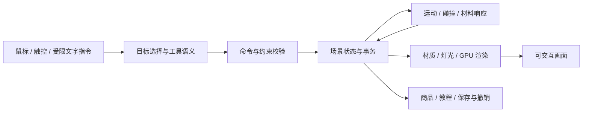

# 鼠标交互产品的独立实现方案

更新：2026-10-07。**基础方向探索以ATELIER 0.18.2收束，本文保留独立实现架构与按需扩展的研究路线。** 当前11场景、35/36项受控映射、C35九目标和十份整套稳定存档形成可复用基线；独立新桌与灯具工作台深化支撑面检测、关系与成果保存，尚未接入客厅、九任务或十份整套备份，也不增加场景或编号。C19购物联动未接入，试衣/真人扩展继续暂停。后期有具体产品想法，再确定用户、任务、输入和交付范围，选取相关基础细化研究；本文七阶段和未实施算法不代表当前排期。

先读[项目理解与完整总览](http://localhost:4189/projects/011-solaris/overview.html)和[新版汇总图](../assets/atelier-understanding-map.svg)，当前操作与边界见[接入说明](integration.md)、[交付范围](product-release.md)和[网页场景说明](http://localhost:4189/projects/011-solaris/integration.html#scenes)。0.18.2当轮386/386项产品Node测试与16/16项仓库检查已通过，本次文档整理不表示复测。全部版本的验收数字、真实操作和未验证事项保留原归属；35/36不是完成率。36条目的来源与证据等级以[公开能力目录](capability-catalog.md)为准，不由我们的代码推断Solaris内部实现。

**0.6.0历史：** 当轮独立客厅、汽车、影像、Carnegie建筑白模与料理备料五个工作台覆盖24项受控能力：客厅14、汽车3、影像2、地标3、料理2；当时其余12项待接。料理使用CC0完整带皮食材和本地近似刚体组合/受控检视，苹果/牛油果拖入、浮起/受阻与保存恢复已验收；地标为官方CC0简化中空打印几何，无原色、完整室内/花园或可靠物理尺度，真实环绕、滚轮、平移模式、时间、知识入口和持久化已验收；设备取消/触控与性能另验。影像默认px，mm只来自用户已知参考。下方算法表同时保留当时已实施方法和更广的研发目标，不能把目标直接当作当前功能。

## 产品方向与依赖边界

产品定位为可编辑的高质量场景工作台：用户直接操作对象、环境、工具和主体关系，系统维护可保存的状态，并绘制操作后的画面。交互逻辑、场景数据、工具协议、关联行为和业务流程由我们实现，运行时不调用Solaris或其他外部推理API。真人上装参考另使用本机部署的FASHN预训练模型及解析组件，属于有限外观研究，不是从零训练或所有算法自研；其来源、失败与限制按专项记录阅读。原来的混合接入建议已被本方案取代。

可以采用开源渲染、图像处理和物理库作为基础设施；依赖本地打包的代码与资产，不把产品能力交给远程模型。基础库的许可、版本和分发方式需要登记。未来若研究自动建模或生成，作为我们控制的独立研发模块，不能成为第一版正常运行的前提。

第一版输入是有对象结构、尺寸和材质信息的场景资产。照片可以作为设计参考；一张普通照片不会自动变成可任意旋转、编辑、试穿的三维场景。完整的单图重建和开放式视觉生成另设研发任务。

## 核心数据与执行链路

场景状态是画面与业务共同使用的数据源。每个对象有稳定 ID，并记录资产版本、真实单位、位置与姿态、材质、可执行操作、碰撞边界以及对象关系。灯具同时关联发光部件和灯光参数；衣物关联衣物网格、适配体型与商品 ID；动作主体关联骨架、动作状态和目标。

图中每个产品模块均由我们维护。二维图像视口和三维视口可以使用不同的渲染方式，但共享对象 ID、工具协议和命令历史。仿真按固定时间步推进；编辑指令在明确的同步点应用，避免渲染、碰撞和界面读取不同版本的状态。

| 模块 | 我们实现的职责 | 可采用的基础设施 |
| --- | --- | --- |
| 对象与交互 | 目标拾取、拖动平面、轴向约束、吸附、尺寸范围、输入取消 | Three.js 射线拾取与变换控件 |
| 外观与环境 | 材质变体、局部绘制、灯光绑定、时间参数、相机控制、资产管理 | Three.js 渲染器、glTF 资产加载 |
| 工具与指令 | 同一手势的模式解释、工具对目标的适用规则、有限中文语法 | 我们的命令注册表、解析器与校验器 |
| 穿搭与商品 | 人体骨架、衣物适配、鞋与脚的绑定、商品选项和购物状态 | 网格、骨骼、形变目标；专门的衣物算法 |
| 运动与组合 | 食材堆叠、跟随、跳跃、浮起、器具与人物接触 | 刚体库、动作混合；我们的约束与行为逻辑 |
| 教学与测量 | 校准后的尺度、视口变换、核查过的实验规则、过程记录 | 二维图像视口、内容数据与我们的计算模块 |
| 流程与存储 | 教程进度、布局适配、场景切换、撤销、版本与保存 | 本地存储；需要协作时使用自有状态服务 |

技术依据：Three.js r180 的 [Raycaster](https://github.com/mrdoob/three.js/blob/r180/src/core/Raycaster.js) 用于鼠标拾取，[TransformControls](https://github.com/mrdoob/three.js/blob/r180/examples/jsm/controls/TransformControls.js) 提供对象变换控制；[GLTFLoader](https://github.com/mrdoob/three.js/blob/r180/examples/jsm/loaders/GLTFLoader.js) 与 [AnimationMixer](https://github.com/mrdoob/three.js/blob/r180/src/animation/AnimationMixer.js) 分别提供资产加载和动画基础。这些基础能力不自动提供本表中的完整产品流程。

Rapier 的 [场景查询](https://rapier.rs/docs/user_guides/javascript/scene_queries/) 可用于射线和形状检测。其 [运动学刚体说明](https://rapier.rs/docs/user_guides/javascript/rigid_body_type/) 明确指出，直接指定运动学对象轨迹不会自动阻止穿墙；拖动与跟随中的障碍约束仍须由产品代码处理。物理库的具体版本与浏览器兼容性在集成前锁定。

## 拖动台灯的具体实现

1. 按下时，从指针位置投射射线，解析到灯具对象 ID；记录初始变换和抓取偏移。当前工具决定是移动、缩放还是旋转，并在界面上明确显示。
2. 移动时，把指针射线与允许的拖动平面相交。桌面放置工具只允许进入可放置表面，保持灯底与桌面接触，并检查碰撞、边界和吸附条件。
3. 更新灯具及其绑定灯光的位置。渲染器根据新几何绘制遮挡，并更新所选方案支持的动态光照与阴影。动态反射和间接照明另有计算成本，必须在目标设备上评估，不能用固定环境贴图宣称全部光影准确更新。
4. 松开时，将整次拖动提交为一条可撤销命令；取消或输入丢失时按规则回退。指针移出画面仍能结束操作，编辑期间避免相机同时抢占拖动。
5. 保存对象与灯光状态、资产版本和相机。重新打开后重建同一方案；动态主体还需要保存速度、动作时间及必要的仿真状态。

灯移走后的墙面和桌面由已有场景几何绘制。场景必须具备这些内容，不能依赖一张照片中原本被灯遮住的未知区域。挂画缩放、沙发换布料和太阳拖动同样以参数与关系更新驱动渲染。

## 全部 36 个条目的实现映射

下表保留0.6.0时的全部条目实现路线，包含当轮已接入的受控范围和待研发目标。“工程实现”表示存在明确的受控场景路线；“专门研发”表示需要额外算法与质量研究；“产品设计”对应官方设想或适配流程。当轮已接入的24项为C01–C04、C06–C16、C20、C22–C26、C29、C34与C36；当前35/36映射、每项范围和暂停状态以[接入说明](integration.md)及[网页清单](http://localhost:4189/projects/011-solaris/integration.html#inventory)为准。路线中更广的目标不自动计为当前功能，覆盖条目不等于达成原模型在任意输入上的效果。

| ID | 功能 | 独立实现方式与输入要求 | 主要验收与边界 |
| --- | --- | --- | --- |
| C01 | 灯具移动 | 真实网格、放置面、灯光绑定与受约束拖动 | 接触、遮挡、灯光响应；工程实现 |
| C02 | 挂画尺寸调整 | 挂墙锚点、尺寸参数、边框与画面的共同变换 | 宽高比与墙面接触保持；工程实现 |
| C03 | 植物尺寸调整 | 底部锚点、整体缩放与植物资产 | 接地、枝叶和盆的比例保持；工程实现 |
| C04 | 语言指定家具移动 | 有限中文语法解析成对象、方向、距离命令 | 歧义提示与边界校验；不承诺任意自然语言 |
| C05 | 商品陈列重排 | 商品槽位、拖放与布局约束求解 | 不误改试穿与购物状态；产品设计，原来源为设想 |
| C06 | 沙发布料替换 | 布料 PBR 材质、UV、纹理尺度与变体库 | 保留网格褶皱和接缝，比较真实材质；资产依赖 |
| C07 | 语言指定沙发换色 | 对象词与颜色词解析到材质命令 | 改正确对象，保留其他参数；受限语法 |
| C08 | 墙面换色 | 独立墙面材质槽及颜色参数 | 保留纹理与同场景照明；工程实现 |
| C09 | 画作内容修改 | 画布纹理替换、笔刷和可编辑图层 | 保存图层与撤销；任意描述生成画作另需研发 |
| C10 | 室内时段调整 | 时间参数驱动太阳、天空、人工灯与环境参数 | 同一空间中的连续变化；工程实现 |
| C11 | 室内光照调整 | 可调灯具、曝光与动态阴影方案 | 逐项标定，避免固定烘焙光照在移动后仍残留 |
| C12 | 地标时段切换 | 授权地标资产、天空与昼夜灯光系统 | 地标几何保持；真实日照需地点和日期数据 |
| C13 | 地标视角探索 | 三维场景相机与可导航区域 | 场景边界与几何完整；不由单张照片自动补全 |
| C14 | 场景中的地标学习 | 对象热点、资料卡与来源数据 | 内容可核查，绑定正确对象；工程实现 |
| C15 | 室内视角探索 | 自由相机、轨道控制与导航限制 | 完整房间、多角度质量；工程实现 |
| C16 | 相机平移与俯视 | 明确的相机模式和变换 | 位移与俯仰分别控制；不推断原示例的鼠标手势 |
| C17 | 拖衣服到人像试穿 | 初期用已标定三维人体、服装网格、骨骼适配与形变；再研发布料碰撞 | 专门研发；普通人物照片上的写实试穿未解决 |
| C18 | 拖鞋子到人像试穿 | 鞋资产与脚部锚点、姿态及体型适配 | 专门研发；保持接触与尺度，不承诺照片输入同等效果 |
| C19 | 试穿与购物车关联 | 商品 ID、变体、数量与事务事件 | 视觉与购物状态一致，取消和撤销恢复；工程实现 |
| C20 | 拖食材组合沙拉 | 0.6.0完整食材备料组合，真实扫描网格、球形包络、有限碗与固定时间步 | 默认4件/上限16件，稳定ID、沉降、数量和保存；非切丁/烹饪，主工作流已验收，设备等专项另验 |
| C21 | 火源触发材料反应 | 接触条件、核查过的材料响应规则、局部热状态与视觉效果 | 专门研发；教学模型范围明确，不宣称通用化学预测 |
| C22 | X 光图拖动放大 | 图像坐标与视口矩阵、缩放锚点 | 像素位置准确，图像数据保留；工程实现 |
| C23 | X 光图拖动测量 | 测量工具、坐标逆变换及像素间距或标尺校准 | 未校准仅显示像素距离；不推定临床准确性 |
| C24 | 汽车灯光开关 | Car Concept 灯组材质与实际投射光绑定，点击灯具或面板控制 | 已接入；0–300 展示参数，不是工程光强或全部灯规仿真 |
| C25 | 拖车查看角度 | 完整授权汽车网格、轨道相机、六个视角与独立配置 | 已接入；手势控制相机，保留已有模型比例，不补全照片 |
| C26 | 打开汽车引擎盖 | 原独立盖板、局部 X 铰链及子树，开度0–1对应0–60° | 已接入；内部是原概念资产简化网格与烘焙纹理，不用于具体车型维修 |
| C27 | 猫的纹理变成工具 | 自有取样工具从资产或用户选区提取颜色、局部纹理，形成笔刷描述 | 专门研发；受限纹理取样不等于任意对象的语义风格提取 |
| C28 | 画风变成绘画工具 | 初期用调色板、笔触纹理与边缘参数构造笔刷；另研本地风格算法 | 专门研发；参数化笔刷不等于通用神经风格迁移 |
| C29 | 点击触发浮起 | 0.6.0稳定且通路无阻食材的受控轨迹、物理暂停与原姿态恢复 | 浮起/归位/取消、目标与其他食材保持；不是动作生成，主工作流已验收，设备等专项另验 |
| C30 | 拖鱼改变位置 | 水域拖动约束、路径平滑与朝向计算 | 不穿过边界，拖动响应连续；工程实现 |
| C31 | 潜水员跟随鱼 | 目标关系、路径规划、避障、跟随距离与动作混合 | 不穿障碍，多轮跟随保持关系；专门研发 |
| C32 | 拖滑板触发骑手跳跃 | 手势阈值、滑板轨迹、骨骼动作、接触约束与落地状态 | 人板协调、起跳落地合理；专门研发 |
| C33 | 商店随意图适配 | 用户明确偏好、规则排序、布局约束和状态保存 | 适配理由可解释，保留选品；产品设计，原来源为设想 |
| C34 | 教程按进度恢复 | 教程状态图、步骤完成条件、检查点与版本迁移 | 重开继续，跳步与错误可恢复；产品设计，原来源为设想 |
| C35 | 按意图改变场景 | 有限意图指令、预定义场景注册表、状态迁移与转场 | 仅进入已有场景；自由生成未见场景另需研发 |
| C36 | 太阳与光照联动 | 太阳方位/高度与天空、阴影的参数绑定 | 操作与环境同步；原录像未明确全部按下/松开事件 |

结构化映射、模块依赖与实施状态见 [product-feasibility.json](product-feasibility.json)。C05、C33、C34 的来源等级仍是官方设想；我们的工程方案不会改变它们的来源等级。

## 优秀场景的生产与验收

第一场景是完整的客厅设计工作流：为阅读角做两套方案，移动灯具、调整画作与植物、换布料与墙色、调整环境、比较视角，最后保存并重新打开。先把这个场景做完整，再加入其他专业场景。

第二场景为汽车产品探索：在 Khronos 专业 Car Concept 上环绕观察、选择车漆、点击灯具与引擎盖、调整亮度与开度、保存配置、重开恢复及导出真实渲染。模型与纹理由 Eric Chadwick 制作，© 2024 Darmstadt Graphics Group GmbH，CC BY 4.0；14 张 PNG 和原几何嵌入本地 GLB，原标记与许可保留。车灯、部件层级和铰链来自真实资产；概念机械舱的简化网格与烘焙纹理不承诺发动机工程细节。

第四场景采用Carnegie官方CC0简化中空外部打印STL，以建筑白模展示进行C12时段、C13相机和C14资料热点的交互验证；没有原色纹理、完整室内/花园或物理长度单位。白模陈列材质与视觉光照由本项目制作，历史内容直接关联博物馆官方史料，扫描与当前现场分开；本轮浏览器已验收多角度、时间光影、四画面知识入口、一次撤销和保存恢复，见[地标记录](landmark-validation.json)；右键、设备取消、触屏及硬件性能继续专项验证。

第五场景是料理备料台，以Poly Haven CC0真实apple/lemon/onion/avocado完整带皮模型接入C20和C29。从场景托盘直接拖入作者陶瓷碗，来源可重复取用，每次有效添加创建稳定ID；默认4件、最多16件。Cannon-es 0.20.0本地MIT库只提供刚体基础，固定1/120秒时间步、球形近似包络、有限容器和落点/沉降事务由产品规则组合。20个原文件、12张1k纹理、24,211三角面与4,716,226字节已独立校验。

稳定且通路无阻的食材可点击缓慢浮起检视；受阻拒绝，检视期间全部物理暂停，其他食材固定；镜头临时跟随，归位/取消恢复原组合与原视角，不写入稳定存档。保存只保留稳定组合，拖放/沉降中取消回原状态；一次完整动作一条undo。食材不是切丁沙拉，显示归一化与原资产尺寸分开，不提供软体、剥皮、烹饪、称重或营养。

66项产品测试（原49项、厨房核心8项、物理9项）通过。真实托盘拖入苹果4→5、牛油果5→6，ID/模板保持并物理停稳；苹果一次撤销逐值回初始且可重做。原生越界拒绝和碗内移动均可精确恢复，下落期撤销只取消当前pending；移除/清空也能一步恢复。苹果#5原生点击缓浮、保存不写临时姿态、归位JSON逐值不变；牛油果辅助检视取消精确恢复，受挡苹果#2原生点击明确拒绝且状态不变。6件保存重载位置、四元数、相机和nextId逐值一致；非法nextId1拒绝，合法同ID换模板实际重建网格并可撤销。原生环绕相机变custom且一次撤销精确恢复。

三相机预设均保持完整食材数组；原生滚轮距离3.554208772708772→2.4567043372563138，target/items不变，一次撤销完整JSON精确回原总览。C20/C29能力说明已实际打开，操作、预期、验收与边界清晰；自然桌面client/scroll均1280，无横向溢出且不覆盖视口。

真实工作区与近景浮起截图均为1280×720；当前canvas JPEG预览实际解码为1470×969，三张图片与六件hero配置已经写入本地，浏览器warn/error为空。近景浮起镜头临时跟随，归位全JSON与起始逐值相同；浮起期间保存后重载仍精确恢复原近景配置与idle，不写入临时镜头。

[真实工作区](../assets/atelier-kitchen-workspace.jpg)、[浮起近景](../assets/atelier-kitchen-inspection.jpg)、[真实canvas JPEG](../assets/atelier-kitchen-render.jpg)与[六件可恢复配置](../assets/atelier-kitchen-config.json)保留完整姿态与hero相机。

最终网页36/24/12、五场景、当前阶段2/5与能力说明最新验收状态已实际核对。四种食材均已原生拖入成功；柠檬与洋葱分别从6→7停稳，一次撤销完整回6件。堆叠数值稳定性修复后，中心投放第7件柠檬已通过原生鼠标复验，保留原六件食材，一步撤销完整恢复；修复前未稳定投放也曾实际验证明确提示与完整回滚。求解迭代从24提升到60，边界、穿透和稳定阈值保持；原六件组合加精确中心柠檬的回归在20/30/60/120Hz输入下约3.067模拟秒稳定，物理9项测试通过。模拟耗时由固定时间步计算，实际耗时取决于设备与帧率，界面采用“食材未能稳定，请减少数量或更换落点”的失败反馈。

多方向碗边极值、16件满碗上限、溢出恢复与长期重复组合仍待专项。按住中途Escape/失焦、停顿续拖、右键平移、触屏、指定硬件性能/长期稳态、完全网络隔离与下载实际写盘仍待设备验收，不能用源码方案替代。 见[料理接入](integration.md#kitchen)和[验收记录](kitchen-validation.json)。

场景生产采用有许可的专业模型、扫描材质或真实设计资产。家具需要正确尺度、轮廓、接缝、法线与 UV；房间需要窗、墙、地面和隐藏部分的完整几何。给资产制作可操作语义、碰撞形状、材质变体和不同细节等级。操作中的画面质量必须与展示封面一致。

| 验收项 | 可执行检查 |
| --- | --- |
| 画面质量 | 与经授权的设计参考在一致视角下对照；查看材质纹理、接触、窗光、边缘与多角度细节，并由人工审阅 |
| 光照一致 | 移灯、改太阳、开关灯后检查阴影与反射；固定烘焙照明不能用于宣称已支持动态照明 |
| 连续交互 | 真实执行拖动、停顿、逆向、释放、取消、越界及快速切换；检查目标身份、锚点、邻近对象和相机抢输入 |
| 状态可重建 | 多轮修改后撤销/重做，保存并重开；比较对象、材质、灯光、相机和业务数据 |
| 性能 | 先指定设备、分辨率和场景规模，再测指针到可见反馈、帧时间分布、加载与显存；未测前不宣称固定帧率 |
| 独立运行 | 客户端资产与依赖本地打包；阻断第三方网络后完成工作流。协作版只允许访问我们的资产与状态服务 |

真实演示必须展示用户输入与引擎连续响应。官方视频继续用于研究，不能作为我们产品质量的验收结果。低质量占位模型只能用于内部验证，不能交付成“优秀场景”。

## 0.6.0历史研发顺序与研究条件

下表与随后五场景/24项/12项数字保留原版本的推进记录，不是0.18.2当前缺口或继续执行的排期。当前基线与按需扩展定位见本文首段；未来仅对具体产品需要的算法、资产、业务和设备范围重新定义验收。

| 阶段 | 交付范围 | 进入下一阶段的条件 |
| --- | --- | --- |
| 1. 客厅与通用编辑 | 客厅资产、选择与变换、材质光照、视角、教程、撤销与保存；14项 | 当前受控范围已接入，持续检查画面、交互与状态可靠性 |
| 2. 汽车产品探索 | 完整车辆、车灯、相机与盖板；C24–C26 | 原始部件与铰链、灯光绑定、配置重建均有对应验收 |
| 3. 影像工具与地标 | C22/C23二维视口与C12–C14 Carnegie白模已受控接入 | 影像默认 px，mm 需用户已知参考；坐标与测量保持，地标资料逐项有来源 |
| 4. 场景组合与主体联动 | 料理备料C20/C29受控接入，C30–C32待研发；2/5 | 当前阶段继续；料理真实鼠标主工作流已验收，设备等专项继续，水下与滑板另须避障/动作专项检查 |
| 5. 三维穿搭与商品 | 标定人体、衣鞋与业务状态；C17–C19 | 公开体型范围内检查穿插与接触，商品和视觉事务一致 |
| 6. 取样笔刷与材料教学 | 局部纹理与风格工具、材料实验；C21、C27–C28 | 内容依据、取样范围、可撤销图层与算法质量可验证 |
| 7. 陈列、意图与转场 | 商品陈列、显式偏好、登记场景转场；C05、C33、C35 | 场景成熟后接入；理由、返回和各场景状态可解释且可恢复 |

客厅、汽车、真实影像、CC0建筑打印几何与四种CC0食材已打包，五个场景由自有状态与本地渲染运行。剩余12项、专项算法及商品业务仍未实现，工期和新增资产成本未估算。阶段表示实施顺序，不承诺发布日期；阶段来源为 [roadmap.json](roadmap.json)，实际功能状态来源为 [product-feasibility.json](product-feasibility.json)。浏览器操作、汽车小屏幕、完整断网和性能分别记录，静态代码检查不代表它们全部通过；仍需指定设备与延迟、显存预算。

若要求任意上传照片即可移动物体并补全背景、写实换装、探索未见视角或生成任意画风，我们还需要解决重建、分割、遮挡补全、人体与服装估计、视觉生成及长期一致性。可研究自有训练或本地运行算法，但它们需要数据、算力和评估，不能把训练一个通用世界模型计入普通前端开发。本路线先实现可独立运行的功能类型，再逐项研究这些更高要求。
