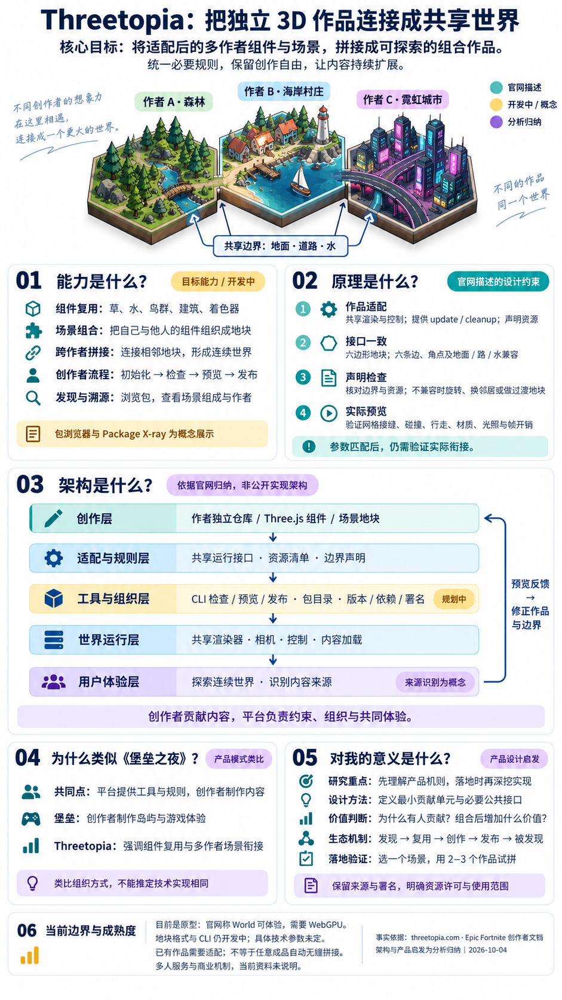

# 012 · Threetopia · 多作者 3D 世界拼接与平台机制

**能力：** 面向 Three.js 创作者的共享世界原型，目标是复用组件、组合场景，并将适配后的多作者地块连接成可探索的组合作品；提供创作者发布、内容发现与来源追溯的设想。

**原理：** 作品接入共享渲染与控制，提供更新和清理接口并声明资源；六边形地块按地面、道路、水和角点高度匹配六条邻边，先检查声明，再共同预览实际接缝、碰撞与跨界体验。

**架构：** 按功能归纳为创作、适配与规则、工具与组织、世界运行、用户体验五层；类似堡垒创作者平台的工具与规则底座，更强调组件复用和多作者场景的连续衔接，不能据此推定实现相同。

**使用场景：** 作为共享虚拟展览、主题社区、浏览器 3D 体验和可复用场景生态的设计参考；这些是潜在采用方向，需要结合真实需求验证。

**价值：** 借鉴最小贡献单元、必要公共接口、组合前验证、署名与来源追溯，以及发现、复用、创作、发布的内容循环；重点思考贡献动机、创作自由和组合后的额外价值。

**边界：** 现有作品需要适配，不能任意自动拼接；地块格式、CLI 和创作者工具仍开发中，包浏览器与 X-ray 是概念。World 可体验仅据官网声明、未实测；后台实现与多人能力未验证。

**当前结论：** 当前优先保留产品思路与平台机制，不继续深入实现或复现，按产品参考归档；以后有明确落地需求，再用少量真实作品验证接口、衔接和用户价值。

[返回总索引](../../README.md) · [证据、讨论纠偏与未验证问题](notes/research.md)

总览图由内置 imagegen 根据本轮讨论生成；地块画面是概念示意，功能架构是我们的归纳，不作为上游运行截图或已实现能力的证明。

## 研究对象与资料范围

| 项目 | 内容 |
| --- | --- |
| 来源 | [Threetopia 官网](https://threetopia.com/) |
| 类比参考 | [Epic：Get Started Creating in Fortnite](https://dev.epicgames.com/documentation/en-us/fortnite/get-started-creating-in-fortnite) |
| 核查日期 | 2026-10-04（Asia/Shanghai） |
| 归档定位 | 产品参考，已归档；保留后续落地时重新研究的入口 |
| 本次产出 | 中文理解总结、原创整理图、证据记录；未复制上游代码 |
| 验证方式 | 阅读公开网页；未运行 CLI、发布内容或验证 World 的跨地块体验 |

## 它解决的是什么问题

一个作者能做出漂亮的森林，另一个作者能做出村庄，但两份独立演示并不会自然形成同一款产品。它们可能使用不同坐标、相机、资源组织和交互方式；即使放在一起，用户也可能遇到接缝、尺度差异或控制方式切换。

我们把 Threetopia 的产品方向理解为：先让内容拥有共同的连接方式，再组织成可探索的整体。输入可以是局部组件，也可以是完整场景；输入需经过适配，输出才可能成为可复用的贡献。

例如，作者 A 提供森林，作者 B 提供村庄，作者 C 提供鸟群。组合者选用这些贡献，处理森林与村庄的连接，再安排探索路径。整体作品的价值来自内容质量，也来自组合者的选择和编排。组合并不自动转移原作者的版权；能否复用、修改和发布，需要明确许可与署名规则。本轮未确认具体许可证。

## 原理：把连接规则变成创作接口

可以用一个概念流程理解：

**独立贡献 → 适配约定 → 检查兼容 → 组合预览 → 发布与复用 → 整体体验**

这里的关键不是“把模型放到同一个画面”，而是定义每个贡献对外承诺什么。我们把边界分成三类分析：

| 边界类型 | 要解决的问题 | 对产品设计的启发 |
| --- | --- | --- |
| 空间边界 | 地形、道路、水和邻接关系能否连续 | 优先规定接入处，避免把整个场景都标准化 |
| 运行边界 | 场景进入、更新与离开时如何协作 | 让局部内容遵守共同生命周期，减少彼此干扰 |
| 创作边界 | 个性风格与整体体验如何兼容 | 把必守规则和可自由发挥的部分明确区分 |

官网具体约束及其开发状态见[证据矩阵](notes/research.md#公开资料证据矩阵)。声明相符与实际衔接是不同层次的验证：前者检查约定，后者需要看到和走过组合结果。对自己的产品而言，应先确定“连接成功”的用户体验，再设计可以检查的参数。

## 五层功能架构：我们的分析框架

下表用于解释能力之间的关系，**不是上游源码模块图，也不表示这些模块已全部上线**。

| 层次 | 主要职责 | 我们应关注的产品问题 |
| --- | --- | --- |
| 1. 创作内容层 | 作者提供组件和场景，描述来源与依赖 | 贡献单元多大最容易制作、发现和复用？ |
| 2. 连接约定层 | 规定对外边界、运行接口及适配要求 | 最少统一哪些内容，才能稳定组合？ |
| 3. 创作工具层 | 帮助作者准备内容、检查、预览和发布 | 错误是否能定位？作者能否低成本修复？ |
| 4. 世界组合层 | 把兼容内容放入整体体验，协调加载和运行 | 内容增加后，体验质量如何保持？ |
| 5. 探索与追溯层 | 用户体验世界，并理解各部分来自谁 | 消费内容能否进一步促进发现作者和复用？ |

沿这五层，作者负责局部贡献，平台负责共同约定，组合者负责整体组织，用户通过体验评价结果。这是职责划分的建议，不是已证实的组织、服务或商业架构。

## 为什么可以类比《堡垒之夜》

Epic 提供 Creative 和 UEFN 等工具，让创作者制作和发布岛屿。[Epic 创作入门](https://dev.epicgames.com/documentation/en-us/fortnite/get-started-creating-in-fortnite)

两者在“共同平台承载创作者内容”的产品模式上具有可比性。Threetopia 的区别点是强调贡献之间的连接。因此，这里的“类似堡垒的架构”指平台与创作者的职责关系，不能推导两者使用相同引擎、后台或内容协议，也不能推导堡垒之夜岛屿采用六边形无缝拼接。

我们真正借鉴的是：用户不必只消费平台团队制作的全部内容；平台可以让创作者成为内容供给者，让整体产品随贡献持续丰富。

## 对我们有什么意义

首先，**规则本身可以成为产品能力**。如果不同作者必须逐一沟通和手工适配，内容增加也会增加集成成本。清楚的接口、及时的错误反馈和可验证的预览，能降低参与门槛；是否真的有效，需要后续试点验证。

其次，**组合后的价值需要单独设计**。森林加村庄只是内容集合；连贯的探索路径、共同任务或清楚的主题，才可能让组合体验更有价值。构建自己的产品，需要定义用户进入后要做什么，以及为什么愿意再次回来。

最后，**供给与复用要形成循环**。作者为什么贡献、作品如何被发现、复用如何带来认可、优质内容如何被维护，都需要机制支撑。许可证、版本兼容、质量审核和作者激励是我们的落地问题清单，本轮没有把它们写成 Threetopia 已具备的功能。

当前适合先验证三个问题：贡献者能否容易接入，组合者能否形成有用体验，用户能否感受到组合的额外价值。若未来确有同类项目需求，再研究地块协议、适配实现、性能与内容治理。详细证据及未验证事项保留在[研究笔记](notes/research.md)。
