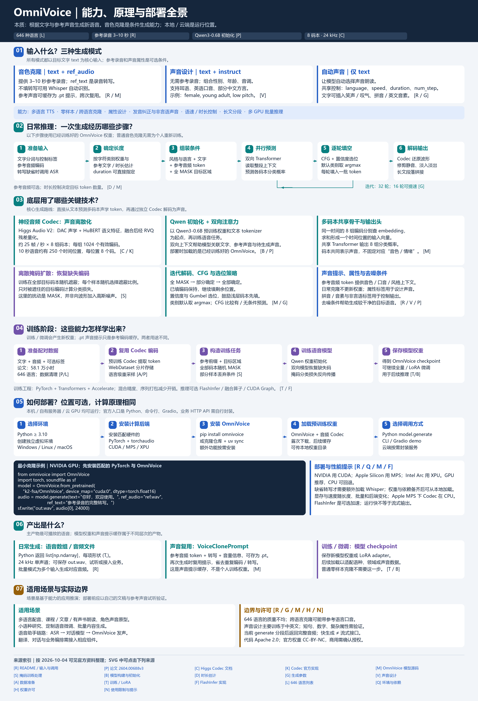

# 013 · OmniVoice · 多语言语音生成与音色克隆

**能力：** 多语言文字转语音，官方标注覆盖 646 种语言；支持短参考声音的零样本克隆、属性声音设计和自动声音，并提供发音、语速、时长、生成步数及批量控制。

**原理：** 神经音频 Codec 将声音表示为离散 token；训练好的双向 Transformer 在文字与声音条件下多轮补全 8 组码本编码，再解码为 24 kHz 波形。普通克隆通常无需逐人训练。

**使用场景：** 朗读与旁白、教育配音、角色试音、助手的语音输出及语音研究；翻译、对话、字幕对齐和业务服务需另行接入，采用效果需用真实语言、素材和硬件验证。

**价值：** 在同一模型中复用跨语言声音条件，可在本机、服务器或云 GPU 部署，并提供训练与微调路径。研究网页用完整引导图和教学交互解释能力、输入输出、数据表示、生成机制及部署。

**边界：** 646 种语言的覆盖不代表质量一致；声音设计主要在中英文训练。源码 Apache 2.0、官方权重 CC-BY-NC；网页为知识展示，未提供真实 TTS 服务，本次未运行模型或实测音质、速度。

[返回总索引](../../README.md) · [研究笔记与证据](notes/research.md) · [网页源码](web/index.html) · [网页说明](web/README.md)

## 研究对象与资料范围

| 项目 | 内容 |
| --- | --- |
| 来源 | [OmniVoice](https://github.com/k2-fsa/OmniVoice) |
| 访问日期 | 2026-10-04（Asia/Shanghai）；未固定上游 commit |
| 论文版本 | [arXiv:2604.00688v3](https://arxiv.org/html/2604.00688v3) |
| 权重 | [k2-fsa/OmniVoice 模型卡](https://huggingface.co/k2-fsa/OmniVoice) |
| 许可证 | 源码 Apache-2.0；官方预训练权重 CC-BY-NC，见[许可说明](https://huggingface.co/k2-fsa/OmniVoice#license) |
| 本次产出 | 中文知识网页、原理总览图与研究笔记；未复制上游模型代码 |
| Web 部署目标 | [OmniVoice 中文汇总网页](https://yydshly.github.io/1002_codex_project/projects/013-omnivoice/) |
| 验证范围 | 阅读官方仓库、论文、模型卡、Codec 文档和关键实现；未训练或运行推理 |
| 目录状态 | 以 [catalog.json](../catalog.json) 中的状态为准 |

## 理解总览



[下载 PNG](assets/omnivoice-overview.png) · [查看 SVG](assets/omnivoice-overview.svg)。图是依据公开资料制作的教学整理，示意声音与编码不代表真实模型推理结果。

## 它的本质能力是什么

核心是**条件语音生成**：给文字，再可增加参考声音或声音属性，生成符合条件的新语音。克隆是其中一种方式，多语言则扩大可覆盖的文字和发音范围。[官方能力与接口](https://github.com/k2-fsa/OmniVoice)

| 方式 | 主要输入 | 希望得到的结果 |
| --- | --- | --- |
| 声音克隆 | 目标文字、参考音频及其文字 | 用接近参考说话人的声音读新文字 |
| 声音设计 | 目标文字、性别／年龄／音高／口音等属性 | 无参考音频时生成指定特征的声音 |
| 自动声音 | 目标文字 | 由模型自动选择声音朗读 |

参考音频建议 3–10 秒；省略参考文字时可用 Whisper 自动转写。声音设计有约定类别，不能推定任意自然语言指令都有效。[使用提示](https://github.com/k2-fsa/OmniVoice/blob/master/docs/tips.md)、[声音设计](https://github.com/k2-fsa/OmniVoice/blob/master/docs/voice-design.md)

### “声音参数化”要区分三种东西

| 概念 | 实际含义 | 作用 |
| --- | --- | --- |
| 音频编码 token | 声音压缩后的离散编号序列 | 表示具体声音，不是手工音色参数表 |
| 模型参数／权重 | 训练得到的网络数值 | 学习文字、声音与上下文的生成规律 |
| 参考声音提示 | 参考编码、参考文字等条件 | 推理时指定声音，无需逐人重新训练 |

保存的 `VoiceClonePrompt` 用于复用声音条件，不是训练出个人模型权重。[提示实现](https://github.com/k2-fsa/OmniVoice/blob/master/omnivoice/models/omnivoice.py)

## 输入怎样变成输出

**文字与声音条件 → 文本／音频编码 → 估计目标长度 → 全 MASK 目标编码 → 多轮并行补全 → Codec 解码 → 24 kHz 单声道音频。**

训练时真实音频已知，随机遮挡编码后学习恢复；推理时真实目标声音未知，从全 MASK 开始生成，默认 32 轮。[训练处理](https://github.com/k2-fsa/OmniVoice/blob/master/omnivoice/data/processor.py)、[生成参数](https://github.com/k2-fsa/OmniVoice/blob/master/docs/generation-parameters.md)

“双向 Transformer”表示利用**当前可见的左右上下文**：完整文字、参考提示、已生成编码。它不会预先看到未知的真实目标音频。Codec、注意力和采样机制见[研究笔记](notes/research.md#架构与关键实现)。

## 如何部署

权重可在电脑、公司服务器或云 GPU 加载运行。“本地模型”描述权重由运行进程执行，不意味着只能放在个人电脑。下载齐所需权重与依赖后可使用本地目录；省略参考文字时还需要 ASR 模型。对其他应用提供网络调用，需另行封装服务接口。[加载与生成](https://github.com/k2-fsa/OmniVoice/blob/master/omnivoice/models/omnivoice.py)

环境声明为 Python ≥ 3.10、PyTorch / torchaudio ≥ 2.4、Transformers ≥ 5.3.0；实际设备兼容与速度需要验证。[依赖声明](https://github.com/k2-fsa/OmniVoice/blob/master/pyproject.toml)

以下是参考步骤，**本次未执行模型安装与推理**：先在独立 Python 环境安装匹配硬件的 PyTorch，再安装库、启动其 Gradio 界面。

```bash
pip install omnivoice
omnivoice-demo --ip 127.0.0.1 --port 8001
```

还可使用 Python API、单条 CLI 或批量推理工具。模型界面与本项目静态知识网页是不同应用。[调用入口](https://github.com/k2-fsa/OmniVoice/blob/master/pyproject.toml)

## 本项目网页预览

网页使用 HTML、CSS、JavaScript，汇总三种模式、输入输出、训练、生成与部署，并提供掩码补全和注意力教学交互。它不加载模型，不生成真实音频。

在研究库根目录使用 Node.js ≥ 22：

```bash
node scripts/catalog.mjs build
node scripts/serve.mjs --port 4193
```

打开 `http://127.0.0.1:4193/projects/013-omnivoice/`。发布配置与模型服务独立，见[网页说明](web/README.md)和[研究库部署指南](../../docs/deployment.md)。

## 当前结论与后续验证

本轮完成资料和代码层面的知识整理。采用模型前，应以实际目标语言和已获授权的素材生成最小样例，检查发音、相似度、噪声、长文本一致性、延迟与显存。当前不对实际表现作结论；权重的非商业许可需要纳入采用判断。
