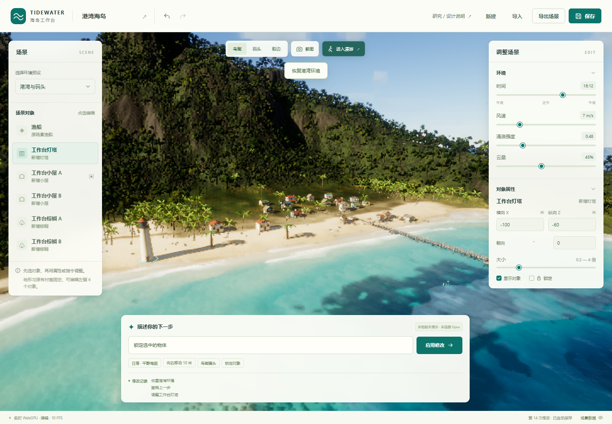
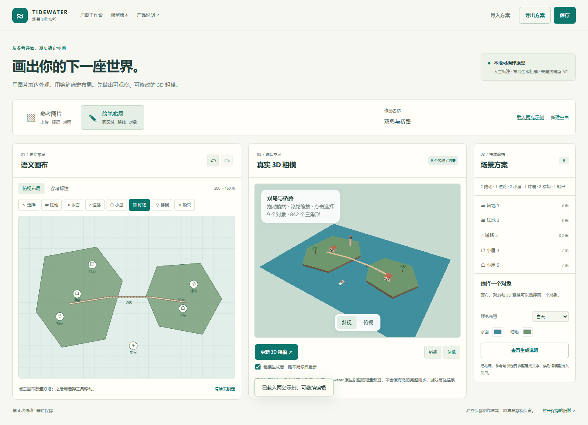
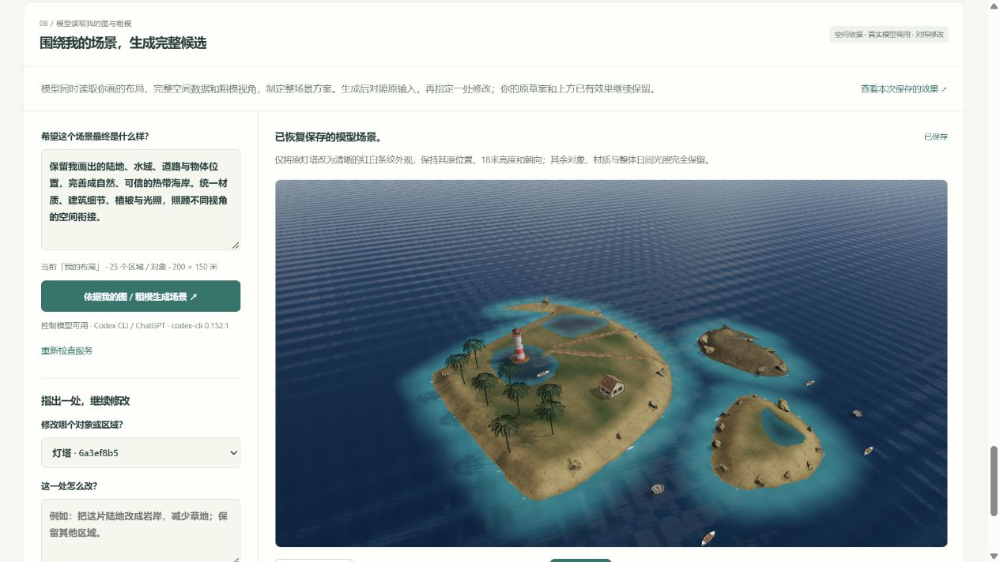
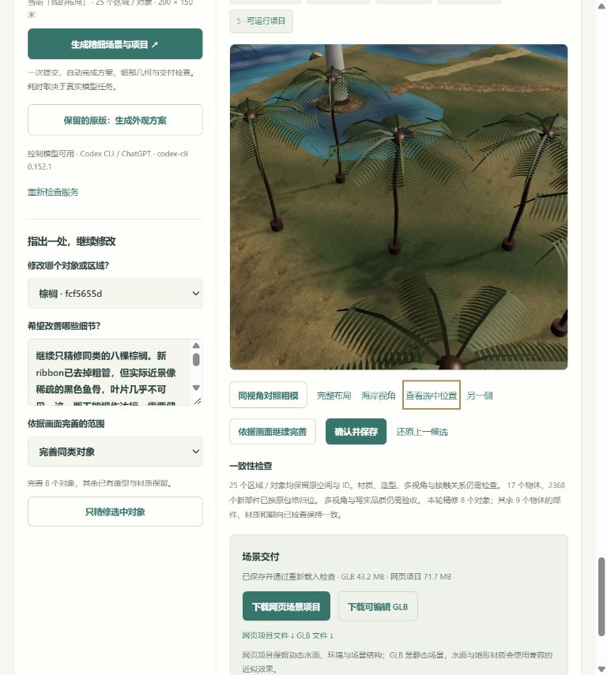

# 014 · Tidewater · 可控 3D 海岛工作台

## 当前成果与远端使用

2026-10-08：保留现有原场景，暂不继续视觉优化，按当前能力发布阶段成果。主场景是用户绘笔的200×150米三岛布局，共25个来源对象，其中17个物体已接入模型定义的精修几何。原空间、几何和4轮精修历史保持；六木屋A/B另作独立业务示例。

- [成果与产品说明](https://yydshly.github.io/1002_codex_project/projects/014-tidewater/release.html)：源库价值、研究过程、入口出口、控制原理、已验证能力、业务方向和后续优化。
- [原海岛浏览](https://yydshly.github.io/1002_codex_project/projects/014-tidewater/camp-viewer.html?proposal=560be513-9fa1-4ee5-b4dc-22c01e3aae8b)：实际3D、近景、对象介绍、另一侧与粗模对照。
- [场景提案工作室](https://yydshly.github.io/1002_codex_project/projects/014-tidewater/camp.html)：编辑介绍与参考、保存本浏览器提案、JSON导入导出；首次打开沿用原场景。
- [完整研究总图](https://yydshly.github.io/1002_codex_project/projects/014-tidewater/research-map.html)及[能力归档](https://yydshly.github.io/1002_codex_project/projects/014-tidewater/capabilities.html)。

**核心控制思路**：用户图或粗模 → 稳定对象ID、位置、尺寸与锁定 → 模型读取布局、多视角和参考，完善外观配方与部件几何 → 程序校验、归位与比较 → 局部修改另存 → GLB、JSON和自包含网页工程。每次生成都以已有作品和修改范围为依据，已确认的空间与历史持续保留。当前控制适配器实际使用Codex CLI / ChatGPT；回执未返回确切模型ID，不能标成Opus。

**在线与本机**：GitHub Pages提供静态展示、布局和提案编辑以及已有成果下载，不托管模型服务。新方案生成、精修和新工程落盘需按下文本地说明启动4198服务；在线页面会说明这一状态并禁用相应服务按钮。已有原场景工程无需模型服务即可独立运行。

**后续按需扩展**：海岸水面过渡、植被自然度、建筑/船只近景、光照与设备性能；文旅提案、品牌展示、导览、教学、游戏或虚拟拍摄按真实需求接业务。后续精修仍锁定原布局、只修改指定范围、另存候选并在同一镜头检查。当前成果适合运行和讨论概念方案，不承诺任意输入一次生成即可达到最终写实品质。

**发布构建**：根目录`npm run build`会先执行`tools/build-publication.mjs`，生成可复现的`publish/`，再汇总到Pages总站。公开版包含当前源码、原场景与六木屋独立提案、v3/v5回放及下载；较早三轮回放采用阶段截图与当前场景链接。重复完整备份、模型会话、Python环境和权重继续在本机保留，源码库不上传这些本机资料；能力基线清单与检查证据保留。

**当前能力已归档，提案功能沿用原海岛**：[能力归档](web/capabilities.html) 汇总九类能力与边界，352 份源文件和证据保留在 [v5 基线](versions/2026-10-07-capability-baseline-v5/capabilities.json)。[场景提案工作室](web/camp.html) 现在默认沿用原三岛、灯塔、木屋、棕榈与船只的25对象精修结果，接入对象介绍、参考、局部方案、历史、客户浏览与独立工程；六间木屋 A/B 单独作为业务示例保留。详见 [当前归档与业务验证](notes/capability-baseline-and-camp-proposal.md)。这仍是需外观验收的概念方案原型。

**能力**：接入 Tidewater 的真实 WebGPU 海岛，编辑原版渔船和新增灯塔、两座小屋、两棵棕榈；调整时间、风速、涌浪、云量和镜头。已实现对象选择、移动、旋转、缩放、隐藏、锁定、撤销/重做、本地保存、JSON 导入导出和 GPU 画面 PNG 截图。

**新增实验**：参考图片和语义绘笔两个入口共享独立场景草案。支持图片上传与人工标注、绘制水陆多边形和道路、放置物体标记、结构化 plan、真实 WebGPU 粗模、局部移动与高度调整。选中未锁定陆地后，可以预览沙滩、岩石与植被细化，在粗模/细化之间比较，再应用、取消或移除。锁定、30 步会话撤销/重做、IndexedDB 保存、方案 JSON 和生成说明导出继续可用。

**模型代码候选**：保留较早的 [粗模与 3D 方案比较](web/model-scene.html)。编码模型依据已有布局编写海岸建筑、灯塔、棕榈、船只和材质代码；可以比较、独立保存、导出包含真实几何和对象分组的 GLB。该独立页面读取草案并运行固定代码，当时没有使用真实 3D 生成接口；新的神经模型生成已接在当前页第 06 步。历史记录见 [试验说明](notes/model-scene-experiment.md)。

**当前页写实实验**：创作页面的 [05 / 写实场景实验](web/create.html?entry=layout#realistic-panel) 读取当前布局快照，组合 PBR 物理材质、扫描岩石、草地资源与 HDRI 环境光照；支持粗模对照、海岸/建筑/全景镜头、白天/日落与截图。这一步由编码模型实现本地场景组装。继续推进前，已保存 [上一版完整网页及只读场景回放](web/versions/2026-10-05-realistic-material-v1/snapshot.html)。

**真实模型资产**：当前页 [06 / 模型生成精细资产](web/create.html?entry=layout#neural-panel) 已通过内置图像生成工具制作小屋参考图，再调用 Microsoft 官方 TRELLIS.2 服务，得到带 PBR 纹理的真实 GLB。候选按照原对象 ID、尺度和落地位置放回粗模布局；可以检查候选、调整朝向、确认替换与还原。该阶段仅生成一间小屋，已保存为 [可旋转的只读版本](web/versions/2026-10-05-neural-cabin-v1/snapshot.html)；屋檐等细节仍需修正。

**整场景推进**：当前页新增 [07 / 完善整个场景](web/create.html?entry=layout#world-panel)，按原布局为每个区域与物体建立任务，分别记录神经网格、扫描素材、程序几何和待补足资产，保留对象 ID、位置、尺寸与锁定。本机已实际运行 TripoSR CUDA 推理，生成棕榈、灯塔和船的带 RGB 纹理 GLB，连同 TRELLIS.2 小屋组成四种模型资产。棕榈薄叶片被模型重建为厚重成团的树冠，未通过写实质量检查；页面默认保留原程序细叶片，并提供神经原始树冠对照。资产载入成功与画面采用该资产分别记录，整片场景仍是需要继续检查与修正的候选。

**依据我的图／粗模生成**：当前页 [08 / 围绕我的场景，生成完整候选](web/create.html?entry=image#scene-completion-panel) 保留原方案入口，并新增“生成精细场景与项目”。一次提交依次运行真实模型方案、模型编写的部件几何、原对象归位、网格检查、静态 GLB 导出与独立重新解析、网页项目打包。发现已知部件变换错误时，读取渲染近景自动修正一轮；手动完善可选择单个对象、全部未锁定同类对象或整个场景。局部任务只生成范围内的几何补丁，后端合并完整场景，页面和独立网页项目重新比较范围外实例、模板、所引用材质与朝向。锁定、原 ID 与空间包络由执行器控制。原呈现已保存为 [独立只读回放](web/versions/2026-10-05-scene-assembly-v1/snapshot.html)，扩展前的源文件和输入另存于 [2026-10-07 备份](web/versions/2026-10-07-before-fine-scene/manifest.json)，新增局部精修前的结果保留在 [冻结 v3 项目](web/versions/2026-10-07-fine-components-v3/index.html)。当前仍限七类海岸区域／对象；新增几何是模型定义的部件、曲线与顶点组合。新增 `ribbon` 是模型给出左右边界的薄带网格基元；本轮没有生成新的神经纹理，也未通过照片级品质验收。

**原理**：原工作台由 Tidewater 自研引擎、WGSL、FFT 海浪和大气/云模块持续渲染；独立适配器把校验后的状态映射到对象与参数，面板和文字指令共用执行器。粗模与本地细化复用原生 Engine/几何/数学模块，以独立轻量 WGSL 预览把 plan 转成真实几何。当前页写实实验使用 Three.js WebGL2 渲染本地资源与物理材质，两种预览共用布局依据，渲染实现分别保留。

**使用场景**：在已有海岛中摆放展示对象、调整环境与构图，反复比较不同效果，保存配置并导出画面。第一版是具体的场景编辑工作台，可作为后续海岛主题网页、交互展示和虚拟拍摄产品的基础。

**价值**：把你的图或粗模作为持续有效的空间依据，控制模型组织整片场景的生成与修改，产品保存对象身份、检查约束、呈现候选与保留已确认结果。第 08 步已经运行真实模型调用与局部修改；最终视觉效果仍取决于生成工具和资产质量。

**边界**：原生海岛工作台的地形、岸线和村落固定；六个对象可编辑。文字输入是明确标注的本地规则解析，未连接 Opus。预设只调整环境；新增物体没有新增碰撞、导航或真实灯光。原工作台 JSON 不保存逐帧波浪、玩家状态或整个世界模型；`seed` 为保留字段，尚不驱动原版地形随机数。

**实验边界**：图片与绘笔入口通过人工标注和程序几何创建不同粗略布局，不自动识别整张场景图或恢复准确深度。图片标记需要在俯视布局中校正空间。粗模不含完整 FFT 海水、游戏物理或导航。第 06 步已接通单图到单对象 3D 生成，但 TRELLIS.2 会推测不可见部分，不能保证门窗、背面、内部结构与真实建筑一致；文字要求在本接口中只记录，不作为模型条件。网页未接 Opus 指令模型、逐次生图接口、任意资产导入或云分享。

**扩展设计**：布局、plan、粗模、基础编辑、本地细化、物理材质组装、神经模型资产与受控部件生成已形成分阶段实验。产品保存空间与对象身份，图像模型表达外观，3D 模型生成精细组件，再按 ID、尺度与位置回填；第 08 步的部件链路还支持只替换指定对象的几何并保护范围外依赖。后续需继续提高生成资产质量、扩展区域生成和物体类型、完善资源工程保存、空间规则、玩法与镜头时间线。图片是参考入口之一；已有资产、规则、任务和真实数据也可以提供依据。

[返回总索引](../../README.md) · [原生海岛工作台](web/index.html) · [参考图片入口](web/create.html?entry=image) · [绘笔布局入口](web/create.html?entry=layout) · [保留旧版](web/previous/index.html) · [研究网页](web/research.html) · [源码研究](notes/research.md) · [产品设计](notes/product-design.md)



## 本地体验

在仓库根目录运行：

```bash
node projects/014-tidewater/tools/serve.mjs
```

打开 [海岛工作台](http://127.0.0.1:4196/) 或 [研究页](http://127.0.0.1:4196/research.html)。运行时没有 npm 依赖，素材保存在本地。请通过 HTTP 服务访问，直接双击 HTML 无法可靠加载模块。

新增第 08 步还需运行 `node projects/014-tidewater/tools/control-model-server.mjs`（本机端口 4198）。本机已安装并登录 Codex CLI；服务以只读模式、禁用 shell／补丁／子代理功能执行非交互任务，实际发送图片和场景数据，并保留任务输出。调用方式见 [官方非交互模式文档](https://learn.chatgpt.com/docs/non-interactive-mode)。这是当前本机实验适配器；它不是云端多用户服务，也没有内置 API Key。第 06 步的 TripoSR GPU 服务仍独立使用 4197。

新入口是 [参考图片](http://127.0.0.1:4196/create.html?entry=image) 与 [绘笔布局](http://127.0.0.1:4196/create.html?entry=layout)。原生工作台继续保留；本次新增前的网页可从 [保留旧版](http://127.0.0.1:4196/previous/index.html) 打开。

可以按下面的顺序体验产品闭环：

1. 等待原生海岛就绪，选择左侧“工作台小屋 A”。
2. 输入“把选中的物体向右移动10米”，确认属性与画面一起变化。这里的“右”是世界 X 轴正方向。
3. 输入“改成日落，海浪平静一点”，只修改环境，原布局保留。
4. 撤销、重做，再锁定小屋；再次尝试移动会明确被拒绝。
5. 切换鸟瞰、码头或船边镜头，导出 PNG；导出 JSON 后可以重新导入配置。

“新建”恢复当前环境预设和默认对象布局，仍可撤销；“保存”和自动保存写入当前浏览器的独立存储键 `tidewater-studio.v1`。清除站点数据、换浏览器或 origin 会影响存档访问。

## 多场景产品探索

原生工作台验证同一海岛内的可控编辑。新增实验则允许用户手动建立不同布局，并由结构化 plan 创建不同粗模；它还没有把图片或一句话自动转成完整世界。让模型自由重写整份代码，或单独增加图片上传，都不能保证保留已有内容和空间关系。

可以这样体验新增实验：

1. 在图片入口上传 PNG、JPEG 或 WebP，或使用海岛截图；填写外观要求，人工标记关键物体。切到俯视布局校正位置和距离。两个入口共享草案，切换不清空作品。
2. 在绘笔入口拖动画陆地或水域，松开闭合；画道路，点击放置小屋、灯塔、棕榈或船。新建为空白，也可以显式载入“两岛示例”。
3. 点击“生成 3D 粗模”，从斜视、俯视或旋转后的视角检查布局。首次生成后默认随布局更新，也可关闭自动更新后手动生成。
4. 从画布、列表或粗模选择对象，在画布拖动或修改中心 X/Z、高度；锁定后移动和删除会被拒绝。“清除未锁定”保留锁定对象；撤销/重做最多 30 步，仅当前会话。
5. 选中未锁定陆地，在“细化选中区域”卡片选择热带海岸、岩岸草甸或花园岛方向，调整稀疏/适中/丰富密度和沙滩、岩石、植被开关，再预览候选。切换“修改前/候选效果”比较，满意后应用；也可以换一版、取消、移除或撤销。细化不改已有轮廓、水域、道路与标记，修改其他草案内容或切换目标会取消候选。
6. 保存草案或导出 `.creation.json`，其中包含布局、已应用细化和缩小后的参考图像素；导入可以继续编辑。查看生成说明并复制或下载文本，供后续模型接入使用，文本本身不携带图片像素。
7. 在同页下方“05 / 写实场景实验”点击“把当前粗模转为写实场景”。查看物理材质、环境光照与扫描资源组合后的 3D，切换“查看粗模”对照同一布局；使用海岸、小屋、灯塔和全景镜头，多角度检查效果。修改绘笔后点击更新，预览使用新的布局快照；可切换白天/日落并保存当前视角截图。
8. 在“06 / 模型生成精细资产”选择未锁定的小屋、灯塔、棕榈或船，点击“载入已完成模型结果”读取对应的本地 GLB，这不会再次推理。在上方 3D 中旋转检查，调整 0°/90°/180°/270° 朝向，满意后确认替换；可以还原上一步，并下载模型 GLB。
9. 更换单对象参考图后，选择实际生成服务，再点击“用参考图生成新 3D”。“本机 GPU · TripoSR”使用本地 4197 服务，透明背景图片在本机处理；“Microsoft 官方 · TRELLIS.2”把图片发送到官方 Space，受匿名 GPU 额度、排队与服务可用性影响。两个模型均按图片生成，文字用于记录；失败显示实际错误。
10. 新增第 07 步继续组织整片场景：每个原对象都列出布局约束、实际来源与执行状态。同种物体可以明确共用一份已经生成的模型；这表示模型复用，不表示对每个实例分别进行了推理。缺少资产时保留原几何并标为待完善。
11. 在第 08 步描述场景目标，点击“生成精细场景与项目”。模型读取完整布局与实际图片，生成外观方案和新细部网格；页面自动归位、检查与打包。查看整体、选中位置、另一侧和同视角粗模。选择未锁定的小屋、灯塔、棕榈或船，填写细节要求，再选择“只完善选中对象”“完善同类对象”或“重新完善整个场景”，点击“依据画面继续完善”；“只精修选中对象”始终只改该对象。局部任务采集选中近景和另一侧，只替换指定对象的完整细部几何，范围外已有部件、材质和朝向经比较后保持；整场景模式重新生成全部未锁定的四类物体，仍保留原布局与方案朝向。可下载静态可编辑 GLB 和自包含网页项目，解压后运行其 `node serve.mjs` 或 `python start.py`，无需模型服务。交付文件会先保存在本机 `web/assets/fine-deliveries/`，刷新可恢复待检查候选；打包或自动修正失败保留此前已完成的几何。JSON 导出／导入保留完整输入、几何、历史版本与模型回执。

本轮最多同时细化 5 块陆地，每块最多 48 个装饰，实际数量会因面积与障碍减少。各陆地独立使用预算，细化新区域不重新分配已有区域的装饰。超过上限需先移除某块细化；锁定陆地需要先解锁。



完整产品仍按 **语义布局 → 结构化方案 → 概念图确认外观 → 3D 粗模确认空间 → 精细 3D → 局部编辑 → 按需增加玩法或镜头 → 交付版本** 发展。概念图不替代空间检查，图片不可见的部分仍需补全。

| 已经能体验的本地实验 | 后续设计，尚未实现 |
| --- | --- |
| 人工图片标注、语义分区、道路与物体标记 | 图片自动识别、深度恢复与精细重建 |
| 独立 plan、真实粗模、不同布局与基本数值校验 | 复杂空间规则、连通性、碰撞和导航校验 |
| 局部移动、高度、锁定、撤销与本地方案备份 | 布局驱动的逐次概念图生成、完整工程版本与云发布 |
| 选中陆地的程序细化；第 08 步模型外观方案与实际部件几何，单个／同类／整场景精修，范围外依赖检查与一轮自动变换修正 | 任意精细形态生成、完整自动视觉验收与稳定修复 |
| PBR/扫描资源/HDRI 场景组装；TRELLIS.2 小屋、TripoSR 棕榈/灯塔/船真实网格；逐对象整场景任务契约 | 薄叶片、船舱与建筑质量修正、区域重建与拓扑检查 |
| 自包含网页场景与静态 GLB、实际输入和模型回执；可独立重新运行 | Opus 服务适配、任意资产导入、任务/事件与相机时间线 |

图片之外可以向六个入口扩展：语义布局、现有 3D 资产、规则约束、剧情事件、镜头时间线、地图和真实数据。近期继续沿用“保留布局，生成组件，比较后应用”的流程，提高资产质量与生成范围，再完善约束和资产管理；玩法和镜头按目标用户选择重点。完整设计与控制边界见 [产品设计](notes/product-design.md)。

## 本轮真实生成记录

参考图由本轮内置图像生成工具生成，见 [小屋参考 PNG](web/assets/neural/cabin-reference-v1.png)；它是外观条件，不是最终 3D。实际 3D 来自 [Microsoft 官方 TRELLIS.2 Space](https://huggingface.co/spaces/microsoft/TRELLIS.2)，模型为 [microsoft/TRELLIS.2-4B](https://huggingface.co/microsoft/TRELLIS.2-4B)。模型输入单张图片，输出带 PBR 材质的网格；本轮没有让 Opus 直接生成图片或 3D。

| 本轮输出 | 实际记录 |
| --- | --- |
| 可下载资产 | [cabin-generated-v1.glb](web/assets/neural/cabin-generated-v1.glb) |
| 网格 | 98,320 个三角形，80,777 个顶点 |
| 纹理 | 两张内嵌 WebP，基础色与金属度/粗糙度 |
| 文件大小 | 4,859,472 bytes（约 4.63 MiB） |
| 生成参数 | seed 20261005；512³；纹理 2048；导出三角形目标 100,000 |
| 生成任务 | `7731f838b77c48b69c074368a1cc8bdd` |
| GLB 导出任务 | `ecf4025051ef4bf0b6382b2c1e3551e4` |
| 来源、哈希与参数 | [完整生成清单](web/assets/neural/cabin-generated-v1.manifest.json) |

这是已完成的单对象生成记录；三角形数量和文件导出成功不等于质量达到最终场景要求。[12 项浏览器验收记录](checks/neural-browser-results.json)覆盖原位置落地、尺寸适配、正背面、朝向、粗模对照、独立保存、刷新恢复、还原和布局不变。第二次真实服务请求返回 `quota-exceeded`，页面如实显示错误；已有本地 GLB 仍可加载。新增资产契约 12 项及官方服务协议 11 项 Node 测试通过，连同原有 95 项合计 118 项。后续需修正屋檐等细节并完善其他组件。此前材质实验的测试数字仅对应旧版本。

继续推进整场景后，本机 NVIDIA GeForce RTX 4070 Laptop GPU 已实际完成棕榈、灯塔与船三类 TripoSR 推理。三份初版输出均使用官方 `stabilityai/TripoSR` 权重版本 `5b521936b01fbe1890f6f9baed0254ab6351c04a`，256 提取分辨率、1024² 纹理，输入条件为图片；文字要求在外部记录。

| 本地实际输出 | 网格与文件 | 实际模型时间与检查状态 |
| --- | --- | --- |
| [棕榈 GLB](web/assets/neural/palm-generated-v1.glb) · [来源清单](web/assets/neural/palm-generated-v1.manifest.json) | 69,534 三角形、55,119 顶点、3,069,412 bytes；一张内嵌 RGB PNG | CUDA 推理 3.828 秒；提网格 9.562 秒、烘焙 13.953 秒。薄叶片变为粗厚树冠，未通过写实质量检查 |
| [灯塔 GLB](web/assets/neural/lighthouse-generated-v1.glb) · [来源清单](web/assets/neural/lighthouse-generated-v1.manifest.json) | 48,290 三角形、37,908 顶点、2,276,496 bytes；一张内嵌 RGB PNG | CUDA 推理 0.922 秒；提网格 8.296 秒、烘焙 16.828 秒。真实候选仍需多视角检查 |
| [船 GLB](web/assets/neural/boat-generated-v1.glb) · [来源清单](web/assets/neural/boat-generated-v1.manifest.json) | 73,264 三角形、57,230 顶点、3,067,032 bytes；一张内嵌 RGB PNG | CUDA 推理 4.328 秒；提网格 12.453 秒、烘焙 41.219 秒。真实候选仍需检查船舱与背面 |

TripoSR 产生形状与 RGB 基础色，未生成独立法线、粗糙度或金属度贴图；渲染中的粗糙度/金属度是显式设定的常量。它与此前 TRELLIS.2 小屋的 PBR 输出不同。推理完成、网格可载入、默认画面采用和视觉质量通过是不同状态；程序细叶片保留自身来源，不能冒称为模型修好的结果。

讨论结论与入口状态见研究网页的 [产品探索](web/research.html#exploration)、[创作流程](web/research.html#creation-pipeline) 和 [页面扩展点](web/research.html#extensions)。新增实验没有改造原生海岛的地形和游戏系统。

## 从单个资产走向整片场景

第 07 步要验证的是：用已有粗模确定空间，让专门的模型生成组件，再在同一三维世界中调整环境和检查整体效果。场景保留实际几何、镜头和多角度观察；新的参考图片只是组件的外观输入。

| 场景内容 | 当前实际依据 | 可以确认的控制边界 |
| --- | --- | --- |
| 陆地、水域、道路 | 原 plan 和程序几何 | 保留轮廓、对象 ID、标高与锁定；不自动推断真实高程或导航 |
| 小屋 | 已完成的 TRELLIS.2 网格与 PBR 纹理 | 按原占地等比归位，比较、调整朝向、确认或还原 |
| 棕榈 | 已实际生成 TripoSR 网格与 RGB 纹理；原程序细叶片另保留 | 神经树冠较厚成团，默认保留程序细叶片，可切换检查真实神经候选 |
| 灯塔 | 已实际生成 TripoSR 网格与 RGB 纹理 | 保持原尺度与位置，形态和背面仍需检查 |
| 船 | 已实际生成 TripoSR 网格与 RGB 纹理 | 按原船标记复用，保留原位置与尺度；船舱、背面与水面衔接仍需检查 |
| 岩石、草簇与地面纹理 | 既有 Poly Haven 扫描素材及 PBR 纹理 | 来源逐项保留；分布由本地规则组织，不是本轮模型扫描生成 |
| 天空与环境反射 | 实拍 PureSky HDR 全景 | 用于背景与环境照明，不把场景物体烘焙成二维背景 |
| 海水、内陆水与岸边泡沫 | 原水岸轮廓、本地着色与 HDR 反射 | 近岸颜色和波纹是显示近似，不代表已经重建水下地形或水动力 |

[整场景契约](web/world-generation-core.js) 为每个源实体保留完整副本和布局指纹。神经或扫描资产必须真实载入非空网格，才能记录成功；锁定实体保持原几何，缺少资产记录能力缺口，失败记录实际错误。运行中、失败或过期的任务不能被静默确认为完成。不同实例明确记录共同资产 ID，因此可以区分“生成了几种模型”和“放置了多少个物体”。

[四种默认资产清单](web/assets/neural/world-assets-v1.json)在保存的 25 个区域／对象布局中对应 17 个物体标记：一间小屋、一座灯塔、七艘船和八棵棕榈。同种物体可复用一份真实 GLB，全部载入后是 17 份候选实例，默认画面显示九份神经资产；八棵棕榈仍显示原程序细叶片，神经树冠可切换对照。这里的 17、9 和四种资产分别表示载入、默认显示和默认资产类型，不能当作 17 次推理或 17 个通过写实验收的对象。

第 06 步确认保存的模型优先绑定对应的原对象 ID；第 07 步读取完整布局指纹一致的存档，只用于该对象，其他同类对象继续使用默认资产。未确认的候选不会进入整场景版本。独立生成、局部确认和整体装配因此可以连续进行；每个任务保留实际来源与 SHA-256，不会把自定义结果静默替换为默认模型。

新环境模块 [world-environment.js](web/realistic/world-environment.js) 使用已有实拍 HDR 和原水岸距离改善背景、反射与水面表现，并区分海水、池塘和断续岸边浪花。扫描草改用八种高株变体，主屋所在陆地最多 900 簇，其他未锁定陆地各最多 280 簇，对照原版 348 簇；实际数量受面积与障碍影响。[受保护微地形](web/realistic/world-terrain.js) 只在允许的内陆表面增加最多 ±0.8 米起伏，保持地基、道路、水岸与锁定范围，原 plan 不改。这些环境改善由程序实现，与模型生成网格分别记录。

本轮新增的 [棕榈](web/assets/neural/palm-reference-v1.png)、[灯塔](web/assets/neural/lighthouse-reference-v1.png)、[船](web/assets/neural/boat-reference-v1.png) 图片由内置图像生成工具创建。[完整提示词](assets/neural-service/world-reference-prompts-v1.json) 保留输入方向；它们是独立物体参考图，不是对用户整片布局的 3D 重建。

公共模型演示的额度已成为实际限制，因此本轮在 `assets/neural-service/local-triposr/` 内配置独立 Python 环境与模型缓存，使用 [TripoSR](https://github.com/VAST-AI-Research/TripoSR) 在本机完成上述真实推理。该模型从单张图片重建组件，官方提供纹理烘焙；浏览器加载本轮 GLB 是读取已生成文件，没有重新推理。模型及代码为 MIT，输出资产的来源、参数与限制仍需单独保存，不能因模型许可把生成结果归为 CC0。[官方模型卡](https://huggingface.co/stabilityai/TripoSR)

第 06 步也已接入本机任务接口，使用已配置的隔离环境，在仓库根目录另开终端运行：

```powershell
& ./projects/014-tidewater/assets/neural-service/local-triposr/.venv/Scripts/python.exe ./projects/014-tidewater/assets/neural-service/local-triposr/local-server.py
```

服务只监听 `127.0.0.1:4197`，按真实队列、推理、网格提取、纹理烘焙和导出状态返回结果，任务文件保存在 `web/assets/neural/local-jobs/{taskId}/`。页面以完整 GLB、大小和 SHA-256 校验结果；这里没有自动去背景模型，需要透明背景的单对象 PNG/WebP。读取已有四种 GLB 不需要启动推理服务；重新生成才使用 Python 环境与 GPU。部署到其他机器时，这个本机环境不随静态网页一同搬移。完整启动与输入限制见 [本机运行说明](assets/neural-service/local-triposr/runtime-instructions.json)。

启动服务后可点击“重新检查本机服务”，无需重新载入布局。“查看另一侧”将镜头转到当前对象背面，方便检查单图重建。TripoSR 同一输入可能得到相同网格；要改变外观，需要更换单对象参考图，文字字段只记录要求。

本轮实际网页验证已完成：重新发起本机 GPU 推理并取得独立任务，确认小屋和船，按精确对象装入整场景，重复装配、还原两个已确认资产、独立保存、刷新恢复与树冠显示对照。完整原草案保持不变。最终检查为 [166 项 Node 回归](checks/world-unit-results.txt)、[12 项运行服务与文件校验](checks/local-service-smoke-results.json)和 [15 项实际网页导出／交互证据](checks/world-browser-results.json)。[当前真实网页画面](assets/world-current-page-v1.png)与 [效果方案](assets/world-final.effect.json)保存本轮结果；这些检查验证操作与来源，不代表写实质量已通过。

真正的整场景质量还需要检查组件背面、薄叶片、建筑结构、物体落地、水岸衔接、光照一致性与设备性能。新增任务契约只能保证来源和操作边界可追踪，不能保证模型推测的内容都准确，也不代表最终品质已经达标。

## 保留旧版与存储隔离

本次新增前的网页保存在 `web/previous/`，可以直接打开 [旧工作台](web/previous/index.html) 和 [旧研究页](web/previous/research.html)，共用未改动的原生 runtime。旧源文件、文档和截图保存在 `versions/2026-10-04-before-creation-inputs/`；[快照清单](versions/2026-10-04-before-creation-inputs/manifest.json) 记录 14 个文件的 SHA-256。

继续模型资产生成前的材质版本已保存为 [2026-10-05-realistic-material-v1](web/versions/2026-10-05-realistic-material-v1/snapshot.html)：455 个网页与资源文件的完整副本，另附 25 个区域／对象的冻结布局，只读回放不写入当前草案。[文件清单](web/versions/2026-10-05-realistic-material-v1/snapshot-manifest.json) 保留逐项 SHA-256；冻结布局指纹为 `plan-v1-205c416bbb9a2967-22228`。

继续整场景前，单小屋模型阶段另保存为 [2026-10-05-neural-cabin-v1](web/versions/2026-10-05-neural-cabin-v1/snapshot.html)：可旋转的旧第 06 步真实小屋与材质环境，固定 25 个区域／对象、`entry=image`，布局指纹为 `plan-v1-162afc9e3f46f3aa-22227`。两份可运行副本各 466 文件、90,566,879 bytes，逐文件 SHA-256 一致；回放不读写创作数据库，也不重新请求模型。旧 scene 与原 11 个备份文件保持不变，未改写旧材质版，详见 [文件清单](web/versions/2026-10-05-neural-cabin-v1/snapshot-manifest.json)。

新实验使用独立 IndexedDB `tidewater-creation-lab.v1` 保存当前草案，两个入口共享该草案。它只把已有 `tidewater-studio.v1` 配置复制到 `tidewater-studio.before-creation-inputs` 作为备份，不覆盖原存档。新 plan 与原工作台 JSON 是不同格式，不能互相导入；本地草案仍受浏览器与 origin 限制。

当前页写实实验读取草案快照，镜头与光照只影响预览；修改布局后需要显式更新。第 06 步把确认后的模型替换资产与源布局指纹保存在独立 `tidewater-neural-assets.v1` 数据库，源布局变化或目标锁定后拒绝应用过期候选。第 08 步新增细部候选的 GLB 与独立网页项目导出；网页项目含本地纹理、HDR、扫描资源与运行代码，静态 GLB 明确记录动态水面、地形混合与天空的近似。上一轮 [模型代码候选](web/model-scene.html) 的独立保存和 GLB 导出继续保留。

## 来源与版本

| 项目 | 内容 |
| --- | --- |
| 固定编号 | 014 |
| 上游 | [dgreenheck/tidewater](https://github.com/dgreenheck/tidewater) |
| 研究与运行基线 | [4811ba48d795197de5621985f404e765c0b7c0ef](https://github.com/dgreenheck/tidewater/tree/4811ba48d795197de5621985f404e765c0b7c0ef) |
| 研究日期 | 2026-10-04（Asia/Shanghai） |
| 代码许可 | MIT，© 2026 DRG Software Solutions LLC |
| 资源许可 | 按资产分别保留，见 [第三方声明](THIRD_PARTY_NOTICES.md) |
| 原版体验 | [Tidewater](https://dgreenheck.github.io/tidewater/) |

Tidewater 是完整浏览器钓鱼应用，`package.json` 标记 `private: true`，尚非通用编辑器 SDK。本项目保留上游 `src/` 和静态资源，以同源 iframe 和独立 `editor-bridge.js` 适配器接入产品界面。[来源校验清单](checks/upstream-manifest.json) 记录 SHA-256；348 个上游文件已比对一致。

## 已验证与设备限制

第 08 步早期外观方案阶段已实际完成整场景任务 `96f55ca7-f641-404f-9c1e-15828eb92cc5`：25 个原区域／对象、一张绘笔图与两张粗模视角。随后局部任务 `ea5f69c9-dc90-4e93-9b4b-7df76581e0b4` 读取四张实际图片（增加修改前候选），仅改变灯塔外观；其余 24 项记录和全局环境完全相同。该布局没有上传原始参考图，不能把本轮记为图片重建。实际候选已通过页面确认、刷新恢复与 JSON 导出，见 [导出的完整输入与候选](assets/scene-completion-final.export.json)、[5 项来源与数据一致性检查](checks/scene-completion-evidence-results.json)、[浏览器观察](checks/scene-completion-browser-results.json) 和 [55 项测试](checks/scene-completion-unit-results.txt)。来源检查不能证明写实品质；首次局部任务因全局颜色越界被拒绝，修复约束字段复用后重跑成功，已有候选保持。



可以查看早期方案的 [同视角粗模](assets/scene-completion-coarse-v1.png)、[另一侧](assets/scene-completion-reverse-v1.png) 与 [局部灯塔](assets/scene-completion-lighthouse-v1.png)。实际模型提供者为 Codex CLI / ChatGPT，回执没有具体模型 ID；本轮没有使用 Opus。这个早期阶段采用已登记的场景工具和已有网格；后续部件几何阶段则实际构建模型设计的新网格，两段记录分别保留。

第 08 步现已完成真实局部几何任务 `40f03009-853b-40f3-b8dc-ca55f400e198`：只精修 8 株棕榈，另外 9 个物体的实例、模板、引用材质与朝向保持不变，原布局 25 个 ID 保留。合并后的完整场景有 17 个细部对象、2,368 个展开部件，其中棕榈占 2,264 个；新增小叶由模型明确设计薄带边界。首轮局部候选仍较疏，第二轮已保存为交付 `fb72a98c-b32b-4165-8ea9-d024e779b5e6`，静态 GLB 43.2 MiB、自包含网页项目 71.7 MiB。几何、范围外一致性和导出检查不能代替人工写实验收，建筑、船只及植物仍需多视角检查。证据见 [完整 v5 存档](assets/fine-scene-scoped-v5.export.json)、[棕榈实际近景](assets/fine-scene-scoped-palm-v5.png) 和 [链路与能力边界](notes/fine-scene-generation.md)。



跨场景评估有三种手绘布局基准：窄岸小屋与灯塔、双岛航道与锁定灯塔、少树小港与双屋，见 [基准工具](tools/build-fine-benchmarks.mjs) 与 [输入及静态校验清单](assets/fine-benchmarks/manifest.json)。双岛已经完成真实方案、细几何与独立网页回放：原 12 个来源 ID 与锁定灯塔保留，6 个未锁定物体生成 97 个部件，GLB 与网页工程通过独立文件核验。见 [双岛存档](assets/fine-benchmarks/dual-island-lock.export.json)、[磁盘核验](checks/fine-benchmark-dual-island-delivery-results.json) 和 [实际浏览器核验](checks/fine-scoped-browser-results.json)。其他两份尚未调用模型，双岛画面仍较简化，尚无完整跨场景成功率或“一次生成写实达标”的结论。

此前第 05 步材质实验已在用户的 25 个区域／对象布局中实际运行，并验证另一份双岛方案。[12 项浏览器验收](checks/realistic-browser-results.json) 覆盖粗模对照、镜头、日落、PNG 截图、输入不变、移动对象后的显式更新，以及未编辑的旧标签页不覆盖新存档。[5 项地形测试](checks/realistic-terrain.test.mjs) 验证原轮廓、锁定高度、湖床与有限坐标；[5 项资源校验](checks/realistic-asset-results.json) 验证 28 个本地文件的来源、哈希和 glTF 依赖，素材总计 16.20 MiB。该阶段 Node 测试 95/95 通过；这些是此前材质版本记录，不能证明新模型流程或照片品质。

实际画面见 [同页写实步骤](assets/realistic-workbench.png)、[同镜头粗模对照](assets/realistic-coarse-comparison.png) 与 [完整布局](assets/realistic-layout-overview.png)。新增资源来自 Poly Haven CC0，扫描资源和纹理是既有素材；场景与建筑代码由本轮编码模型编写，来源详见 [素材清单](web/realistic/assets/manifest.json)。

19 项真实 Chrome WebGPU 浏览器检查通过，覆盖原渲染器就绪、文字与属性修改真实环境/几何、撤销/重做、锁定、复合指令拒绝、镜头、本地保存、实际 JSON 文件导入导出、无效导入保护、新建恢复、视图拾取、GPU PNG 读回和移动页面无横向溢出；该次运行无网页异常或缺失资源。详细结果见 [浏览器记录](checks/browser-results.json)。另有 12 项场景核心测试和 16 项仓库测试通过。

上述记录对应原生海岛工作台。新增 plan [19 项核心测试](checks/creation-core.test.mjs)、独立粗模 [10 项真实 WebGPU 检查](checks/creation-preview-results.json)，以及两入口 [41 项端到端检查](checks/creation-browser-results.json) 均通过。端到端覆盖真实绘笔到几何、人工图片标注、位置/高度和 3D 拾取、锁定与历史、含参考图/意图的 IndexedDB 恢复、原存档备份、实际 JSON 文件导入导出与错误保护、320..1440 的五种页面宽度及旧版访问。它们只验证两入口和粗模阶段；后续模型几何与局部精修以各自记录为准，尚不代表任意图片可自动精细重建。

本机使用默认 Chrome 后端和 Intel Gen12lp。显式 D3D12/D3D11 尝试曾出现驱动挂起，软件适配器资源上限也不足；这次通过不代表所有设备兼容。工作台默认内部渲染比例为 0.5，关闭海雾与运动模糊，并限制每次等待一个 GPU 帧完成；原始源码保留。

首次编译数百 shader 可能超过一分钟。上游的 60 fps 是 Apple M5 Pro、2560×1267 的目标，本项目未给出性能保证。需要支持 WebGPU 的浏览器、可用 GPU 与 localhost/HTTPS；错误会在工作台显示。

复现状态测试：

```bash
node --test projects/014-tidewater/checks/scene-core.test.mjs
```

浏览器检查脚本是 [tools/browser-check.mjs](tools/browser-check.mjs)，需要本机 Chrome 和 Puppeteer；安装测试依赖的说明见 [Web 说明](web/README.md)。

新入口检查脚本为 [tools/creation-browser-check.mjs](tools/creation-browser-check.mjs)，运行前需启动本地 4196 服务。新实验真实截图见 [布局](assets/creation-workbench-layout.png)、[图片参考](assets/creation-workbench-reference.png)、[示例粗模](assets/creation-workbench-demo.png) 和 [移动端](assets/creation-workbench-mobile.png)。

## 文档与文件

[研究与可控 3D 产品思路总图](web/research-map.html) 把八个探索转折、Tidewater 能力与原理、模型职责、入口、统一空间依据、生成执行、一致性验收与局部修改、出口、实测证据及八个产品扩展方向汇总为一张图。可放大查看或下载 [PNG](assets/tidewater-product-research-map.png) 与 [可编辑矢量 SVG](assets/tidewater-product-research-map.svg)。图中按源码事实、本地已验证与待扩展区分状态；文字源见 [完整标签](assets/tidewater-product-research-map.txt)，可以用 [构图脚本](tools/build-research-map.py) 重新生成。

总图背景左侧为固定源码中的作者午后海滩实景截图，右侧为本地第 08 步的三岛与红白灯塔候选；“场景回顾”对照同一次任务的绘笔布局、对应粗模与候选。图片来源、裁切区域和章节位置见 [构图清单](assets/tidewater-product-research-map.manifest.json)。[原文字版](versions/2026-10-05-research-map-text-v1/tidewater-product-research-map.png) 已保留。

| 内容 | 入口 |
| --- | --- |
| 能力、呈现效果与渲染原理 | [源码研究](notes/research.md) |
| 用户流程、控制边界、多场景扩展与模型接入契约 | [产品设计](notes/product-design.md) |
| 可浏览的中文研究说明 | [研究网页](web/research.html) |
| 场景状态、校验与本地解析 | [scene-core.js](web/scene-core.js) |
| 状态历史、保存与编辑界面连接 | [app.js](web/app.js) |
| 新实验 plan、事务校验与生成说明 | [creation-core.js](web/creation-core.js) |
| 陆地程序细化、装饰预算与避让 | [creation-refinement.js](web/creation-refinement.js) |
| 沙滩轮廓裁切与障碍避让几何 | [creation-refinement-geometry.js](web/creation-refinement-geometry.js) |
| 图片、语义画布、历史与 IndexedDB | [creation.js](web/creation.js) |
| 独立原生 WebGPU 粗模预览 | [creation-preview.js](web/creation-preview.js) |
| 当前页写实预览接入、布局快照与控件 | [realistic/app.js](web/realistic/app.js) |
| Three.js WebGL2 场景、物理材质与资源组装 | [realistic/scene.js](web/realistic/scene.js) |
| 同一布局的地形采样与粗模对照几何 | [realistic/terrain.js](web/realistic/terrain.js) |
| 图片到 3D 服务任务、真实错误与 GLB 返回 | [trellis-provider.js](web/trellis-provider.js) |
| 本机 GPU 服务、真实队列/推理状态与 GLB 校验 | [local-3d-provider.js](web/local-3d-provider.js) |
| 单对象源绑定、任务状态、锁定/过期检查与等比归位 | [asset-generation-core.js](web/asset-generation-core.js) |
| 当前页模型候选、比较、应用、还原与独立资产保存 | [asset-generation.js](web/asset-generation.js) |
| 每个原实体的整场景任务、来源绑定、真实结果与能力缺口 | [world-generation-core.js](web/world-generation-core.js) |
| 整场景模型约束、对象与局部范围检查 | [scene-completion-core.js](web/scene-completion-core.js) |
| 完整输入、真实模型任务、3D 候选与独立保存 | [scene-completion.js](web/scene-completion.js) |
| 模型细部几何、局部补丁合并与真实网格执行 | [fine-geometry-core.js](web/fine-geometry-core.js) · [fine-geometry.js](web/realistic/fine-geometry.js) |
| 单个／同类范围选择、范围外实例与模板／材质的独立比较 | [fine-refinement-core.js](web/fine-refinement-core.js) |
| GLB 独立重新解析与自包含网页项目 | [scene-delivery.js](web/scene-delivery.js) · [本轮设计与能力边界](notes/fine-scene-generation.md) |
| 本机控制模型服务、真实调用与输入输出回执 | [control-model-server.mjs](tools/control-model-server.mjs) · [runner](tools/control-model-runner.mjs) |
| 实拍 HDR 背景、海水/内陆水材质与原岸线显示 | [world-environment.js](web/realistic/world-environment.js) |
| 保留地基、道路、水岸与锁定范围的内陆微地形 | [world-terrain.js](web/realistic/world-terrain.js) |
| 模型产物、参考图片与实际任务来源 | [生成清单](web/assets/neural/cabin-generated-v1.manifest.json) |
| 原生渲染适配器 | [editor-bridge.js](web/runtime/editor-bridge.js) |
| 保留的上游许可与归属 | [第三方声明](THIRD_PARTY_NOTICES.md) |

工作台界面、编辑配置、五个程序几何演示资产，以及新增创作界面、plan 和轻量预览是本地扩展；海岛、原生引擎与原版内容来自 Tidewater。本项目是研究原型，并非上游作者发布的编辑产品。
